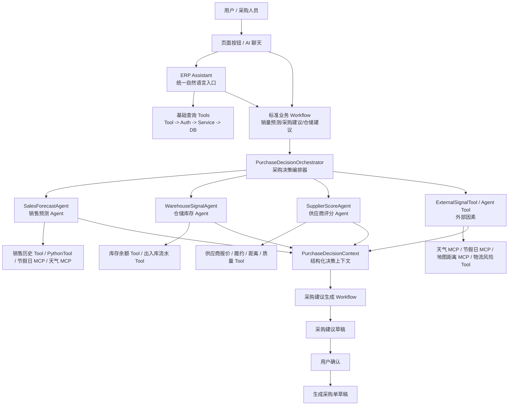
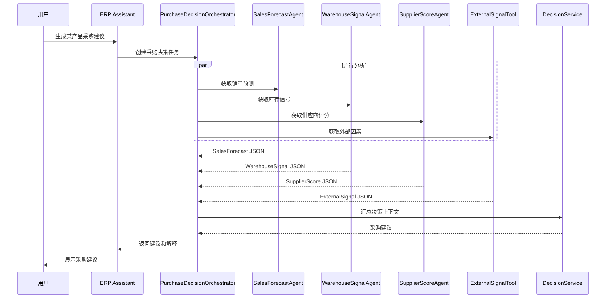

# ERP AI Agent 架构设计思考：从单 Agent 到多专家编排

本文面向面试表达，说明本 ERP 项目为什么不采用“一个 Agent 调所有工具”的方式，而是采用“基础查询 Tool + 标准业务 Workflow + Agent 个性化编排”的 AI 架构。

---

## 1. 背景问题

ERP 的采购建议不是简单问答，它需要综合多个业务域的数据和外部因素：

| 决策维度 | 需要的数据 | 复杂点 |
|---|---|---|
| 销售预测 | 历史销量、趋势、节假日、天气、活动因素 | 分析流程长，工具多，上下文大 |
| 库存状态 | 当前库存、锁定库存、可用库存、安全库存 | 需要和仓储模块保持一致 |
| 供应商选择 | 报价、交付周期、质量、距离、履约历史 | 需要评分模型和可解释依据 |
| 外部因素 | 天气、节假日、距离、物流风险 | 需要接入 MCP 或外部服务 |
| 采购建议 | 建议采购量、推荐供应商、风险说明 | 需要综合多个 Agent 输出 |

如果让一个采购 Agent 同时掌握销售、库存、供应商、天气、节假日、距离等全部工具，会出现几个问题：

- 工具数量过多，模型容易选错工具。
- 销售预测过程很长，会挤占采购决策上下文。
- 采购 Agent 既要分析又要决策，职责过重。
- 采购建议出错后，很难定位是销售预测错、库存数据错，还是供应商评分错。

因此本项目的优化思路是：**基础查询走受控 Tool，核心建议走稳定 Workflow，长流程分析拆给专家 Agent 或 Python 分析工具，采购总控只消费结构化决策信号。**

---

## 2. 选型结论

本项目采用：

```text
单入口 ERP Assistant
+ 基础查询 Tool
+ 标准业务 Workflow
+ 采购决策 Orchestrator
+ 多专家 Agent / 专家工具
+ 固定 JSON 输出
+ 结果落库审计
+ MCP 作为外部工具接入层
+ A2A 作为后期跨系统 Agent 协议预留
```

不采用：

```text
一个超大 Agent 直接调用所有业务工具和外部 MCP 工具
```

也不采用：

```text
多个 Agent 用自然语言随意聊天协作
```

核心原因是：**工作流负责稳定执行，Agent 负责自然语言理解和个性化编排，多 Agent 的价值是隔离上下文、隔离工具集、隔离职责，并把复杂任务拆成可验证的中间结果。**

---

## 2.1 最终落地分层

| 层级 | 作用 | 典型能力 |
|---|---|---|
| 基础查询 Tool | 第一落位能力，安全查询 ERP 数据 | 查库存、查销售汇总、查采购状态 |
| 标准业务 Workflow | 稳定执行核心业务建议 | 销量预测、采购建议、仓储建议 |
| Planner + Agent 个性化编排 | 生成结构化计划、补参数、解释结果 | “只看本地供应商重新算一下” |

基础查询能力必须最先实现，调用链固定为：

```text
Agent -> Tool -> 权限校验 -> ERP Service -> 数据库 -> JSON -> Agent 解释
```

销量预测、采购建议、仓储建议优先设计成按钮或明确 API 触发的 Workflow。个性化需求不靠无限模板匹配，而是由 Planner 在能力节点白名单中生成结构化计划，执行前必须经过 PlanValidator 校验。

---

## 2.2 Planner 可行性和边界

Planner 能解决固定 Workflow 模板有限的问题，但必须是受控 Planner。

```text
LLM 生成 Plan JSON
-> PlanValidator 校验
-> PlanExecutor 执行能力节点
-> 每步结果落库审计
```

不采用纯 ReAct：

```text
思考 -> 执行 -> 观察 -> 再思考 -> 再执行
```

原因是 ERP 业务需要权限、审计、可复现和用户确认。先规划再执行，更适合采购、库存、销售这类有业务风险的场景。

Spring AI Alibaba 可以支撑 Planner 架构中的 LLM、Tool Calling、Workflow / Graph、Multi-agent / Agent Tool，但 ERP 的 `PlanValidator`、能力节点白名单、权限校验和业务执行器必须由项目自己实现。

能力节点示例：

| 节点 | 作用 |
|---|---|
| `validate_product` | 校验产品 |
| `validate_supplier` | 校验供应商 |
| `query_inventory` | 查询库存 |
| `run_sales_forecast` | 执行销量预测 |
| `score_suppliers` | 供应商评分 |
| `calculate_purchase_qty` | 计算采购量 |
| `generate_draft_preview` | 生成草稿预览 |

---

## 3. 架构总览



---

## 4. Agent 职责划分

| Agent | 职责 | 可用工具 | 输出 |
|---|---|---|---|
| `ERP Assistant` | 统一聊天入口、识别用户意图 | 少量路由工具 | 路由到采购、库存、销售等任务 |
| `PurchaseDecisionOrchestrator` | 编排采购决策流程 | 子 Agent 调用能力 | 汇总后的采购建议 |
| `SalesForecastAgent` | 预测未来销量 | 销售历史、PythonTool、节假日、天气 | 销量预测信号 |
| `WarehouseSignalAgent` | 计算库存风险 | 库存余额、锁定库存、出入库流水 | 库存状态信号 |
| `SupplierScoreAgent` | 计算供应商得分 | 报价、距离、交付、质量、履约历史 | 供应商评分列表 |
| `ExternalSignalTool / ExternalSignalAgent` | 统一外部因素 | 天气、节假日、距离、物流风险 MCP | 外部风险信号 |

关键点：

- 每个专家 Tool / Agent 只看自己需要的上下文。
- 每个专家 Tool / Agent 只暴露少量稳定工具。
- 专家 Tool / Agent 不直接修改业务数据。
- 采购决策只读取结构化结果。

---

## 5. 结构化输出设计

多 Agent 协作最怕信息缺失，所以本项目不让 Agent 之间传自由文本，而是传固定 JSON。

销售预测输出示例：

```json
{
  "product_id": 1001,
  "forecast_days": 30,
  "forecast_qty": 850,
  "avg_daily_sales": 28.33,
  "trend": "UP",
  "confidence": 0.82,
  "reasons": [
    "近30天销量上升",
    "节假日前需求增加",
    "天气因素轻微利好"
  ]
}
```

库存信号输出示例：

```json
{
  "product_id": 1001,
  "warehouse_id": 10,
  "stock_qty": 300,
  "locked_qty": 80,
  "available_qty": 220,
  "safety_stock_qty": 200,
  "stock_risk": "MEDIUM"
}
```

供应商评分输出示例：

```json
{
  "product_id": 1001,
  "recommended_supplier_id": 501,
  "suppliers": [
    {
      "supplier_id": 501,
      "supplier_name": "华东供应商A",
      "score": 91.5,
      "price_score": 88,
      "delivery_score": 95,
      "quality_score": 92,
      "distance_score": 90,
      "reason": "交付稳定，距离较近，综合得分最高"
    }
  ]
}
```

采购决策上下文：

```json
{
  "product_id": 1001,
  "sales_forecast": {},
  "warehouse_signal": {},
  "supplier_score": {},
  "external_signal": {},
  "recommend_qty": 650,
  "recommend_supplier_id": 501,
  "risk_level": "MEDIUM",
  "decision_reason": "预计销量上升，可用库存接近安全库存，推荐向华东供应商A采购"
}
```

---

## 6. 为什么不用纯单 Agent

| 方案 | 优点 | 问题 | 结论 |
|---|---|---|---|
| 单 Agent 调全部工具 | 实现简单 | 工具多、上下文长、容易选错工具 | 不适合采购预测决策 |
| 多 Agent 自由对话 | 看起来接近人类协作 | 信息可能丢失，难审计，难复现 | 不适合 ERP 业务闭环 |
| 多专家 Agent + 编排器 | 工具隔离、上下文隔离、结果可验证 | 需要定义结构化输入输出 | 推荐 |

Spring AI Alibaba 的 Multi-agent 文档也提到，多 Agent 适合“单个 Agent 工具太多”“上下文或记忆增长过大”“任务需要专业化”的场景；并支持 `Tool Calling`、`Sequential Agent`、`Parallel Agent`、`LlmRoutingAgent`、`SupervisorAgent` 等模式。参考：[Spring AI Alibaba Multi-agent](https://java2ai.com/docs/frameworks/agent-framework/advanced/multi-agent/)。

本项目采购决策正好符合这些场景：销售预测和外部因素分析流程很长，应该拆成专家任务，最终由采购编排器汇总。

---

## 7. 推荐的编排模式

采购决策建议使用 **并行分析 + 汇总决策**。



实现上：

- 短任务可以实时执行。
- 销售预测这种长任务可以异步执行，并把结果缓存到分析结果表。
- 采购建议优先读取最近一次有效预测结果，必要时再触发刷新。

---

## 8. MCP 和 A2A 的定位

| 技术 | 解决的问题 | 在本项目中的定位 |
|---|---|---|
| MCP | Agent 如何连接外部工具、API、数据源 | 天气、节假日、地图距离、物流风险等外部能力 |
| A2A | 独立 Agent 系统之间如何通信协作 | 后期跨服务、跨系统、跨团队 Agent 协作 |
| Spring AI Alibaba Multi-agent | Java 项目内部的多 Agent 编排 | 当前项目的主要实现方式 |

A2A 官方规范将其定位为独立 Agent 系统之间的互操作协议，支持能力发现、任务协作、上下文交换，并强调不需要访问彼此内部状态、记忆或工具；同时也说明 MCP 更关注 Agent 如何连接工具和数据源，A2A 更关注 Agent 如何协作。参考：[A2A Protocol Specification](https://a2a-protocol.org/latest/specification/)。

因此本项目的选择是：

- **MVP / 单体阶段**：不用 A2A，优先使用固定 Tool 和标准 Workflow；需要专家推理时使用 Spring AI Alibaba 内部多 Agent 编排。
- **外部工具接入**：使用 MCP 封装天气、节假日、距离等外部服务；MVP 先做成 `ExternalSignalTool`，复杂后再升级为 `ExternalSignalAgent`。
- **后期服务拆分**：如果销售预测 Agent、供应商 Agent 独立部署，再考虑 A2A。

---

## 9. 项目中的优化思路

本次架构优化主要解决三个问题。

第一，解决上下文过长。

销售预测流程会读取销售历史、节假日、天气、促销、趋势等信息。如果全部塞进采购 Agent，会影响采购建议质量。拆成 `SalesForecastAgent` 后，采购 Agent 只读取预测摘要。

第二，解决工具选择错误。

每个专家 Agent 只暴露本领域工具，例如仓储 Agent 只能用库存工具，销售预测 Agent 才能用销量分析和外部因素工具。工具少了，调用正确率会更高。

第三，解决结果不可审计。

每个专家 Agent 都输出固定 JSON 并落库，采购建议可以追溯：

```text
采购建议
 -> 销售预测结果
 -> 库存信号结果
 -> 供应商评分结果
 -> 外部因素结果
```

这样面试时可以强调：这个设计不是为了炫技做多 Agent，而是为了解决 ERP 决策场景里的 **上下文控制、工具隔离、可解释和可追溯**。

---

## 10. 落地阶段规划

| 阶段 | 目标 | 实现方式 |
|---|---|---|
| 阶段 1 | AI 查询库存、采购、销售 | 单入口 Agent + 固定业务 Tool |
| 阶段 2 | 销量预测、库存风险分析 | 专家 Tool / PythonTool，结果结构化 |
| 阶段 3 | 采购建议 | `PurchaseDecisionOrchestrator` 编排多个专家 Agent |
| 阶段 4 | 外部因素增强 | 接入天气、节假日、地图距离 MCP |
| 阶段 5 | 跨系统协作 | 如专家 Agent 独立部署，再引入 A2A |

---

## 11. 面试表达总结

可以这样回答：

> 我没有直接做一个大而全的采购 Agent，因为采购建议依赖销量预测、库存状态、供应商评分和外部因素。如果单 Agent 持有全部工具，上下文会过长，工具选择也容易出错。所以我把 AI 模块拆成三层：第一层是基础查询 Tool，所有查询都必须经过权限校验和 ERP Service；第二层是标准业务 Workflow，销量预测、采购建议、仓储建议通过按钮或明确 API 触发，保证稳定可复现；第三层是 Agent 个性化编排，负责理解用户意图、补全参数、触发工作流和解释结果。MCP 用于接入天气、节假日、地图距离等外部工具；A2A 作为后期跨系统 Agent 通信协议预留。

这个回答的重点是：

- 不是为了多 Agent 而多 Agent。
- 标准 Workflow 解决稳定性，多专家 Agent 解决上下文过长和工具过多。
- ERP 业务动作仍然通过原业务 Service 执行。
- AI 结果可解释、可追溯、可审计。
