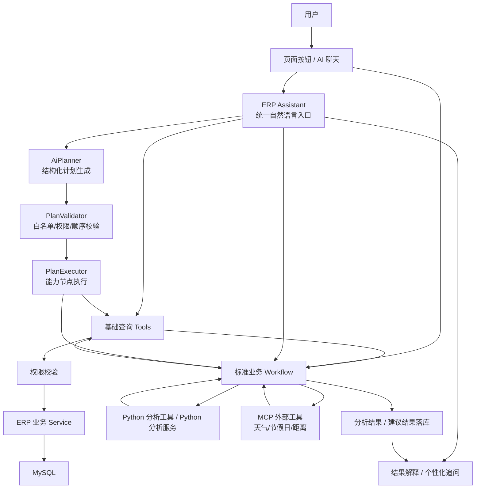
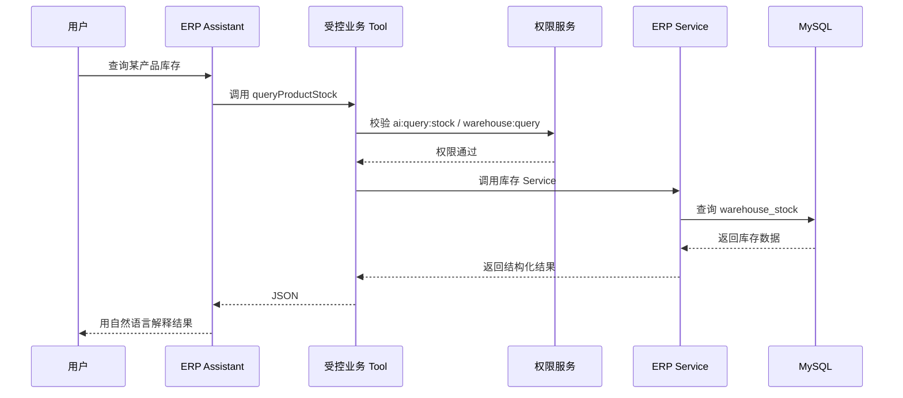
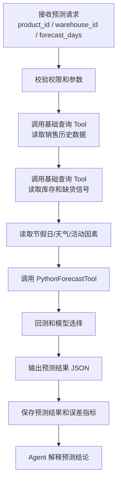
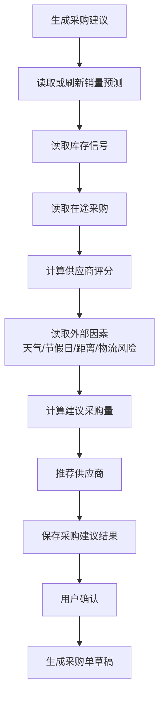
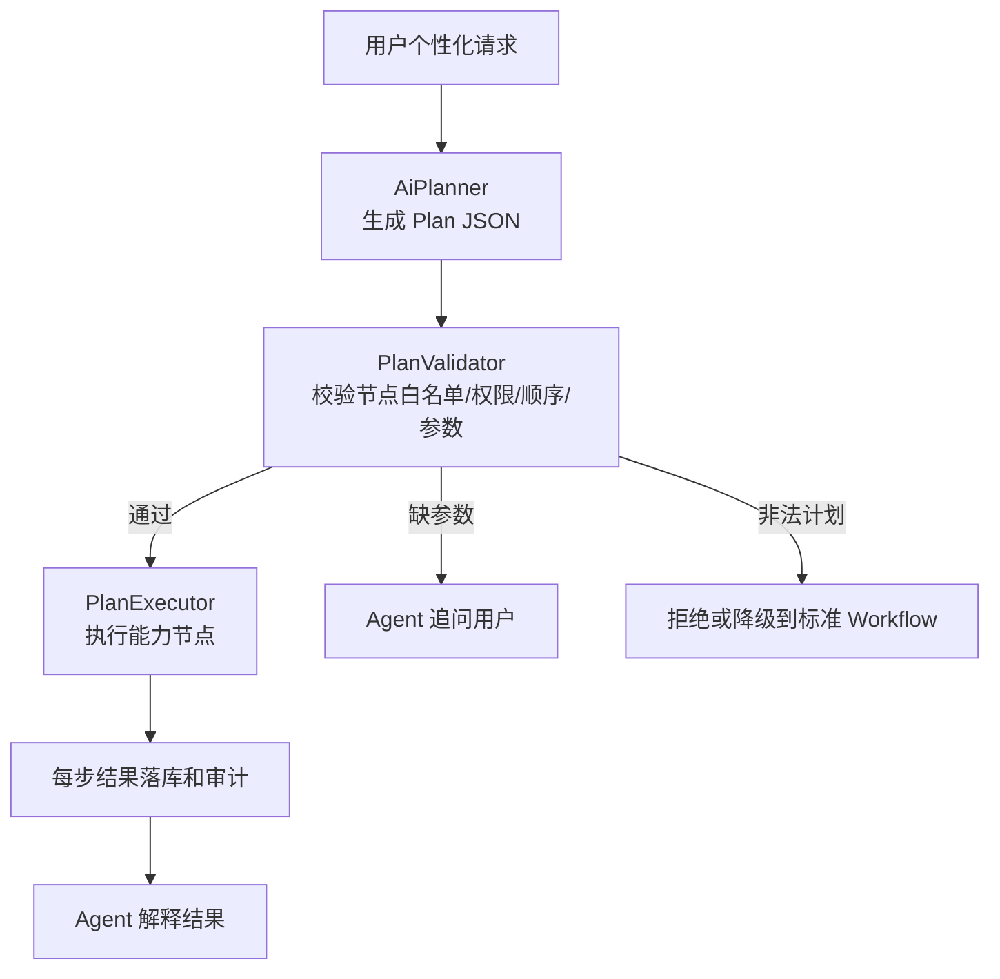

# AI 模块最终设计方案：基础查询 + 稳定工作流 + Agent 个性化编排

本文作为后续开发 AI 模块的落地蓝图。核心结论是：**第一落位不是复杂采购决策，而是基础 AI 查询能力；核心业务建议能力采用按钮或明确入口触发稳定工作流；Agent 负责自然语言理解、参数补全、工作流选择和结果解释。**

---

## 1. 总体定位

AI 模块不是绕过 ERP 的独立系统，而是 ERP 的智能入口和分析辅助层。

```text
用户自然语言 / 页面按钮
  -> AI 模块
  -> 受控 Tool / Workflow
  -> 权限校验
  -> ERP Service
  -> MySQL / Redis / Python 分析 / MCP
  -> 结构化结果
  -> Agent 解释或生成建议
```

设计原则：

- **业务主链路必须稳定**：采购、销售、库存等动作最终都走原 ERP Service。
- **基础查询优先落地**：先完成 AI 查询库存、销售汇总、采购状态等能力。
- **重要决策走工作流**：销量预测、采购建议、仓储建议不让 Agent 自由发挥。
- **Agent 不直接做数据分析**：Agent 调用 Python 分析工具，读取结构化分析结果。
- **AI 不直接改业务数据**：采购单草稿、库存调整等动作必须用户确认。
- **全过程可见可追溯**：Tool 调用、工作流步骤、Python 结果、建议结果都要记录。

---

## 2. 三层能力架构

| 层级 | 目标 | 入口 | 稳定性要求 |
|---|---|---|---|
| 第一层：基础 AI 查询 | 用自然语言查 ERP 数据 | 聊天窗口 | 必须最先落地，Tool 固定、权限固定 |
| 第二层：标准分析工作流 | 生成销量预测、采购建议、仓储建议 | 页面按钮 / 明确 API / Agent 触发 | 步骤固定，可复现、可审计 |
| 第三层：Planner + Agent 个性化编排 | 处理非标准问题、补参数、解释结果 | 聊天窗口 | 先生成结构化计划，再校验并执行 |

架构图：



---

## 3. 第一落位：基础 AI 查询能力

这是 AI 模块的第一优先级。用户用自然语言提问，Agent 只负责识别意图和调用固定业务 Tool，Tool 内部必须调用已有 Service 做鉴权和查库。

### 3.1 基础查询流程



### 3.2 初期固定 Tool

| Tool | 权限码 | 调用 Service | 说明 |
|---|---|---|---|
| `queryProductStock` | `ai:query:stock` 或 `warehouse:query` | 库存 Service | 查询产品库存、可用库存、锁定库存 |
| `querySalesSummary` | `ai:query:sales` 或 `sales:query` | 销售 Service | 查询销售汇总、销量趋势基础数据 |
| `queryPurchaseOrderStatus` | `ai:query:purchase` 或 `purchase:query` | 采购 Service | 查询采购订单状态、入库进度 |
| `queryInventoryWarning` | `ai:query:stock` 或 `warehouse:query` | 库存 Service | 基于当前库存和安全库存返回预警 |
| `querySupplierBasicInfo` | `supplier:query` | 供应商 Service | 查询供应商基础信息和可供产品 |

第一阶段禁止：

```text
Agent 直接生成 SQL
Agent 绕过 Service 查库
Agent 直接修改采购单、销售单、库存
Agent 动态生成 Python 代码执行
```

---

## 4. 第二落位：按钮触发的稳定工作流

对于销量预测、采购建议、仓储建议这类重要能力，优先做成页面按钮或明确 API，不依赖 Agent 自由选择工具。

```text
用户点击按钮
  -> 创建分析任务
  -> 执行固定 Workflow
  -> 保存中间结果
  -> 保存最终建议
  -> 用户查看解释
  -> 用户确认后进入业务草稿
```

标准工作流：

| Workflow | 入口 | 说明 |
|---|---|---|
| `SalesForecastWorkflow` | 产品页 / 销售分析页 / Agent 触发 | 生成未来销量预测 |
| `PurchaseSuggestionWorkflow` | 采购页 / 产品页 / Agent 触发 | 生成采购数量和推荐供应商 |
| `WarehouseSuggestionWorkflow` | 库存页 / Agent 触发 | 生成库存预警、补货、滞销建议 |
| `SupplierScoreWorkflow` | 供应商页 / 采购建议流程 | 计算供应商综合得分 |

---

## 4.1 前端动态渲染和业务动作承接

智能经营助手的前端展示以“自然语言汇报 + 结构化事件”为主，不把每日晨报、销量预测、库存分析等内容固化成单一静态模板。后端可以固定提示词的汇报结构，但接口层仍建议返回可解析的事件或 JSON 片段，让前端按组件渲染图表、草稿和业务操作。

### 4.1.1 对话返回格式

流式返回时建议按事件拆分，不要求后端生成图表图片：

```json
{
  "type": "text_delta",
  "content": "USB-C 扩展坞近 7 日需求继续上升，建议优先补货。"
}
```

```json
{
  "type": "chart",
  "chart": {
    "id": "sales_forecast_14d",
    "title": "未来 14 天销量预测",
    "kind": "line",
    "xField": "date",
    "yFields": [
      {"field": "forecastQty", "name": "预测销量", "unit": "件"},
      {"field": "safeStockQty", "name": "安全库存", "unit": "件"}
    ],
    "data": [
      {"date": "2026-07-04", "forecastQty": 42, "safeStockQty": 30}
    ]
  }
}
```

```json
{
  "type": "draft_created",
  "draft": {
    "businessType": "PURCHASE_ORDER",
    "draftId": 10001,
    "title": "USB-C 扩展坞采购草稿",
    "editable": true
  }
}
```

前端规则：

- `text_delta` 渲染为对话正文，保持用户看到的是一段自然语言汇报。
- `chart` 在对应消息内渲染图表卡片，图表由前端组件库渲染，必须带图例、坐标轴单位和放大查看入口。
- `draft_created` 不进入“AI 建议池”，而是在会话右侧打开可收起、可拖拽调整宽度的业务工作框，用户可以预览、编辑、生成或跳转到草稿单。
- `workflow_step`、`tool_call` 等过程事件只用于查看流程弹窗或调试，不默认铺满对话。

### 4.1.2 草稿和确认边界

AI 不直接修改正式业务数据，所有写操作必须遵循：

```text
AI 建议 -> 用户预览 -> 生成草稿 -> 人工确认 -> 正式单据
```

采购草稿、调拨草稿、出库草稿和入库草稿的表单字段不得共用一个模糊表单。每类草稿必须按业务单据提供独立字段：

- 采购草稿必须能选择供应商、采购商品、数量、预计到货日期和采购仓库。
- 调拨草稿必须能选择调出仓库和调入仓库；不得使用含义不明的“调整仓库”字段。
- 出库单和入库单的新增或草稿编辑都必须允许选择对应出库仓库或入库仓库。
- 销量预测窗口只属于预测分析参数，不应出现在调拨单、出库单、入库单等业务草稿表单中。

### 4.1.3 任务结果和会话历史

定时任务不使用“历史版本”概念，用户看到的是按日期分类的任务结果记录。任务中心应支持日历选择日期、查看当日任务、点击结果跳转到对应的历史会话或任务详情，并展示本次结果、上次结果、较上次新增风险、已解决风险和连续未处理风险。

每日晨报由智能体返回自然语言汇总，可附带图表和明细查看事件。前端不要把晨报固定成硬编码三段式卡片，但要能根据后端返回的文本和结构化事件动态渲染。

---

## 5. SalesForecastWorkflow：销量预测工作流

销量预测必须由 Python 分析工具完成，Agent 只负责触发、解释和衔接采购建议。Python 分析工具不直接查库，销售历史、库存和缺货信号必须先通过基础查询 Tool 获取，经过权限校验和 ERP Service 后再传给 Python。



Python 分析工具负责：

```text
数据清洗
按天聚合销量
补齐无销量日期
识别异常销量和缺货影响
构造移动平均、趋势、节假日、天气等特征
训练或执行候选预测方法
回测并计算误差
选择预测结果
输出预测量、模型、置信度、误差和解释原因
```

MVP 候选方法：

| 方法 | 用途 | 说明 |
|---|---|---|
| 移动平均 | 快速基线 | 可解释、实现简单 |
| 加权移动平均 | 强调近期销量 | 适合近期趋势明显的商品 |
| 指数平滑 | 平滑趋势 | 适合相对稳定销量 |
| Holt-Winters | 趋势和周期 | 适合存在周期性的商品 |

后续再扩展 Prophet、LightGBM、Croston 等模型。

输出示例：

```json
{
  "product_id": 1001,
  "warehouse_id": 10,
  "forecast_days": 30,
  "forecast_qty": 850,
  "daily_avg_forecast": 28.33,
  "model_name": "Holt-Winters",
  "wape": 0.18,
  "mae": 12.4,
  "confidence": 0.82,
  "trend": "UP",
  "reasons": [
    "近30天销量高于近90天均值",
    "未来存在节假日需求提升",
    "历史缺货天数较少，预测可信度较高"
  ]
}
```

---

## 6. PurchaseSuggestionWorkflow：采购建议工作流

采购建议是标准业务工作流，不让 Agent 自由决定工具调用顺序。



建议采购量基础公式：

```text
建议采购量 = 预测销量 + 安全库存 - 可用库存 - 在途采购量
```

采购建议必须输出：

```json
{
  "product_id": 1001,
  "recommend_qty": 730,
  "recommend_supplier_id": 501,
  "forecast_qty": 850,
  "available_qty": 220,
  "in_transit_qty": 100,
  "safety_stock_qty": 200,
  "risk_level": "MEDIUM",
  "decision_reason": "销量上升，可用库存接近安全库存，推荐向交付稳定的华东供应商A采购"
}
```

---

## 7. WarehouseSuggestionWorkflow：仓储建议工作流

仓储建议主要处理库存预警、滞销库存、安全库存和补货提醒。

固定步骤：

```text
读取 warehouse_stock
读取 product.safety_stock_qty
读取近期销售速度
读取入库单、出库单和库存流水
调用 Python 分析工具计算滞销和风险
生成库存建议
保存建议结果
```

输出方向：

- 库存不足提醒。
- 可用库存低于安全库存提醒。
- 滞销产品提醒。
- 高锁定库存提醒。
- 建议补货数量。

---

## 8. SupplierScoreWorkflow：供应商评分工作流

供应商评分用于采购建议中的“选谁买”。

评分维度：

| 维度 | 来源 | 说明 |
|---|---|---|
| 报价 | 供应商报价 / 历史采购价 | 越低越好，但不能只看价格 |
| 交付周期 | 历史采购订单 | 越稳定越好 |
| 履约准时率 | 历史入库确认时间 | 衡量是否按期交付 |
| 质量 | 退货、异常、质检记录 | 后续扩展 |
| 距离 | 地图距离 MCP / 地址数据 | 影响运输成本和时效 |
| 外部风险 | 天气、物流风险 MCP | 只作为风险信号 |

MVP 可以先用加权评分：

```text
综合得分 = 价格得分 * 0.35
        + 交付得分 * 0.25
        + 履约得分 * 0.20
        + 距离得分 * 0.10
        + 质量得分 * 0.10
```

---

## 8.1 ExternalSignalTool / ExternalSignalAgent 设计

外部因素在 MVP 阶段先不做成独立 Agent，而是封装为 `ExternalSignalTool` 或 `ExternalSignalWorkflow`，由采购建议工作流直接调用。

输入：

```json
{
  "warehouse_id": 10,
  "supplier_id": 501,
  "delivery_city": "杭州",
  "forecast_days": 30
}
```

输出：

```json
{
  "weather_risk": "LOW",
  "holiday_demand_factor": 1.15,
  "distance_km": 180,
  "logistics_risk": "MEDIUM",
  "reasons": [
    "未来30天存在节假日需求提升",
    "供应商距离较近，运输时效风险较低"
  ]
}
```

实现方式：

- MVP：`PurchaseSuggestionWorkflow -> ExternalSignalTool -> MCP 天气/节假日/距离工具`。
- 复杂阶段：当外部因素需要多步推理、多个外部工具组合、独立上下文或缓存策略时，再升级为 `ExternalSignalAgent`。
- 如果升级为 Agent，采购编排器不直接和它自由聊天，而是把它包装成 Agent Tool，输入固定 JSON，输出固定 JSON。

这样可以先保证稳定性，后续再获得 Agent 的灵活推理能力。

---

## 9. Agent 在系统中的真正职责

Agent 不替代工作流，Agent 负责让系统更好用。

| 场景 | 处理方式 |
|---|---|
| 用户点“生成采购建议” | 直接执行 `PurchaseSuggestionWorkflow` |
| 用户问“为什么建议采购 730 件” | Agent 读取建议结果并解释 |
| 用户说“只考虑本地供应商重新算一下” | Planner 生成结构化计划，筛选供应商后执行采购建议能力节点 |
| 用户说“就用供应商A算采购量” | Planner 跳过供应商评分节点，只执行供应商校验、销量预测、库存查询和采购量计算 |
| 用户问“这个产品最近是不是卖得异常” | Agent 选择销售分析计划或销量预测工作流 |
| 用户查库存、采购单状态 | Agent 调基础查询 Tool |
| 用户确认生成采购单 | 工作流调用采购 Service 生成草稿 |

一句话：**标准路径用 Workflow 保证稳定，非标准需求用 Planner 组合能力节点，Agent 负责理解和解释。**

---

## 10. Planner 个性化编排设计

Planner 用来解决“固定工作流模板有限”的问题。它不是匹配一个完整模板，而是在系统提供的能力节点白名单中生成结构化执行计划。

### 10.1 为什么需要 Planner

固定工作流适合高频标准场景，但用户会提出很多带约束的需求：

| 用户需求 | 不应该做什么 | 应该怎么做 |
|---|---|---|
| “就用供应商A算采购量” | 不应跑完整供应商评分 | 跳过评分，只校验供应商并计算采购量 |
| “只比较这三个供应商” | 不应全量供应商评分 | 只对指定供应商集合评分 |
| “只预测销量，不生成采购建议” | 不应进入采购建议流程 | 只执行销量预测节点 |
| “为什么不选供应商B” | 不应重新生成采购建议 | 读取已有结果并解释 |

因此系统采用：

```text
Plan-and-Execute + PlanValidator + Capability Nodes
```

不采用纯 ReAct：

```text
思考 -> 调工具 -> 观察 -> 再思考 -> 再调工具
```

原因是 ERP 需要权限、审计、可复现和用户确认。先规划再执行，更容易在执行前校验风险。

### 10.2 Planner 执行流程



### 10.3 能力节点白名单

能力节点是稳定的业务能力单元，不是 LLM 自由创造的工具名。

| 节点 | 作用 | 底层实现 |
|---|---|---|
| `validate_product` | 校验产品是否存在、是否启用 | 产品 Service |
| `validate_supplier` | 校验供应商是否合法、是否供应该产品 | 供应商 Service |
| `query_inventory` | 查询库存和可用库存 | 基础查询 Tool -> 库存 Service |
| `query_in_transit_purchase` | 查询在途采购量 | 采购 Service |
| `run_sales_forecast` | 执行销量预测 | `SalesForecastWorkflow` |
| `score_suppliers` | 计算供应商评分 | `SupplierScoreWorkflow` |
| `filter_suppliers` | 根据区域、指定名单筛选供应商 | 供应商 Service |
| `query_external_signal` | 查询天气、节假日、距离等外部因素 | `ExternalSignalTool` / MCP |
| `calculate_purchase_qty` | 计算建议采购量 | 采购决策 Service |
| `generate_purchase_suggestion` | 生成采购建议结果 | 采购建议 Service |
| `generate_draft_preview` | 生成采购单草稿预览 | 采购 Service，仅草稿 |
| `explain_existing_result` | 解释已有预测或建议结果 | Agent + 结果表 |

### 10.4 Plan JSON 示例

用户说：

```text
就用供应商A，帮我算一下这个产品未来30天要买多少
```

Planner 输出：

```json
{
  "intent": "purchase_quantity_fixed_supplier",
  "need_user_confirm": false,
  "constraints": {
    "supplier_id": 501,
    "forecast_days": 30,
    "skip_supplier_scoring": true
  },
  "steps": [
    {"node": "validate_product", "input": {"product_id": 1001}},
    {"node": "validate_supplier", "input": {"supplier_id": 501, "product_id": 1001}},
    {"node": "run_sales_forecast", "input": {"product_id": 1001, "forecast_days": 30}},
    {"node": "query_inventory", "input": {"product_id": 1001, "warehouse_id": 10}},
    {"node": "query_in_transit_purchase", "input": {"product_id": 1001}},
    {"node": "calculate_purchase_qty", "input": {}},
    {"node": "generate_draft_preview", "input": {"supplier_id": 501}}
  ]
}
```

### 10.5 PlanValidator 校验规则

PlanValidator 是安全核心，不能省略。

```text
节点必须在白名单中。
节点顺序必须符合依赖关系。
每个节点参数必须完整。
每个节点必须声明权限码并通过权限校验。
写操作必须用户确认。
只能生成草稿或预览，不能直接提交正式业务单据。
Python 节点不能直接查库，只能接收授权结构化数据。
MCP 节点只能输出外部信号，不能修改业务数据。
计划中不能出现自由 SQL、未知工具或动态 Python 代码。
```

### 10.6 Spring AI Alibaba 可行性边界

Spring AI Alibaba 可以支撑 Planner 架构，但不会内置 ERP Planner。

| 能力 | Spring AI Alibaba 是否支撑 | 项目需要自研 |
|---|---|---|
| LLM 生成结构化计划 | 支撑，可结合结构化输出 | `AiPlan`、`AiPlanStep` Schema |
| Tool Calling | 支撑 | ERP Tool 必须调用权限和 Service |
| Workflow / Graph | 支撑 | 业务节点和状态流转 |
| Multi-agent / Agent Tool | 支撑 | 哪些专家 Agent 暴露为 Tool |
| PlanValidator | 框架不内置 | 节点白名单、权限、顺序、风险校验 |
| PlanExecutor | 需要项目实现 | 按节点调用 Tool / Workflow / Service |
| ERP 业务规则 | 框架不内置 | 采购量公式、供应商校验、用户确认 |

推荐实现结构：

```text
erp-ai
├── planner
│   ├── AiPlan
│   ├── AiPlanStep
│   ├── AiPlannerService
│   ├── PlanValidator
│   ├── PlanExecutor
│   └── CapabilityRegistry
├── capability
│   ├── ValidateProductNode
│   ├── ValidateSupplierNode
│   ├── QueryInventoryNode
│   ├── RunSalesForecastNode
│   ├── ScoreSuppliersNode
│   ├── CalculatePurchaseQtyNode
│   └── GenerateDraftPreviewNode
```

最终原则：

```text
LLM 负责规划。
Java 负责校验。
Workflow / Node 负责执行。
ERP Service 负责业务规则。
用户确认负责关键写操作。
```

---

## 11. Python 分析工具集成方式

短期可以把 Python 分析封装成受控工具，长期更建议独立 Python 分析服务。

| 阶段 | 方案 | 说明 |
|---|---|---|
| MVP / Demo | Spring 侧调用固定 PythonTool | 快速验证预测流程 |
| 正式开发 | Java Tool 调 Python FastAPI 服务 | Python 生态完整，便于使用 pandas、statsmodels、scikit-learn |
| 长耗时任务 | 异步任务 + Python Worker + 结果表 | 适合批量预测、每日分析 |

约束：

- Agent 不能动态生成 Python 代码。
- Python 侧只开放固定函数，如 `forecast_sales`、`analyze_slow_moving_stock`。
- Python 返回固定 JSON。
- Java 侧校验 JSON 完整性后再落库。

---

## 12. 推荐代码结构

```text
erp-ai
├── chat                         AI 聊天入口
├── agent                        Agent 定义
│   ├── ErpAssistant
│   ├── SalesForecastAgent
│   └── PurchaseDecisionAgent
├── planner                      计划生成、校验和执行
│   ├── AiPlannerService
│   ├── PlanValidator
│   ├── PlanExecutor
│   └── CapabilityRegistry
├── capability                   能力节点
├── tool                         受控 Tool
│   ├── QueryProductStockTool
│   ├── QuerySalesSummaryTool
│   ├── QueryPurchaseOrderStatusTool
│   └── PythonForecastTool
├── workflow                     标准工作流
│   ├── SalesForecastWorkflow
│   ├── PurchaseSuggestionWorkflow
│   ├── WarehouseSuggestionWorkflow
│   └── SupplierScoreWorkflow
├── mcp                          MCP 外部工具适配
├── audit                        Tool / Workflow 审计
└── dto                          结构化输入输出 DTO
```

---

## 13. 开发顺序

| 优先级 | 内容 | 原因 |
|---|---|---|
| P0 | 基础 AI 查询 Tool | 第一落位，证明 AI 能安全查 ERP 数据 |
| P0 | Tool 权限校验和审计 | 防止 AI 绕过权限 |
| P1 | SalesForecastWorkflow | 采购建议依赖销量预测 |
| P1 | PythonForecastTool | 提供可见、可复查的数据分析结果 |
| P2 | PurchaseSuggestionWorkflow | 生成采购建议和供应商推荐 |
| P2 | WarehouseSuggestionWorkflow | 库存预警和仓储建议 |
| P3 | Planner + 能力节点白名单 | 支持个性化需求且不依赖无限模板 |
| P3 | MCP 外部因素 | 天气、节假日、距离、物流风险 |
| P4 | 多 Agent / Agent Tool | 在工作流和 Planner 稳定后增强专家能力 |

---

## 14. 最终架构表达

可以这样概括：

> 这个项目里的 AI 不是一个自由发挥的大 Agent，而是三层结构。第一层是基础查询 Tool，所有自然语言查询都必须经过 Tool、权限校验和 ERP Service；第二层是标准业务 Workflow，像销量预测、采购建议、仓储建议都通过按钮或明确 API 触发，保证稳定可复现；第三层是 Planner + Agent 个性化编排，LLM 只负责生成结构化计划，系统用 PlanValidator 校验节点白名单、权限、顺序和风险，再由 PlanExecutor 执行能力节点。这样既不会被有限模板限制，也不会让 Agent 自由乱跑。

## 15. 定时任务接口约束

- 定时任务配置只提交稳定标识：`productIds`、`warehouseIds`、`recipientRoleIds`。名称仅用于页面展示，不得作为关联条件保存或提交。
- “全部商品”和“全部仓库”使用稳定哨兵值 `ALL`；后端在执行时按当前权限范围展开，不固化名称快照。
- 接收对象复用系统角色选项接口，AI 模块不重复建设角色或收件人接口。
- 输出形式仅保留 `REPORT` 与 `CHAT_CARD`。铃铛通知由工作台待办/异常聚合负责，定时任务不再提供 `NOTIFICATION` 输出。
- 手动运行采用异步受理，返回 `executionId`、`taskId`、`status=RUNNING`、`acceptedAt`；前端随后刷新任务与执行记录。
- 执行详情不再暴露兼容性的 `sections` 字段；对话流式输出继续使用 SSE。
