# MVP 整体数据库表设计说明

## 设计目标

本项目数据库设计先服务第一版 ERP MVP，目标不是一次性覆盖完整 ERP 的所有能力，而是先把产品、仓库、采购、销售、权限和 AI 查询这条主链路跑通。

整体设计遵循几个核心目标：

- 业务闭环完整：能维护产品、供应商、客户、仓库，能完成采购入库、销售出库和库存更新。
- 表数量可控：第一版避免一开始拆出过多配置表、关系表和日志表，降低开发复杂度。
- 查询性能友好：ERP 列表和大表查询频繁，适当冗余名称、编码等快照字段，减少高频多表联查。
- AI 可用：供应商评分、库存余额、出入库流水、销售采购数据要能支撑后续 AI Tool 查询和采购建议。
- 后续可扩展：MVP 简化不是把路堵死，而是先保留清晰的扩展位置。

## 当前表清单

MVP 阶段共设计 21 张表。

| 模块 | 表 | 作用 |
|---|---|---|
| 系统权限 | `sys_dept` | 部门基础信息 |
| 系统权限 | `sys_user` | 用户账号和所属部门 |
| 系统权限 | `sys_role` | 角色和已授权权限码集合 |
| 系统权限 | `sys_permission` | 可授权权限码目录 |
| 系统权限 | `sys_user_role` | 用户角色关系 |
| 产品 | `product_category` | 产品分类 |
| 产品 | `product` | 产品主数据 |
| 仓库库存 | `warehouse` | 仓库主数据 |
| 仓库库存 | `warehouse_stock` | 当前库存余额 |
| 仓库库存 | `stock_bill` | 出入库流水主表 |
| 仓库库存 | `stock_bill_item` | 出入库流水明细 |
| 采购 | `supplier` | 供应商主数据和供应商总评分 |
| 采购 | `supplier_product` | 供应商可供货产品、价格、交期和产品维度评分 |
| 采购 | `purchase_order` | 采购订单主表 |
| 采购 | `purchase_order_item` | 采购订单明细 |
| 销售 | `customer` | 客户主数据 |
| 销售 | `sales_order` | 销售订单主表 |
| 销售 | `sales_order_item` | 销售订单明细 |
| AI | `ai_document` | 知识库文档 |
| AI | `ai_document_chunk` | 文档切片和向量 key |
| AI | `ai_interaction_log` | AI 问答、Tool 调用和权限审计 |

## 面试表达视角

这套表设计在面试里可以重点表达成一句话：

> 我没有一开始把 ERP 表全部铺满，而是围绕采购、销售、库存这条业务主链路做 MVP 建模。库存变化统一收口到仓库模块，订单只表达业务事实；同时为 AI 查询和供应商推荐预留评分、审计和可追溯数据。这样既能快速落地，也保留了后续扩展权限、批次、退货、财务和 AI Workflow 的空间。

面试官通常关注的不是“你有多少张表”，而是你能不能讲清楚这些问题：

| 面试关注点 | 本设计的回答 |
|---|---|
| 业务是否闭环 | 产品、供应商、采购、仓库、库存、客户、销售都能串起来 |
| 数据是否一致 | 采购和销售不直接改库存，统一通过 `stock_bill` 确认后更新库存 |
| 查询是否高效 | 库存余额单独存，订单和明细冗余名称、编码，减少高频联表 |
| 是否可追溯 | 出入库流水带 `source_type/source_id/source_no/source_item_id` |
| 是否可扩展 | 权限、退货、批次、财务、AI Workflow 都有明确扩展路径 |
| AI 是否可信 | AI 不直接改业务数据，只通过受控 Tool 读 Service，并写审计日志 |

因此讲这套设计时，不要只背表名，要围绕三个关键词展开：

- **业务闭环**：采购入库、销售出库、库存变化能完整跑通。
- **一致性边界**：库存统一由仓库模块负责，避免多模块直接改库存。
- **演进式设计**：MVP 先简单，但每个简化点都能自然扩展。

## 整体设计思路

### 1. 先做能跑通的主链路

ERP 容易一开始设计得很重，例如岗位、菜单、按钮权限、字段权限、库位、批次、序列号、SPU/SKU、审批流、财务结算、退货单、通用审计表都可以拆表。

但第一版如果全部设计出来，会带来几个问题：

- 后端实体、Mapper、接口数量快速增加。
- 前端页面和表单复杂度变高。
- 很多表短期没有真实业务数据支撑，容易变成空结构。
- 后续需求变化时，过早抽象反而更难调整。

所以 MVP 只保留核心交易闭环需要的表：产品、仓库、库存、供应商、采购、客户、销售、用户权限和 AI 基础表。

从业务角度看，第一版最重要的是让下面这条链路成立：

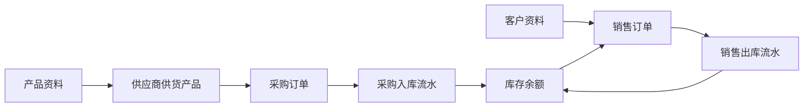

这条链路能跑通，系统才算具备 ERP 的基础业务价值。权限、批次、审批、财务都可以后续增强，但不能替代这条主链路。

### 2. 主数据适当简化

产品模块没有拆品牌表、单位表、SPU/SKU 表，原因是第一版主要关注可采购、可销售、可库存管理的产品。

因此 `product` 直接保存：

- 产品编码和名称。
- 分类。
- 品牌名称。
- 规格型号。
- 单位名称。
- 参考采购价和参考销售价。
- 安全库存数量。

这样可以先完成采购、销售、库存查询。后续如果产品体系复杂，再把品牌、单位、SPU/SKU 拆出去。

### 3. 订单和库存分工明确

采购订单和销售订单只表达业务交易，不直接修改库存。

库存统一由仓库模块处理：

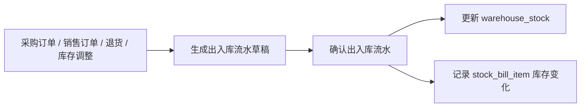

这样做的好处是：

- 库存更新入口统一，避免采购、销售各自改库存导致不一致。
- `warehouse_stock` 负责快速查询当前库存。
- `stock_bill` / `stock_bill_item` 负责追溯库存为什么变化。
- AI 查询库存时优先读库存余额，需要解释原因时再看出入库流水。

这里的架构考虑是把**交易模块**和**库存模块**分开：

| 模块 | 负责什么 | 不负责什么 |
|---|---|---|
| 采购模块 | 供应商、采购订单、采购明细、采购价格 | 不直接改库存 |
| 销售模块 | 客户、销售订单、销售明细、库存锁定 | 不直接扣库存 |
| 仓库模块 | 库存余额、出入库确认、库存变动追溯 | 不负责采购或销售业务规则 |

这样做的好处是模块边界清楚。以后增加销售退货、采购退货、库存调整，也不需要让采购和销售模块各自维护一套库存逻辑。

### 4. 不单独设计库存流水表

项目里没有再设计单独的 `stock_flow` 表，因为 `stock_bill` 和 `stock_bill_item` 已经承担库存变动凭证。

如果同时设计“出入库单”和“库存流水表”，第一版会出现两套记录：

```text
出入库流水记录一次出库
库存流水又记录一次出库
```

这会增加数据一致性维护成本，也会让后续排查库存问题时不知道以哪张表为准。

所以当前设计是：

- `stock_bill` 记录一次出入库动作的来源、类型、仓库、状态和确认信息。
- `stock_bill_item` 记录每个产品的数量、合格数量、不合格数量、变动前库存、变动数量、变动后库存。

后续如果财务库存台账、批次成本、月结存要求更高，再新增独立库存台账表。

### 5. 适当冗余字段，减少高频联查

ERP 数据量大，列表页和查询页很多。如果每次展示订单、库存、流水都实时联查产品、客户、供应商、仓库，会影响开发效率和查询性能。

因此业务表里有意识地冗余了一些快照字段。

| 冗余字段 | 出现位置 | 目的 |
|---|---|---|
| `product_code`、`product_name` | 采购明细、销售明细、库存余额、出入库明细 | 历史单据保留产品快照，列表查询少联表 |
| `supplier_code`、`supplier_name` | 采购订单、供应商供货产品 | 采购列表直接展示供应商 |
| `customer_code`、`customer_name` | 销售订单 | 销售列表直接展示客户 |
| `warehouse_name` | 库存、采购订单、销售订单、出入库流水 | 常用展示字段，避免频繁联仓库表 |
| `purchase_no`、`sales_no`、`bill_no` | 明细表 | 方便按单号查询和排查问题 |

这些冗余字段按业务快照处理。主数据后续改名，不影响历史订单和历史流水展示。

这个设计在面试里可以这样解释：

> ERP 系统更关注历史单据的稳定性和列表查询性能。订单创建时的产品名称、供应商名称、客户名称本身就是业务快照，所以我会在订单和流水里冗余这些字段。这样既减少联表，也避免主数据改名后影响历史单据展示。

也就是说，这里的冗余不是随意违反范式，而是有业务语义的快照冗余。

### 6. 状态流转代替复杂工作流

MVP 阶段没有单独设计审批流引擎，而是在订单和出入库流水上使用状态字段表达业务进度。

采购订单核心状态：

```text
DRAFT -> SUBMITTED -> APPROVED -> PARTIAL_INBOUND -> INBOUND_DONE
```

销售订单核心状态：

```text
DRAFT -> SUBMITTED -> APPROVED -> PARTIAL_OUTBOUND -> OUTBOUND_DONE
```

出入库流水核心状态：

```text
DRAFT -> CONFIRMED
```

这样设计的原因是：

- MVP 先保证交易链路，不把审批流复杂度提前引入。
- 状态字段足够表达当前业务进度。
- 后续如果要接入审批流，可以在状态流转前增加审批节点，不需要推翻订单表。

### 7. 权限目录与角色授权分离

权限模块不设计动态菜单表和角色权限关系表，第一版保留：

- 用户。
- 部门。
- 角色。
- 权限码目录。
- 用户角色关系。

`sys_permission` 维护可授权权限码的名称、模块、操作类型、状态和排序；角色实际获得的权限码继续放在 `sys_role.permission_codes` JSON 中。这样既能独立维护权限目录，又避免 MVP 阶段增加 `sys_role_permission` 关系表和高频关联查询。

这样设计是因为当前需求是“页面大家都能看到，但没有权限的人进不去，或者不能查大表”。所以第一版只需要判断用户是否拥有模块级和大表查询权限，例如：

```text
product:query
warehouse:query
supplier:query
purchase:query
sales:query
ai:query:stock
```

后续如果需要动态菜单、复杂角色授权关系或字段权限，再扩展：

```text
sys_role.permission_codes
  -> sys_menu
  -> sys_role_permission
  -> 数据权限 / 字段权限
```

这背后的架构取舍是：权限系统先服务当前业务，而不是一开始做成完整 IAM 平台。对于 MVP 来说，粗粒度权限码能覆盖“能不能查产品、库存、采购、销售、AI Tool”的核心安全边界。

### 8. AI 设计只保留必要落库点

AI 模块第一版不拆聊天会话表、Prompt 模板表、Workflow 节点日志表，只设计 3 张表：

- `ai_document`
- `ai_document_chunk`
- `ai_interaction_log`

原因是 MVP 先落地两类能力：

- RAG 问答：需要保存文档、切片和向量 key。
- AI Tool 查询：需要记录用户问题、Tool 名称、参数、权限校验结果和返回摘要。

Embedding 向量本体不放 MySQL，而是放 RedisStack。MySQL 只保存 `vector_key`，用于把向量检索结果和业务文档切片关联起来。

`ai_interaction_log` 同时记录 RAG 问答、AI Tool 调用和后续 Workflow 调用，先用一张审计表统一追溯，避免第一版日志表过多。

更重要的是，AI 模块在架构上不能绕过 ERP 业务层：

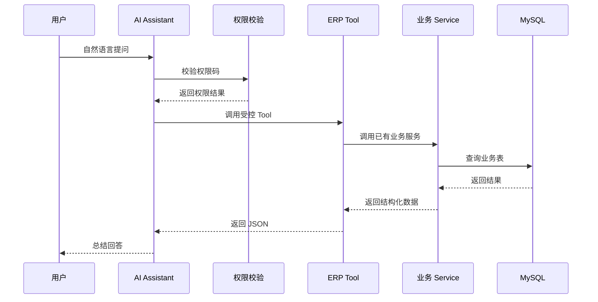

这个设计可以防止 AI 直接生成 SQL 绕过权限，也能通过 `ai_interaction_log` 追溯每次调用的权限、参数和结果。

### 9. 供应商评分为 AI 采购建议预留

采购模块不仅要能下采购单，还要支撑后续 AI 自动选择供应商。

因此设计了 `supplier_product`，它不是简单的供应商和产品关系表，而是 AI 推荐供应商的核心基础表。

它保存：

- 供应商能供应哪个产品。
- 最近采购价。
- 最小起订量。
- 预计交期。
- 价格分。
- 交付分。
- 质量分。
- AI 综合推荐分。

AI 选择供应商时，不需要每次实时扫描所有历史订单，可以先按 `product_id` 找候选供应商，再按 `ai_score`、价格、交期等字段排序。

供应商评分由 `SupplierScoreRefreshJob` 定时刷新：

- 价格分来自最近采购价和同产品最低价对比。
- 交付分来自预计到货日期和实际入库确认时间。
- 质量分来自入库明细里的合格数量和不合格数量。
- 综合分按价格、交付、质量、服务权重计算。

这能保证 AI 模块后续做采购建议时有稳定、可解释、可落库的数据基础。

面试里可以强调：AI 不是直接“拍脑袋”选供应商，而是基于可解释的业务指标选供应商。

| 指标 | 数据来源 | 业务含义 |
|---|---|---|
| 价格分 | 采购订单明细、最近采购价 | 同产品下谁的价格更优 |
| 交付分 | 预计到货日期、入库确认时间 | 供应商是否准时 |
| 质量分 | 入库合格数量、不合格数量 | 到货质量是否稳定 |
| 服务分 | 人工维护或后续售后数据 | 沟通、响应、售后表现 |
| 综合分 | 加权计算 | AI 推荐排序依据 |

这样 AI 的推荐结果可以被解释，也可以被历史数据验证。

## 业务逻辑设计考虑

这一节用于面试时展开讲业务建模。

### 1. 采购业务为什么这样落表

采购业务拆成 `supplier`、`supplier_product`、`purchase_order`、`purchase_order_item`。

这样拆的原因是采购里有两层关系：

- 供应商本身的资质和整体表现。
- 某个供应商供应某个产品时的价格、交期和质量表现。

如果只在 `supplier` 上放评分，就无法回答“同一个供应商供应不同产品时表现是否不同”。所以设计 `supplier_product` 保存产品维度的供应能力和推荐分。

采购订单确认后不直接增加库存，而是生成 `PURCHASE_IN` 出入库流水草稿。只有确认入库后，才更新库存和采购明细的 `inbound_qty`。

这符合真实业务：采购单代表“要买”，入库确认代表“货真的到了”。

### 2. 销售业务为什么先锁库存再出库

销售订单审核后先锁定库存，确认出库后才扣减库存。

原因是销售业务存在一个时间差：

```text
客户下单 / 销售审核 -> 仓库拣货 -> 实际出库
```

如果审核时直接扣库存，可能导致库存账和实际仓库不一致；如果完全不锁库存，又可能导致同一批库存被多个销售订单重复占用。

所以设计了：

- `warehouse_stock.stock_qty` 表示当前实际库存。
- `warehouse_stock.locked_qty` 表示已被销售订单占用但还未出库的库存。
- 可用库存由服务层计算：`stock_qty - locked_qty`。

确认出库时再同时扣减 `stock_qty` 和 `locked_qty`，并回写 `sales_order_item.outbound_qty`。

### 3. 库存业务为什么分余额和流水

库存查询和库存追溯是两个不同场景。

| 场景 | 使用表 | 原因 |
|---|---|---|
| 查当前库存 | `warehouse_stock` | 高频查询，需要快 |
| 查库存为什么变化 | `stock_bill`、`stock_bill_item` | 需要来源、类型、确认人和变动前后数量 |

如果只保留流水，每次查当前库存都要汇总历史流水，性能会很差。如果只保留余额，又无法追溯库存变化原因。

所以同时保留库存余额和出入库流水，是 ERP 库存模块的基本设计。

### 4. 退货为什么先复用出入库流水

MVP 没有单独设计销售退货单和采购退货单。

这是因为第一版只需要支持库存方向的变化：

- 销售退货：客户退货入库，使用 `SALES_RETURN`。
- 采购退货：退回供应商出库，使用 `PURCHASE_RETURN`。

如果后续退货涉及退款、质检、责任判定、售后审批，再补独立退货单表。当前先复用出入库流水，可以减少表数量，同时保留库存追溯能力。

### 5. AI 查询为什么必须写审计

AI Tool 可以读取库存、销售、采购等业务数据，本质上也是一种系统接口调用。

所以每次 AI 调用都要记录：

- 谁问的。
- 问了什么。
- 调了哪个 Tool。
- 用了什么权限码。
- 权限是否通过。
- 查询参数是什么。
- 返回了多少数据。
- 是否成功。

这不是为了复杂，而是为了保证 AI 能力上线后可控、可追溯、可排查。

## 架构设计考虑

这一节用于面试时解释技术取舍。

### 1. 为什么适合模块化单体

MVP 阶段采用模块化单体更合适。

原因是采购、销售、库存之间一致性要求很强。如果一开始拆成多个微服务，会提前引入：

- 分布式事务。
- 服务间调用。
- 数据一致性补偿。
- 部署和运维复杂度。

但如果完全不分模块，代码又容易变成大泥球。

所以采用模块化单体：部署上是一个应用，代码上按领域拆模块。数据库设计也跟着领域边界拆分，但核心交易仍在一个库里完成，方便第一版保证事务一致性。

### 2. 为什么不追求完全第三范式

这套设计没有完全消除冗余，因为 ERP 的业务特点决定了历史单据需要快照。

例如产品后来改名，历史采购单不应该跟着变化；供应商名称调整，历史订单也应该保留当时的展示值。

因此订单、明细、流水中冗余名称和编码，是为了：

- 保留历史业务快照。
- 提升列表查询性能。
- 降低高频联表成本。
- 方便排查和导出。

这属于有业务意义的冗余，不是无规划的数据重复。

### 3. 为什么状态字段很重要

MVP 很多复杂流程都没有单独拆表，而是先用状态字段表达。

例如：

- 采购订单从草稿到已入库。
- 销售订单从草稿到已出库。
- 出入库流水从草稿到已确认。
- AI 文档从待处理到已索引或失败。

状态字段让系统能先跑起来，同时给后续审批流、异步任务、失败重试留下扩展点。

### 4. 为什么服务层承担一致性校验

当前 SQL 不强制物理外键，业务一致性主要由 Service 层控制。

这不是放弃约束，而是考虑到 ERP 后续会有大量导入、作废、归档、迁移和历史单据场景。

Service 层需要负责：

- 校验产品、客户、供应商、仓库是否启用。
- 校验库存是否足够。
- 控制订单状态流转是否合法。
- 确认出入库时更新库存和回写订单明细。
- 防止重复确认同一张出入库流水。

也就是说，数据库负责存储和索引，业务层负责业务规则和事务边界。

### 5. AI 为什么作为业务辅助层

AI 模块不是独立业务系统，而是 ERP 的智能入口和分析辅助层。

它不能绕过权限，也不能直接修改核心业务表。正确路径是：

```text
AI -> 权限校验 -> ERP Tool -> 业务 Service -> 数据库
```

这样设计有几个好处：

- AI 和普通接口复用同一套业务规则。
- 权限不会因为自然语言入口而绕过。
- 业务动作仍然可审计。
- 后续 Workflow 生成采购建议时，也能由用户确认后再落业务单据。

## 全局字段设计考虑

### 1. 主键为什么使用 `ASSIGN_ID`

所有表主键统一使用 `bigint`，由 MyBatis-Plus `ASSIGN_ID` 生成。

这样做的考虑：

- 避免依赖数据库自增，后续扩展分库分表或多实例写入时更灵活。
- Java 实体统一使用 `Long`。
- SQL DDL 不需要 `AUTO_INCREMENT`。

### 2. 为什么不强制物理外键

MVP 阶段不强制创建数据库物理外键，关系由业务层和索引保证。

原因是 ERP 业务表数据量会比较大，后续还会涉及历史单据、软删除、状态作废、数据迁移和批量导入。物理外键虽然能增强数据库约束，但也可能带来：

- 批量导入顺序受限。
- 迁移和清理历史数据更麻烦。
- 删除、作废、归档场景复杂。
- 大表写入和维护成本上升。

当前做法是保留清晰的关联字段和索引，在 Service 层控制业务一致性。

### 3. 时间字段为什么使用数据库默认值

普通审计时间字段统一使用：

```sql
create_time DATETIME NOT NULL DEFAULT CURRENT_TIMESTAMP COMMENT '创建时间',
update_time DATETIME NOT NULL DEFAULT CURRENT_TIMESTAMP ON UPDATE CURRENT_TIMESTAMP COMMENT '更新时间'
```

这样可以减少业务代码手动填充普通创建时间、更新时间的工作。

但业务动作时间不依赖自动更新时间，例如：

- `submitted_at`
- `approved_at`
- `confirmed_at`
- `locked_at`
- `last_login_at`

这些时间由对应业务动作显式写入，因为它们表达的是具体业务事件，而不是记录最后更新时间。

### 4. 逻辑删除为什么不是所有表都有

主数据、配置表和可删除业务主表使用 `deleted`，例如：

- `sys_user`
- `product`
- `supplier`
- `customer`
- `purchase_order`
- `sales_order`

关系表、订单明细表、库存余额表、出入库流水表、审计日志表默认不使用 `deleted`，例如：

- `sys_user_role`
- `purchase_order_item`
- `sales_order_item`
- `warehouse_stock`
- `stock_bill`
- `stock_bill_item`
- `ai_interaction_log`

原因是这些表更偏事实记录或审计记录。库存流水、订单明细、AI 调用日志如果被软删除语义干扰，会影响追溯和对账。需要取消或作废时，优先通过主表 `status` 或业务状态表达。

### 5. 评分为什么用整数保存

评分、百分率、命中率、准确率、合格率、准时率统一用 `int` 保存放大 100 倍后的值。

例如：

| 展示值 | 数据库存储 |
|---|---:|
| 100.00 | 10000 |
| 89.75 | 8975 |
| 0.00 | 0 |

这样做是为了避免 Java 对象转换、JSON 序列化、前端展示过程中出现小数精度和舍入问题。

金额仍然使用 `decimal(18,2)`，数量和库存仍然使用 `decimal(18,4)`。这个整数规则只针对评分和百分率类字段。

## 核心表间关系

### 面试版核心关系图

这张图只展示核心业务关系和关键字段，适合面试时讲整体设计。完整字段仍以各模块表设计和 SQL DDL 为准。

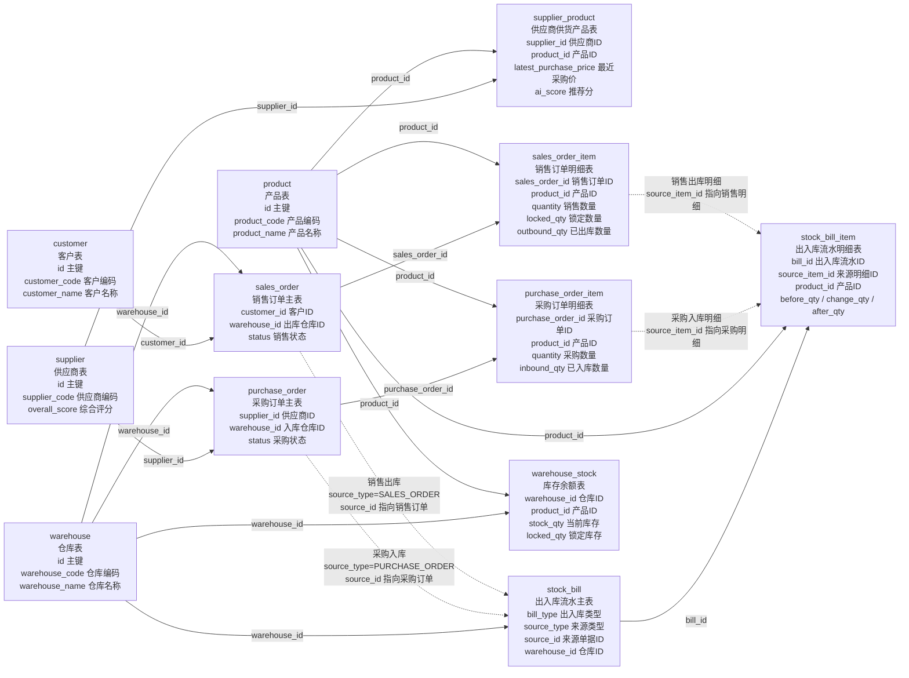

图中实线表示固定字段关联；虚线表示按 `source_type` 解释的业务追溯关系，不是固定物理外键。

| 关系点 | 字段 | 中文说明 |
|---|---|---|
| 供应商供货 | `supplier_product.supplier_id`、`supplier_product.product_id` | 说明哪个供应商能供应哪个产品，是 AI 推荐供应商的基础 |
| 采购入库 | `stock_bill.source_type = PURCHASE_ORDER`、`stock_bill.source_id = purchase_order.id` | 出入库流水可以反查采购订单 |
| 采购入库明细 | `stock_bill_item.source_item_id = purchase_order_item.id` | 出入库明细可以反查采购明细 |
| 销售出库 | `stock_bill.source_type = SALES_ORDER`、`stock_bill.source_id = sales_order.id` | 出入库流水可以反查销售订单 |
| 销售出库明细 | `stock_bill_item.source_item_id = sales_order_item.id` | 出入库明细可以反查销售明细 |
| 库存余额 | `warehouse_stock(warehouse_id, product_id)` | 一个仓库中一个产品只有一条当前库存记录 |

### 权限与 AI 关系图

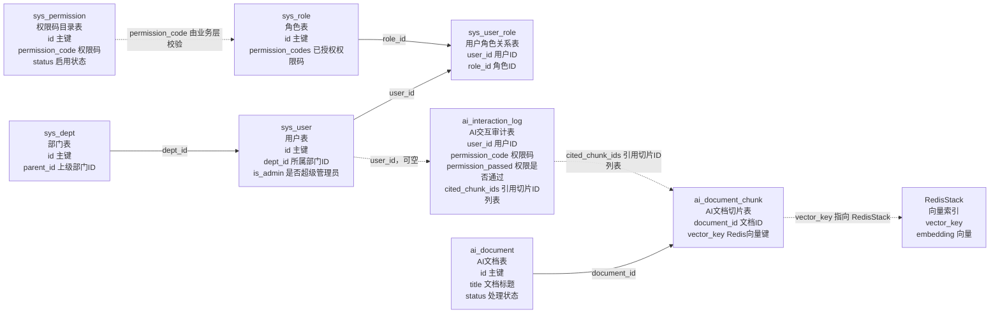

AI 关系里需要特别说明两点：

- `vector_key` 指向 RedisStack 中的向量数据，向量本体不存 MySQL。
- `cited_chunk_ids` 是 JSON 切片 ID 列表，MVP 阶段不单独拆引用关系表。

<details>
<summary>完整字段关系图备查，默认可不看</summary>

说明：这里是备查版关系图。每个字段后面都补了中文含义，但为了不让图过度拥挤，字段按“主键/关联字段/业务字段/审计字段”分组展示；字段全集仍以 SQL DDL 为准。

### 系统权限 ER 关系图

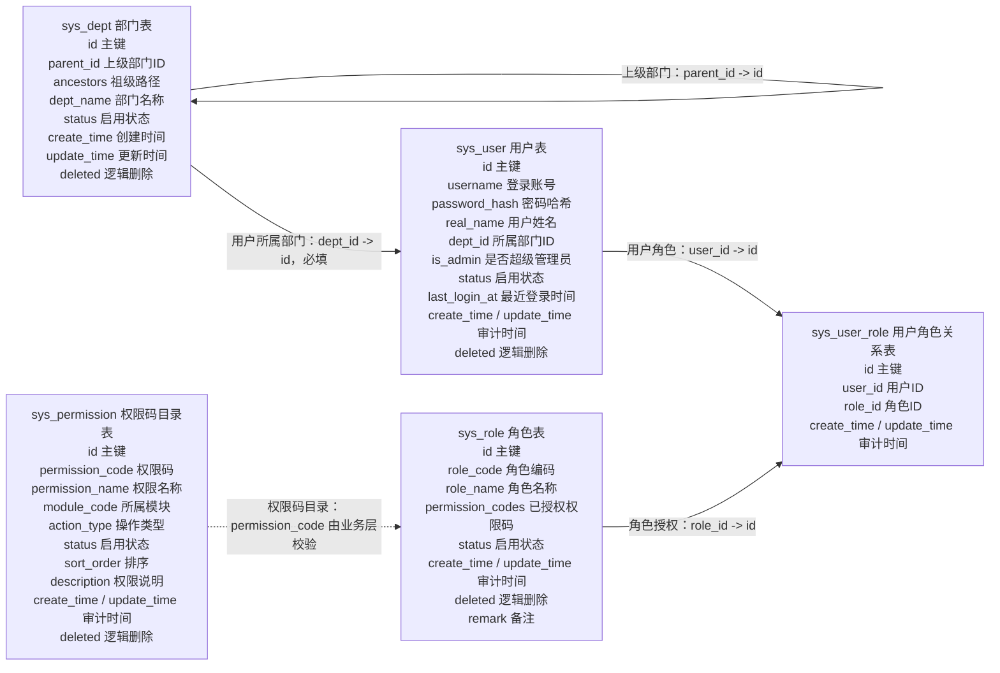

部门层级由业务层保证：停用父级时级联停用下级但不自动停用员工账号；有下级部门或员工归属时禁止删除；编辑接口和批量接口必须复用同一套校验与级联规则。

### 产品与库存余额 ER 关系图

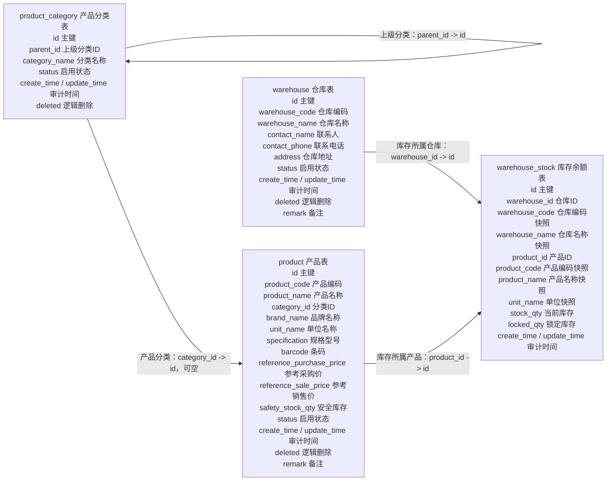

关系补充：

| 约束 | 字段 | 含义 |
|---|---|---|
| 产品编码唯一 | `product.product_code` | 一个产品编码只对应一个产品 |
| 分类层级合法 | `product_category.parent_id` | 上级不能为自身或自身下级；状态按父子级联约束维护 |
| 分类删除保护 | `product_category.id` | 有下级分类或仍被未删除产品关联时禁止删除 |
| 仓库编码唯一 | `warehouse.warehouse_code` | 一个仓库编码只对应一个仓库 |
| 库存余额唯一 | `warehouse_stock(warehouse_id, product_id)` | 一个仓库中的一个产品只保留一条库存余额 |

### 采购 ER 关系图

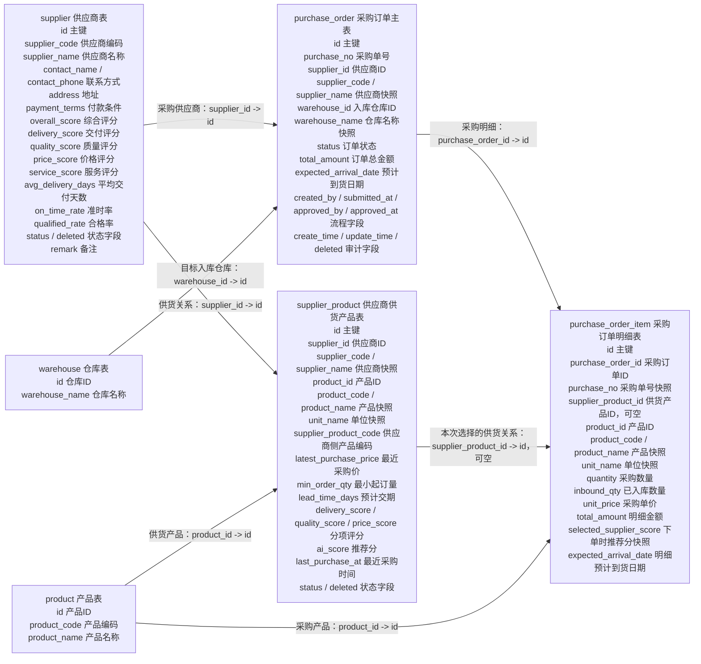

### 销售 ER 关系图

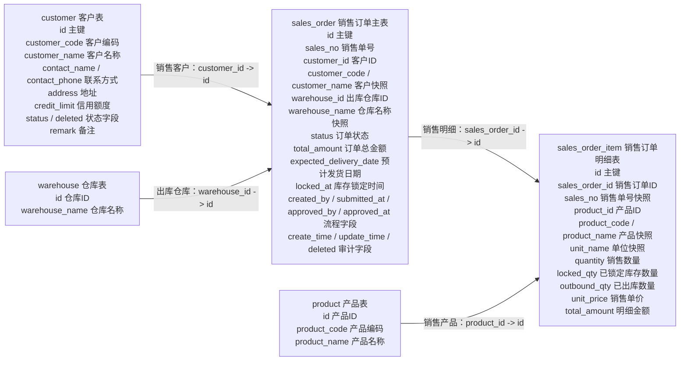

### 出入库流水 ER 关系图

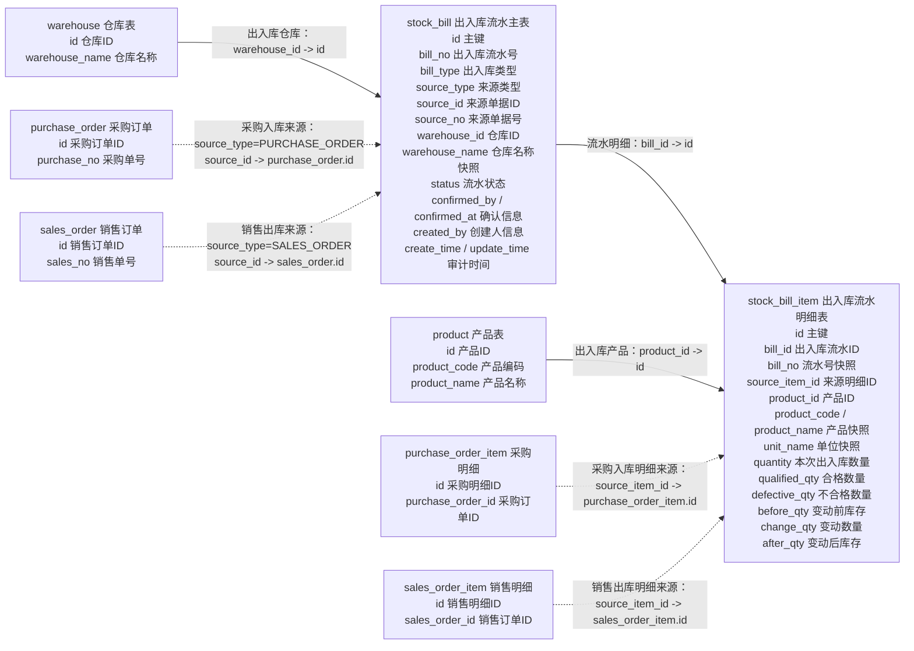

出入库来源追溯不是固定物理外键，而是由 `source_type` 决定 `source_id` 指向哪类业务单据。

| 出入库类型 | `stock_bill.bill_type` | `stock_bill.source_type` | `stock_bill.source_id` | `stock_bill_item.source_item_id` |
|---|---|---|---|---|
| 采购入库 | `PURCHASE_IN` | `PURCHASE_ORDER` | `purchase_order.id` | `purchase_order_item.id` |
| 销售出库 | `SALES_OUT` | `SALES_ORDER` | `sales_order.id` | `sales_order_item.id` |
| 采购退货 | `PURCHASE_RETURN` | `PURCHASE_RETURN_ORDER` | 后续采购退货单 ID | 后续采购退货明细 ID |
| 销售退货 | `SALES_RETURN` | `SALES_RETURN_ORDER` | 后续销售退货单 ID | 后续销售退货明细 ID |
| 库存调整 | `ADJUST_IN` / `ADJUST_OUT` | `STOCK_ADJUST` | 后续库存调整单 ID 或当前流水 ID | 后续库存调整明细 ID |

### AI / RAG ER 关系图

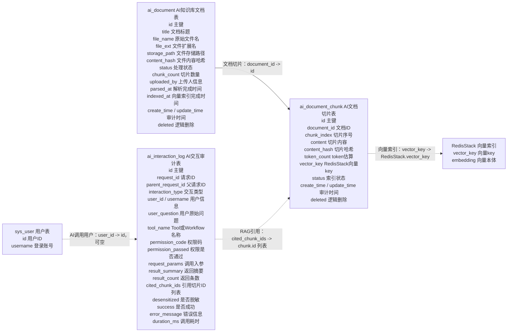

AI 关系里有两个特殊点：

- `ai_document_chunk.vector_key` 对应 RedisStack 中的向量 key，向量本体不存 MySQL。
- `ai_interaction_log.cited_chunk_ids` 用 JSON 保存引用的切片 ID 列表，不单独拆引用关系表，避免 MVP 阶段增加过多日志明细表。

</details>

## MVP 暂不设计的内容

这些内容不是忘记设计，而是为了第一版开发速度先延后。

| 暂不设计 | 当前替代方案 | 后续扩展 |
|---|---|---|
| 动态菜单表 | 前端静态路由 + 接口权限码 | 增加 `sys_menu` 并关联权限码 |
| 独立角色权限关系表 | `sys_role.permission_codes` JSON | 权限规模扩大后拆 `sys_role_permission` |
| 动态按钮元数据 | 核心写操作使用接口权限码 | 增加按钮资源与权限码映射 |
| 字段权限 | 暂不控制 | 增加敏感字段权限 |
| 仓库级数据权限 | 暂不控制 | 增加角色仓库范围 |
| 品牌表、单位表 | 存在 `product` 字段 | 主数据复杂后拆表 |
| SPU/SKU | `product` 直接代表可交易产品 | 商品体系复杂后拆分 |
| 库位、批次、序列号 | 先按仓库 + 产品管理库存 | 仓储精细化后扩展 |
| 单独库存流水表 | `stock_bill` / `stock_bill_item` 承担凭证 | 财务台账复杂后扩展 |
| 销售退货单、采购退货单 | 先复用 `SALES_RETURN`、`PURCHASE_RETURN` 出入库流水 | 退货流程复杂后补单据 |
| 通用业务审计表 | AI 先用 `ai_interaction_log`，普通业务靠状态和流水追溯 | 审计要求提高后新增 `audit_log` |
| AI 会话表、Prompt 表、Workflow 节点日志表 | 先用 `ai_interaction_log` 统一记录 | AI 功能复杂后拆分 |

## 后续扩展方向

第一版稳定后，可以按业务优先级逐步扩展：

1. 权限扩展：动态菜单、按钮权限、字段权限、部门和仓库数据范围。
2. 商品扩展：品牌、单位、SPU/SKU、条码多单位。
3. 仓储扩展：库位、批次、序列号、保质期、库存预警表。
4. 退货扩展：销售退货单、采购退货单、质检和退款流程。
5. 审计扩展：通用业务审计表和操作日志检索。
6. AI 扩展：采购建议 Workflow、销量预测、库存风险分析、供应商评分解释。
7. 财务扩展：应收应付、发票、付款、收款、对账和结算。

## 总结

当前数据库设计的核心思想是：先用较少的表跑通 ERP 主链路，再通过清晰的字段、状态、索引和快照冗余保证查询效率和可追溯性。

权限、库存、采购、销售和 AI 都做了 MVP 级简化，但每个简化点都保留了后续扩展方向。这样第一版能快速开发出来，同时不会影响后面继续演进成更完整的 ERP 系统。
