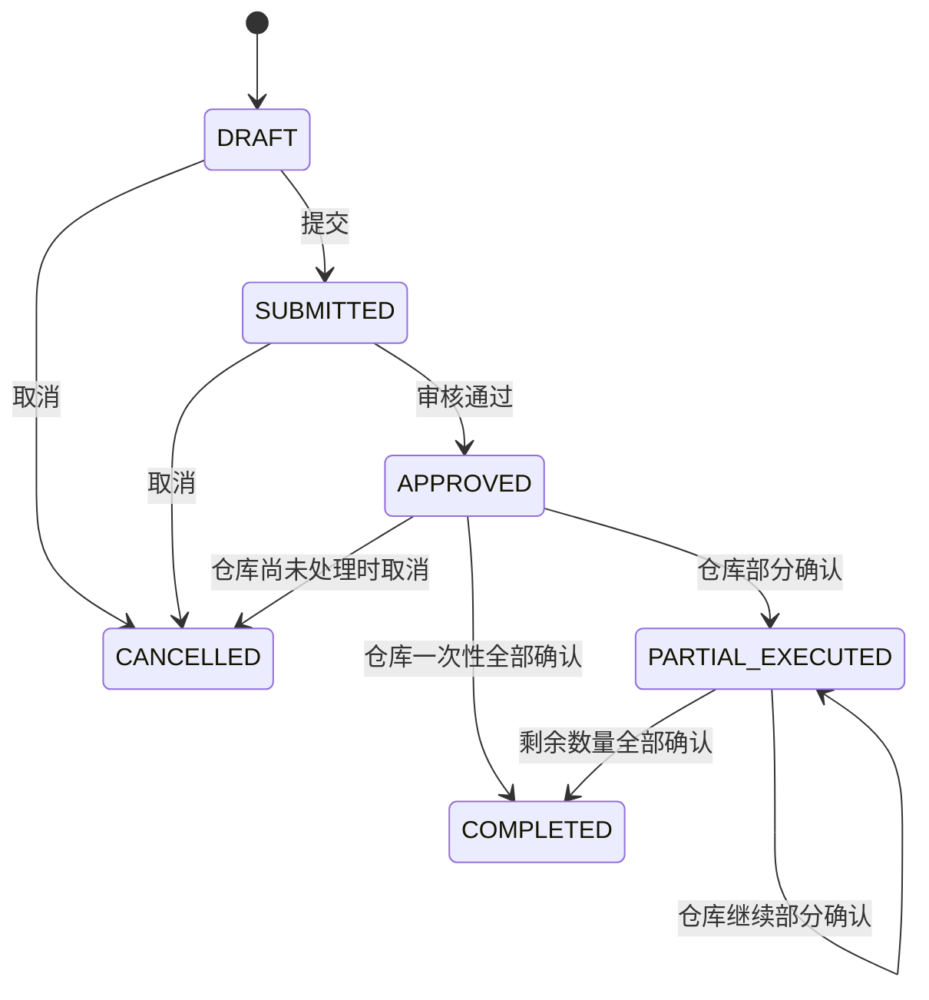
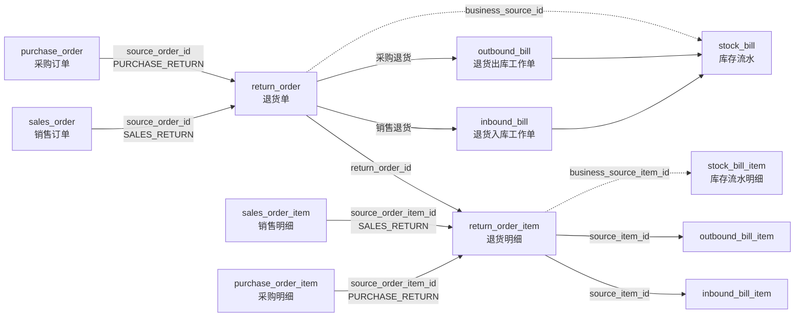

# MVP 销售退货与采购退货库表设计

## 模块归属与依赖

退货业务代码归属独立的 `erp-return` 模块，数据库仍只使用本文件定义的统一
`return_order` 与 `return_order_item` 两张表，不新增采购退货表或销售退货表。

- `erp-return`：退货主数据、来源契约、可退数量派生、状态回写，以及仓储回写适配器；该模块不得依赖采购或销售模块。
- `erp-purchase`：实现采购来源提供者；不再拥有退货实体、Mapper、Controller 或 Service。
- `erp-sales`：已实现销售来源提供者，支持销售退货来源订单与可退明细查询；不得写入无法闭环的半成品单据。
- `erp-warehouse`：只通过入库/出库回写端口通知来源业务；采购退货出库确认与退货进度回写在同一事务内完成。

## 设计目标

退货模块使用一套统一的 `return_order` / `return_order_item` 表，同时承接销售退货和采购退货。退货单负责表达退货申请、审核和执行进度；实际库存变化继续统一通过仓库模块的入库单、出库单和库存流水完成。采购退货审核流程可以调用仓储库存预占能力，但不得自行直接更新 `warehouse_stock`。

前端分别在销售模块和采购模块提供退货页面，但共用同一套数据模型：

- 销售退货：客户退回已出库商品，生成 `SALES_RETURN` 入库工作单。
- 采购退货：企业退回已入库商品给供应商，生成 `PURCHASE_RETURN` 出库工作单。

## 简化原则

- 只新增 `return_order` 和 `return_order_item` 两张表，不修改现有销售、采购、仓库和库存流水表结构。
- 不拆销售退货表和采购退货表，由 `return_type` 决定来源订单、往来单位和仓库执行方向。
- 不保存 `source_order_type` 和 `party_type`；它们都可以由不可修改的 `return_type` 唯一确定。
- 不设计财务结算状态、结算金额、退款单和换货订单关联；`handling_type` 只记录当前处理意向。
- 不在退货明细重复保存合格数量和不合格数量，销售退货质检结果由 `inbound_bill_item` 和 `stock_bill_item` 保存。
- 不设计 `CLOSED` 状态。仓库一旦开始执行，必须继续处理到 `processed_qty = approved_qty`。
- 退货明细是业务事实明细，不使用逻辑删除；只有草稿退货单允许增删明细。
- MVP 不强制创建物理外键，跨模块关系由业务层事务校验和索引保证。

## 枚举约定

### 退货类型 `return_type`

| 值 | 含义 | 原订单 | 往来单位 | 仓库方向 |
|---|---|---|---|---|
| `SALES_RETURN` | 销售退货 | `sales_order` | 客户 | 入库 |
| `PURCHASE_RETURN` | 采购退货 | `purchase_order` | 供应商 | 出库 |

`return_type` 创建后不可修改。后端必须根据该字段选择原订单表、原订单明细表和往来单位表，不能根据前端传入的名称或类型字符串猜测。

### 处理方式 `handling_type`

| 值 | 含义 |
|---|---|
| `REFUND` | 退款或退回货款 |
| `EXCHANGE` | 换货 |
| `OTHER` | 其他处理方式，具体内容写入备注 |

`handling_type` 只记录业务处理意向，本期不生成退款单、结算单或换货订单，也不据此直接改变库存。当前后端仅校验该字段非空，尚未强制上述枚举值。

### 退货原因 `reason_code`

| 值 | 含义 |
|---|---|
| `QUALITY_ISSUE` | 质量问题 |
| `DAMAGED` | 商品损坏 |
| `WRONG_ITEM` | 商品错发 |
| `QUANTITY_ERROR` | 数量错误 |
| `SPEC_MISMATCH` | 规格不符 |
| `NO_LONGER_NEEDED` | 不再需要 |
| `OTHER` | 其他原因 |

`return_reason` 当前对所有 `reason_code` 均为必填，最长 500 字；`reason_code` 同样仅校验非空，尚未由后端强制限制为上述枚举值。

### 退货状态 `status`

| 值 | 销售退货页面 | 采购退货页面 | 含义 |
|---|---|---|---|
| `DRAFT` | 草稿 | 草稿 | 可编辑、可删除、可提交 |
| `SUBMITTED` | 待审核 | 待审核 | 已提交审核；具备对应 `*:manage` 权限的用户仍可编辑并保持该状态 |
| `APPROVED` | 待退货入库 | 待退货出库 | 已审核，等待仓库处理 |
| `PARTIAL_EXECUTED` | 退货入库中 | 退货出库中 | 仓库已确认部分数量，剩余数量必须继续执行 |
| `COMPLETED` | 已完成 | 已完成 | 所有明细均满足 `processed_qty = approved_qty` |
| `CANCELLED` | 已取消 | 已取消 | 未产生仓储事实前取消，终态 |

审核不通过不增加 `REJECTED` 状态，也不提供审核退回；审核人如不通过可取消单据（`SUBMITTED -> CANCELLED`），原因写入 `status_reason`。本期不提供“部分执行后放弃剩余数量”的操作。

## 表：return_order（退货单主表）

| 字段                        | 类型              | 是否为空 | 默认值                 | 说明                                       |
| ------------------------- | --------------- | ---: | ------------------- | ---------------------------------------- |
| `id`                      | `bigint` PK     |    否 | —                   | 退货单ID，由 MyBatis-Plus `ASSIGN_ID` 生成      |
| `return_no`               | `varchar(64)`   |    否 | —                   | 退货单号，由后端生成，唯一                            |
| `return_type`             | `varchar(32)`   |    否 | —                   | `SALES_RETURN`、`PURCHASE_RETURN`，创建后不可修改 |
| `source_order_id`         | `bigint`        |    否 | —                   | 原销售订单ID或采购订单ID                           |
| `source_order_no`         | `varchar(64)`   |    否 | —                   | 原订单号快照，由后端查询写入                           |
| `party_id`                | `bigint`        |    否 | —                   | 销售退货为客户ID，采购退货为供应商ID                     |
| `party_code`              | `varchar(64)`   |    否 | —                   | 客户或供应商编码快照                               |
| `party_name`              | `varchar(200)`  |    否 | —                   | 客户或供应商名称快照                               |
| `warehouse_id`            | `bigint`        |    否 | —                   | 退货执行仓库ID                                 |
| `warehouse_name`          | `varchar(100)`  |    否 | —                   | 仓库名称快照                                   |
| `expected_execution_date` | `date`          |    是 | `NULL`              | 预计退货执行日期；草稿可空，提交前必填                      |
| `handling_type`           | `varchar(32)`   |    否 | `REFUND`            | `REFUND`、`EXCHANGE`、`OTHER`              |
| `reason_code`             | `varchar(32)`   |    否 | `OTHER`             | 退货原因编码                                   |
| `return_reason`           | `varchar(500)`  |    否 | `''`                | 退货原因补充说明                                 |
| `total_amount`            | `bigint`        |    否 | `0`                 | 当前有效退货总金额，按分（×100）保存，17600表示176.00            |
| `status`                  | `varchar(32)`   |    否 | `DRAFT`             | 退货单状态                                    |
| `status_reason`           | `varchar(500)`  |    否 | `''`                | 最近一次取消原因                            |
| `created_by_id`           | `bigint`        |    是 | `NULL`              | 创建人ID，来自当前登录用户                           |
| `created_by_name`         | `varchar(100)`  |    否 | `''`                | 创建人姓名快照                                  |
| `submitted_at`            | `datetime`      |    是 | `NULL`              | 提交时间                                     |
| `approved_by_id`          | `bigint`        |    是 | `NULL`              | 审核人ID                                    |
| `approved_by_name`        | `varchar(100)`  |    否 | `''`                | 审核人姓名快照                                  |
| `approved_at`             | `datetime`      |    是 | `NULL`              | 审核时间                                     |
| `create_time`             | `datetime`      |    否 | `CURRENT_TIMESTAMP` | 创建时间                                     |
| `update_time`             | `datetime`      |    否 | 自动更新                | 更新时间                                     |
| `deleted`                 | `tinyint`       |    否 | `0`                 | 逻辑删除：`0` 正常，`1` 删除                       |
| `remark`                  | `varchar(500)`  |    否 | `''`                | 备注                                       |
| `version`                 | `int`           |    否 | `0`                 | 乐观锁版本号                                   |

建议索引：

- 唯一索引 `uk_return_order_no(return_no)`。
- 来源查询索引 `idx_return_order_source(return_type, source_order_id)`。
- 往来单位查询索引 `idx_return_order_party(return_type, party_id)`。
- 仓库查询索引 `idx_return_order_warehouse(warehouse_id)`。
- 列表查询索引 `idx_return_order_status(return_type, deleted, status, create_time)`。

## 表：return_order_item（退货单明细表）

| 字段 | 类型 | 是否为空 | 默认值 | 说明 |
|---|---|---:|---|---|
| `id` | `bigint` PK | 否 | — | 退货明细ID |
| `return_order_id` | `bigint` | 否 | — | 退货单主表ID |
| `source_order_item_id` | `bigint` | 否 | — | 原销售订单明细ID或采购订单明细ID |
| `product_id` | `bigint` | 否 | — | 产品ID |
| `product_code` | `varchar(64)` | 否 | — | 产品编码快照 |
| `product_name` | `varchar(200)` | 否 | — | 产品名称快照 |
| `unit_name` | `varchar(32)` | 否 | `'件'` | 单位名称快照 |
| `quantity_precision` | `tinyint` | 否 | `0` | 数量小数位快照，范围 0～2 |
| `source_fulfilled_qty` | `bigint` | 否 | `0` | 创建退货明细时原订单累计已出库或已入库数量快照，放大100倍保存 |
| `requested_qty` | `bigint` | 否 | `0` | 申请退货数量，放大100倍保存，500表示5.00 |
| `approved_qty` | `bigint` | 否 | `0` | 审核通过数量，放大100倍保存 |
| `processed_qty` | `bigint` | 否 | `0` | 仓库累计确认的实际处理总量，放大100倍保存 |
| `unit_price` | `bigint` | 否 | `0` | 原订单单价快照，按分（×100）保存，3520表示35.20 |
| `total_amount` | `bigint` | 否 | `0` | 当前有效明细金额，按分（×100）保存，17600表示176.00 |
| `create_time` | `datetime` | 否 | `CURRENT_TIMESTAMP` | 创建时间 |
| `update_time` | `datetime` | 否 | 自动更新 | 更新时间 |
| `remark` | `varchar(500)` | 否 | `''` | 明细备注 |

建议索引：

- 唯一索引 `uk_return_order_item_source(return_order_id, source_order_item_id)`，防止一张退货单重复添加同一条原订单明细。
- 主表查询索引 `idx_return_order_item_order(return_order_id)`。
- 产品查询索引 `idx_return_order_item_product(product_id)`。
- 来源明细查询索引 `idx_return_order_item_source_item(source_order_item_id)`。

建议检查约束：

- `quantity_precision BETWEEN 0 AND 2`。
- `source_fulfilled_qty > 0`。
- `requested_qty > 0 AND requested_qty <= source_fulfilled_qty`。
- `approved_qty >= 0 AND approved_qty <= requested_qty`。
- `processed_qty >= 0 AND processed_qty <= approved_qty`。

以上检查约束只能校验单行数据。跨退货单累计可退数量必须由 Service 在事务中锁定原订单明细后重新聚合校验。

## 数量精度约定

退货数量统一使用 `bigint` 按 100 倍整数保存；交易单价和金额也统一使用 `bigint` 按分（×100）保存，与采购、销售和仓库模块保持一致，产品数量精度限制为 0～2 位。接口按业务小数返回，后端负责 ×100/÷100 转换。

如果现有数据全部符合最多两位小数，则保持本设计；如果存在有效三、四位小数，必须先完成数据清理或重新评估退货数量精度，不能直接截断。

后端进行退货数量与仓库数量转换时必须使用 `BigDecimal` 精确乘除 100，禁止使用 `double`。

## 字段来源与前端提交边界

前端使用真实接口提供原订单、仓库和订单明细选择器，但选择器只降低误操作，最终数据仍由后端重新查询确认。

| 页面字段 | 数据库字段 | 来源 | 前端可编辑 | 提交要求 |
|---|---|---|---:|---|
| 退货类型 | `return_type` | 页面固定路由或创建入口 | 否 | 创建时提交枚举，创建后不可修改 |
| 原订单 | `source_order_id` | 原订单分页选择接口 | 是 | 只提交ID |
| 原订单号 | `source_order_no` | 后端根据原订单ID查询 | 否 | 不提交 |
| 客户/供应商 | `party_id/code/name` | 后端从原订单读取 | 否 | 不提交 |
| 退货仓库 | `warehouse_id` | 仓库分页选择接口 | 是 | 只提交ID |
| 仓库名称 | `warehouse_name` | 后端根据仓库ID查询 | 否 | 不提交 |
| 退货产品 | `source_order_item_id` | 原订单明细接口 | 是 | 只提交原订单明细ID |
| 产品快照 | `product_id/code/name/unit_name` | 后端从原订单明细读取 | 否 | 不提交 |
| 数量精度 | `quantity_precision` | 后端从来源订单明细快照读取 | 否 | 不提交 |
| 申请数量 | `requested_qty` | 用户输入 | 是 | 必填，按数量精度校验 |
| 审核数量 | `approved_qty` | 审核动作 | 审核人可编辑 | 仅审核接口提交 |
| 已处理数量 | `processed_qty` | 仓库确认回写 | 否 | 不提交 |
| 单价 | `unit_price` | 后端从原订单明细读取 | 否 | 不提交 |
| 金额 | `total_amount` | 后端计算 | 否 | 不提交 |
| 状态和审计字段 | `status`、人员和时间字段 | 后端状态动作与登录上下文 | 否 | 不允许普通保存接口提交 |

销售退货页面只能选择已有实际出库数量的销售订单明细；采购退货页面只能选择已有实际入库数量的采购订单明细。客户或供应商由原订单自动带出，不能在退货单中单独更换。

## 金额规则

`total_amount` 当前表示申请金额快照，不是随状态变化的有效退货金额：

- 创建或编辑时，后端按 `requested_qty × unit_price` 计算明细金额，并汇总写入主表。
- 审核只更新 `approved_qty`；仓储确认只更新 `processed_qty` 和状态，两者均不重算主表或明细金额。
- 主表 `return_order.total_amount` 始终等于全部明细申请金额快照之和；取消单保留该历史快照，不代表应退款、应付款或实际执行金额。

金额使用 `RoundingMode.HALF_UP` 四舍五入到两位。若后续需要审核通过金额或实际执行金额，必须新增明确字段或同步改造状态动作、迁移和测试，不能误用当前 `total_amount`。

## 可退数量与占用规则

原订单可退基数使用实际履约数量，而不是原订单下单数量：

- 销售退货可退基数：`sales_order_item.outbound_qty`。
- 采购退货可退基数：`purchase_order_item.inbound_qty`。

有效占用数量按退货单状态计算：

| 状态 | 占用数量 |
|---|---:|
| `DRAFT` | 0 |
| `SUBMITTED` | `requested_qty` |
| `APPROVED` | `approved_qty` |
| `PARTIAL_EXECUTED` | `approved_qty` |
| `COMPLETED` | `processed_qty`，且等于 `approved_qty` |
| `CANCELLED` | 0 |

计算公式：

```text
销售明细剩余可退数量（availableReturnQty）
= max(0, sales_order_item.outbound_qty - 该销售明细在其他有效退货单中的占用数量)

销售退货来源明细的 stockAvailableQty
= 0（当前实现为入库操作跳过库存查询；该值不参与是否可退的判断）

采购明细剩余可退数量（availableReturnQty）
= max(0, min(
    purchase_order_item.inbound_qty - 该采购明细在其他有效退货单中的占用数量,
    warehouse_stock.stock_qty - warehouse_stock.locked_qty
  ))
```

前端只能使用 `availableReturnQty` 判断或限制申请数量：采购退货的库存为 0 会导致 `availableReturnQty` 为 0；销售退货的 `stockAvailableQty` 为 0 不代表不可退，因为客户退回的实物将在后续入库确认时增加库存。

提交和审核退货单时，后端以来源订单 ID 获取分布式锁，并在锁内重新聚合有效退货单占用数量、校验来源明细快照，避免并发超额退货。草稿不占用数量；提交后开始占用；审核数量小于申请数量时，未通过部分自动释放。

## 状态流转与动作规则



| 当前状态 | 可见动作 | 可编辑字段 | 动作前校验 | 结果状态 |
|---|---|---|---|---|
| `DRAFT` | 保存、提交、删除、取消 | 原订单、仓库、日期、处理方式、原因、备注、明细 | 提交时校验必填字段、可退数量和来源有效性 | `DRAFT`、`SUBMITTED`、`CANCELLED` |
| `SUBMITTED` | 编辑、审核通过、取消 | 具备对应 `*:manage` 权限时可全量编辑原订单、仓库、日期、处理方式、原因、备注和明细；审核时填写各明细审核数量 | 编辑校验乐观锁、来源订单、仓库、精度和可退数量；审核在来源订单锁内重新聚合校验 | `SUBMITTED`、`APPROVED`、`CANCELLED` |
| `APPROVED` | 查看、取消 | 业务字段不可编辑 | 取消仅允许所有明细 `processed_qty = 0`，且在同一事务内取消未确认工作单；采购退货还须释放实物库存预占 | `APPROVED`、`CANCELLED` |
| `PARTIAL_EXECUTED` | 查看 | 不可编辑 | 必须继续执行剩余审核数量 | `PARTIAL_EXECUTED`、`COMPLETED` |
| `COMPLETED` | 查看 | 不可编辑 | 终态，不可撤回 | `COMPLETED` |
| `CANCELLED` | 查看 | 不可编辑 | 终态，不可恢复 | `CANCELLED` |

只有 `DRAFT` 可以逻辑删除。删除草稿主表时，同一事务内物理删除对应明细；`SUBMITTED` 后禁止增删明细。

## 仓库与库存流水关联

### 销售退货

```text
return_order.return_type = SALES_RETURN
return_order.source_order_id -> sales_order.id
return_order_item.source_order_item_id -> sales_order_item.id

inbound_bill.inbound_type = SALES_RETURN
inbound_bill.source_type = SALES_RETURN_ORDER
inbound_bill.source_id = return_order.id
inbound_bill.source_no = return_order.return_no
inbound_bill.source_party_id = return_order.party_id
inbound_bill.entry_mode = SOURCE_GENERATED

inbound_bill_item.source_item_id = return_order_item.id
```

仓库确认销售退货入库后：

```text
stock_bill.bill_type = SALES_RETURN
stock_bill.business_source_id = return_order.id
stock_bill.business_source_no = return_order.return_no

stock_bill_item.business_source_item_id = return_order_item.id
```

销售退货的 `processed_qty` 按仓库确认的实际处理总量累计，即本次 `qualified_qty + defective_qty`。合格与不合格数量保存在仓库工作单和库存流水明细，不重复写入退货明细。

### 采购退货

```text
return_order.return_type = PURCHASE_RETURN
return_order.source_order_id -> purchase_order.id
return_order_item.source_order_item_id -> purchase_order_item.id

outbound_bill.outbound_type = PURCHASE_RETURN
outbound_bill.source_type = PURCHASE_RETURN_ORDER
outbound_bill.source_id = return_order.id
outbound_bill.source_no = return_order.return_no
outbound_bill.source_party_id = return_order.party_id
outbound_bill.entry_mode = SOURCE_GENERATED

outbound_bill_item.source_item_id = return_order_item.id
```

仓库确认采购退货出库后：

```text
stock_bill.bill_type = PURCHASE_RETURN
stock_bill.business_source_id = return_order.id
stock_bill.business_source_no = return_order.return_no

stock_bill_item.business_source_item_id = return_order_item.id
```

采购退货审核通过时，来源服务必须通过仓储库存预占能力，在生成 `SOURCE_GENERATED` 待确认出库单的同一事务内，按各明细 `approved_qty - processed_qty` 汇总校验可用库存并增加 `warehouse_stock.locked_qty`。这项实物预占与 `return_order_item` 的可退额度占用是两套不同的约束：前者防止库存被其他出库消耗，后者防止同一采购明细重复退货。

采购退货确认时必须同时校验 `stock_qty` 和对应的 `locked_qty`，并同步扣减二者；部分确认只消耗本次数量，剩余锁定量继续保留给后续工作单。生成下一张工作单不得再次增加锁定量。`APPROVED` 且所有明细未处理时取消，必须在同一事务内取消待确认工作单并释放全部 `approved_qty - processed_qty`；系统生成工作单不得走仓储通用取消接口。

### 工作单生成与幂等规则

- 同一张退货单同一时间最多存在一张 `DRAFT` 或 `PENDING_CONFIRM` 的仓库工作单。
- 在来源订单分布式锁和事务内检查现有未确认工作单，防止重复生成。
- 工作单只包含 `approved_qty > processed_qty` 的明细。
- 工作单 `plan_qty` 对应审核数量，`processed_qty` 对应生成本单前的退货累计处理数量，`current_qty` 由仓库填写，`pending_qty` 由后端计算。
- 对采购退货，首次审核通过生成工作单时才按 `approved_qty - processed_qty` 完成实物库存预占；后续因部分执行生成工作单时只带入剩余计划数量，不得重复预占。
- 仓库确认必须保证幂等；同一工作单重复确认不得重复增加 `return_order_item.processed_qty`。
- 所有明细 `processed_qty = approved_qty` 后，退货单自动进入 `COMPLETED`。

## 销售退货质检与可用库存

销售退货允许仓库记录合格数量和不合格数量：

```text
current_qty = qualified_qty + defective_qty
```

退货单 `processed_qty` 累计 `current_qty`，表示仓库实际处理总量。是否把不合格品计入可用库存属于仓库库存口径，不由退货表决定。

本设计推荐：

```text
stock_bill_item.quantity = current_qty
stock_bill_item.change_qty = qualified_qty
warehouse_stock.stock_qty 只增加 qualified_qty
```

不合格品继续保留在 `inbound_bill_item.defective_qty` 和 `stock_bill_item.defective_qty` 中用于追溯，但不进入可销售库存。后续如果需要查询不合格品实时余额，应新增库存状态或隔离库存模型，不能把它混入当前可用库存。

## 表间关系



`source_order_id`、`source_order_item_id`、`party_id` 都是由 `return_type` 决定目标表的多态业务关联，不能创建单一物理外键。`return_order_item.return_order_id` 是固定主从关联，但仍沿用项目 MVP 不强制物理外键的约定。

## 实施前兼容性检查

- 检查销售明细 `outbound_qty` 和采购明细 `inbound_qty` 是否存在超过两位小数的数据。
- 检查现有仓库确认逻辑是否把销售退货不合格数量计入了 `warehouse_stock.stock_qty`，并按本设计统一口径。
- 检查 `SALES_RETURN_ORDER`、`PURCHASE_RETURN_ORDER` 在 Java 枚举、OpenAPI、Mock 和前端映射中的值完全一致。
- 检查仓库工作单确认事务能够调用退货来源回写逻辑，并避免仓库模块与退货模块形成循环依赖。
- 退货 DDL 与幂等种子已落在 `docs/database/sql/008_mvp_return.sql`；采购退货 `APPROVED` 和 `PARTIAL_EXECUTED` 种子同步反映未处理数量对应的实物锁定，`APPROVED` 种子同步包含待确认仓库工作单，`PARTIAL_EXECUTED`、`COMPLETED` 种子同步包含已确认工作单、库存流水及最终库存余额，确保 `processed_qty` 可按退货单和退货明细追溯。接口、页面和后端实现仍以本文档为退货字段、状态、数量和来源关联的权威契约。

## 测试场景

- 销售退货只能选择实际已出库的销售订单和明细。
- 采购退货只能选择实际已入库的采购订单和明细。
- 前端只提交来源ID、仓库ID和用户输入字段，后端重新查询并保存所有快照字段。
- 多张退货单并发提交时不能超过同一原订单明细的可退数量。
- 审核数量小于申请数量时，未审核通过的数量立即释放。
- 审核通过后生成正确方向的仓库工作单，重复请求不能生成多张活动工作单。
- 仓库部分确认后，销售退货页面显示“退货入库中”，采购退货页面显示“退货出库中”，不能取消或放弃剩余数量。
- 所有审核数量处理完后自动进入“已完成”。
- 销售退货合格与不合格数量之和等于本次处理数量，不合格品不进入可用库存。
- 采购退货审核通过时可用库存不足返回冲突，审核状态、工作单和实物锁定量必须整体回滚；确认时锁定库存不足同样不得生成库存流水或回写处理数量。
- 库存流水能够通过 `business_source_id` 和 `business_source_item_id` 追溯到退货单及明细。
