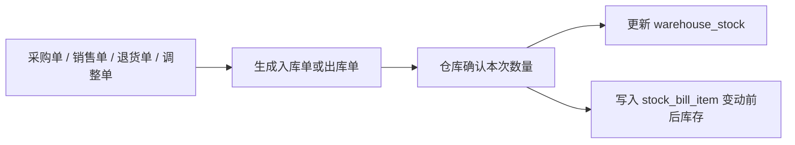

# 传统 ERP 核心架构设计思考

本文面向面试表达，说明本项目传统 ERP 主体为什么采用模块化单体、MVP 极简表设计、入库单/出库单/库存流水分层、适度冗余和受控业务服务，而不是一开始做复杂的全量 ERP 架构。

---

## 1. 设计定位

本项目的核心不是“AI 直接管理 ERP”，而是：

```text
ERP 业务系统是主干。
AI 是自然语言入口和分析建议层。
所有业务动作最终都必须回到 ERP Service。
```

所以传统 ERP 部分必须先保证三件事：

| 目标 | 说明 |
|---|---|
| 业务闭环 | 产品、仓库、采购、销售、退货、库存能完整跑通 |
| 数据一致 | 采购入库、销售出库、库存数量、库存流水一致 |
| 可扩展 | MVP 简单，但后续能扩展权限、批次、售后结算、AI 采购建议 |

---

## 2. 总体架构选择

项目采用 **模块化单体架构**。

```text
erp-admin
  ├─ erp-common
  ├─ erp-security
  ├─ erp-system
  ├─ erp-product
  ├─ erp-warehouse
  ├─ erp-purchase
  ├─ erp-sales
  ├─ erp-ai
  └─ erp-job
```

选择模块化单体的原因：

| 方案 | 优点 | 问题 | 结论 |
|---|---|---|---|
| 单体应用 | 开发快、部署简单 | 模块边界容易乱 | 适合 MVP，但必须按模块拆包 |
| 微服务 | 边界清晰、独立扩展 | 分布式事务、部署、调用链复杂 | MVP 阶段过重 |
| 模块化单体 | 保持单体简单，同时保留领域边界 | 需要约束模块依赖 | 推荐 |

面试表达重点：

> 我没有一开始拆微服务，因为 ERP 的采购、销售、库存强事务关系非常多。MVP 阶段用模块化单体可以降低分布式复杂度，同时通过 Maven 子模块划清领域边界，后期如果某个模块压力变大，再按模块拆服务。

---

## 3. 模块边界设计

| 模块 | 责任 | 不负责什么 |
|---|---|---|
| `erp-security` | 登录、角色、权限码、当前用户上下文 | 不处理具体业务规则 |
| `erp-system` | 用户、角色、部门管理 | 不处理采购、销售、库存 |
| `erp-product` | 产品基础资料、分类 | 不保存库存数量 |
| `erp-warehouse` | 仓库、库存余额、入库单、出库单、库存流水 | 不决定采购价格和销售价格 |
| `erp-purchase` | 供应商、采购订单、采购入库流程 | 不直接绕过仓储模块改库存 |
| `erp-sales` | 客户、销售订单、销售出库流程 | 不直接绕过仓储模块改库存 |
| `erp-return` | 统一退货单、采购退货出库、销售退货入库与回写 | 不直接绕过仓储模块改库存 |
| `erp-ai` | RAG、Tool、Agent 编排、分析建议 | 不直接修改业务数据 |
| `erp-job` | 定时统计、预警扫描、分析刷新 | 不承载核心交易逻辑 |

关键原则：

- 采购入库、销售出库最终都必须调用仓储库存服务。
- AI Tool 必须调用已有业务 Service，不直接查表或写表。
- 产品表只维护基础资料，库存数量归仓储模块管理。

---

## 4. 数据库设计总览

MVP 阶段先控制表数量，按“能跑通核心业务 + 后续可扩展”设计。

| 模块 | MVP 表 | 设计取舍 |
|---|---|---|
| 系统权限 | `sys_dept`、`sys_user`、`sys_role`、`sys_user_role` | 权限码先放角色 JSON，暂不拆菜单权限表 |
| 产品 | `product_category`、`product` | 品牌、单位、规格直接放产品表 |
| 仓库库存 | `warehouse`、`warehouse_stock`、`inbound_bill`、`inbound_bill_item`、`outbound_bill`、`outbound_bill_item`、`stock_bill`、`stock_bill_item` | 入库单/出库单承接待确认仓库作业，库存流水只记录已确认库存事实 |
| 采购 | `supplier`、`supplier_product`、`purchase_order`、`purchase_order_item` | 供应商、供货产品、采购订单和采购明细 |
| 销售 | `customer`、`sales_order`、`sales_order_item` | 客户、销售订单和销售明细 |
| 退货 | `return_order`、`return_order_item` | 采购和销售退货共用统一退货单；审核后生成仓储入库/出库工作单 |

---

## 5. MVP 简化思路

ERP 很容易一开始就设计过重，比如菜单权限、岗位、库位、批次、序列号、SPU/SKU、审批流、退货流、财务结算全部铺开。这个项目先选择 MVP 极简路线。

| 原本可做 | MVP 处理 | 后续扩展 |
|---|---|---|
| 菜单权限表 | 暂不做，页面固定显示，接口校验权限码 | 拆 `sys_menu`、`sys_permission` |
| 数据权限 | 暂不做细粒度过滤 | 增加部门、仓库、自定义范围 |
| 品牌/单位表 | 直接存在 `product` 字段 | 拆品牌表、单位表 |
| SPU/SKU | `product` 直接代表可采购商品 | 后续拆 SPU/SKU |
| 库位/批次 | 暂不做 | 增加库位、批次、序列号 |
| 财务库存台账表 | 先由 `stock_bill` / `stock_bill_item` 承担已确认库存凭证 | 后续如账务要求更高再拆库存台账 |
| 审批流 | MVP 用状态流转 | 后续接入独立审批模块 |

这个取舍的核心是：**先把采购、销售、库存主链路跑通，再补复杂能力。**

---

## 6. 库存设计思想

库存是 ERP 最容易出错的部分，所以设计上分成三类数据。

| 表 | 作用 | 特点 |
|---|---|---|
| `warehouse_stock` | 当前库存余额 | 查询快，按仓库 + 产品唯一 |
| `inbound_bill` / `outbound_bill` | 待确认仓库作业单 | 记录来源、往来方、计划数量、本次数量和剩余数量 |
| `stock_bill` / `stock_bill_item` | 已确认库存流水凭证 | 记录产品、变动前、变动数量、变动后 |

库存更新流程：



为什么拆入库单/出库单和库存流水？

因为采购单审核并不代表货已经到达，销售单审核也不代表货已经出库。MVP 暂无物流模块时，需要仓库人员确认本次数量后才改变库存：

```text
采购单审核 -> 待确认入库单 -> 确认入库 -> 库存流水
销售单审核 -> 待确认出库单 -> 确认出库 -> 库存流水
```

入库单/出库单处理仓库作业和分批数量，库存流水只记录已经确认的库存事实。这样既能查来源单据，也能避免把待入库、待出库误认为库存已经变化。

后续如果有更复杂的财务库存台账、批次成本、月结存等要求，再拆独立库存台账表。

---

## 7. 采购、销售、库存的一致性

采购和销售不能直接改库存，必须通过仓储模块统一处理。

采购入库：


销售出库：


这样设计的好处：

- 库存改动入口统一。
- 采购、销售和库存可以互相追溯。
- 销售退货、采购退货已复用同一套入库单/出库单和库存流水，并由统一退货单承接申请、审核和进度回写。
- AI 查询库存时优先读取库存余额，需要解释变化原因时再读取入库单、出库单和库存流水。

---

## 8. 适度冗余的原因

ERP 数据量大，列表查询频繁，如果所有页面都实时多表联查，会影响性能和开发效率。因此本项目在业务表中适度冗余名称字段。

| 冗余字段 | 出现场景 | 原因 |
|---|---|---|
| `product_code`、`product_name` | 采购明细、销售明细、库存明细 | 历史单据需要保留产品快照 |
| `warehouse_name` | 库存、入库单、出库单、库存流水 | 列表查询减少联表 |
| `unit_name` | 产品、单据明细 | 单位变化不影响历史单据 |
| `supplier_name` | 采购订单 | 方便列表展示和历史追溯 |
| `customer_name` | 销售订单 | 方便列表展示和历史追溯 |

面试表达重点：

> 我不是为了偷懒而冗余，而是 ERP 的历史单据需要快照语义。比如产品名称后续改了，历史采购单仍然应该显示当时的产品名称。同时适度冗余也能减少大表列表的多表联查。

---

## 9. 权限设计思想

权限模块也采用 MVP 简化策略。

第一阶段：

```text
用户
角色
角色权限码 JSON
接口进入时校验权限码
```

不做：

```text
菜单权限
按钮权限
字段权限
仓库数据权限
自定义数据范围
```

原因是前期目标是先跑通业务流程。页面可以都展示，用户点击进入或查询大表时再校验是否有权限。

后续扩展路径：

```text
sys_role.permission_codes
  -> 按模块拆出权限码配置
  -> 如需要菜单控制，再拆 sys_menu
  -> 如需要细粒度授权，再拆 sys_permission / sys_role_permission
  -> 数据权限 / 字段权限
```

这是一种从简单到复杂的权限演进，而不是一次性设计完所有权限表。

---

## 10. 与 AI 模块的关系

传统 ERP 是 AI 的数据和动作基础。

AI 不能直接绕过业务层：

```text
AI Agent
  -> 受控 Tool
  -> 权限校验
  -> ERP Service
  -> MySQL
```

这样做的原因：

- 普通接口和 AI Tool 使用同一套业务规则。
- AI 查询不能绕过用户权限。
- AI 生成采购建议只是建议，用户确认后才生成采购单草稿。
- AI 做销量预测、采购建议时，依赖的是 ERP 已沉淀的销售、库存、供应商数据。

所以这个项目不是“AI 替代 ERP”，而是 **ERP 作为确定性业务系统，AI 作为智能分析和自然语言入口**。

---

## 11. 后续扩展路线

| 阶段 | 扩展点 | 说明 |
|---|---|---|
| MVP | 产品、仓库、采购、销售、退货、库存主流程 | 已跑通进销存与退货交易闭环 |
| 阶段 2 | 细粒度权限、菜单权限、数据权限 | 增强企业内部管控 |
| 阶段 3 | 退款、换货、质检等售后能力 | 在已完成退货单与仓储执行基础上完善售后闭环 |
| 阶段 4 | SKU、批次、库位、序列号 | 支撑复杂商品和仓储 |
| 阶段 5 | 审批流、财务结算 | 支撑正式企业流程 |
| 阶段 6 | AI 采购建议、多 Agent 编排 | 从查询系统升级为决策辅助系统 |

---

## 12. 面试表达总结

可以这样回答：

> 传统 ERP 部分我采用模块化单体架构，而不是一开始拆微服务。因为采购、销售、库存之间强一致性要求比较高，MVP 阶段拆微服务会带来分布式事务和部署复杂度。我按领域拆成产品、仓库、采购、销售、权限、AI 等 Maven 子模块，保持部署简单，同时保留模块边界。
>
> 数据库设计上我没有一开始铺满所有 ERP 表，而是做 MVP 极简设计。比如权限先用角色权限码，不做菜单和按钮权限；产品先不拆 SPU/SKU；仓库先不做库位、批次和序列号。库存部分我重点设计了 `warehouse_stock`、`inbound_bill / outbound_bill` 和 `stock_bill / stock_bill_item`，用库存余额表负责快速查询，用入库单/出库单承接待确认作业，用库存流水负责已确认库存事实和溯源。
>
> 这个设计的核心是先跑通采购、销售、库存主链路，同时每个简化点都有明确扩展路径。后续 AI 采购建议也是建立在这套稳定的 ERP 业务服务之上，AI 不直接改数据，只通过受控 Tool 调用已有 Service。

这个回答能体现三个能力：

- 能做业务建模，不只是写 CRUD。
- 能做架构取舍，不盲目复杂化。
- 能考虑后续 AI、权限、库存和性能扩展。
