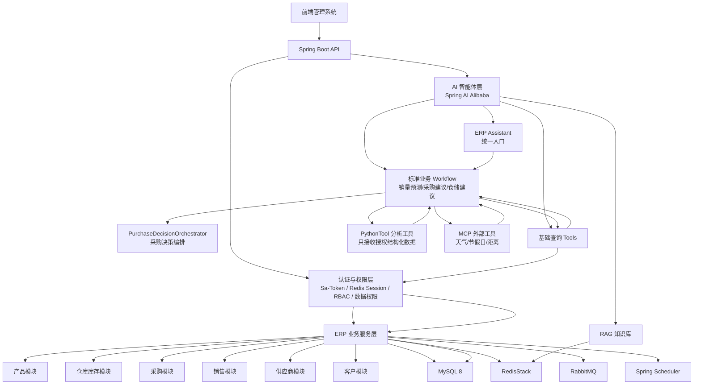
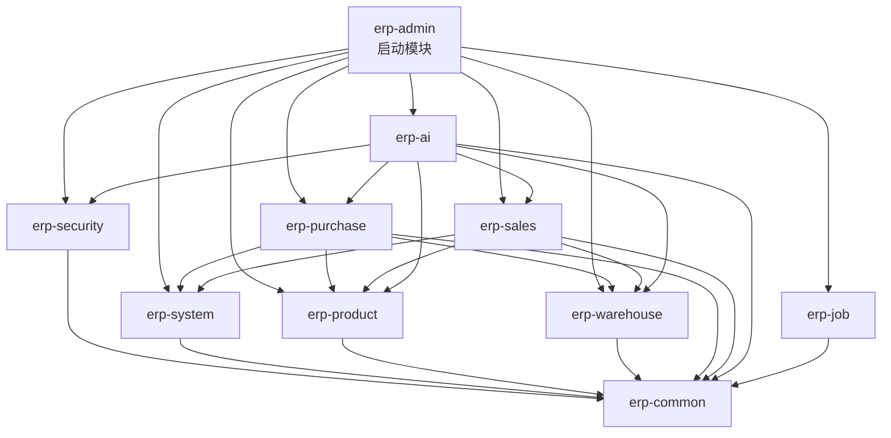
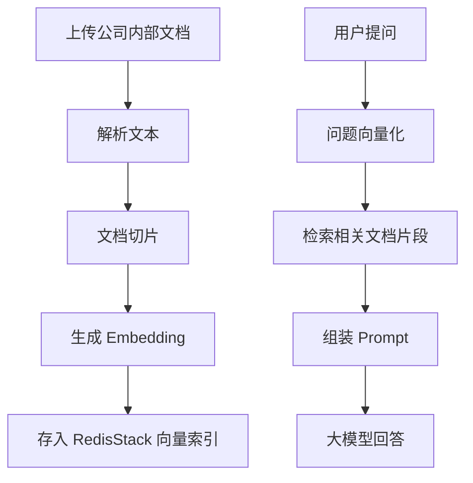
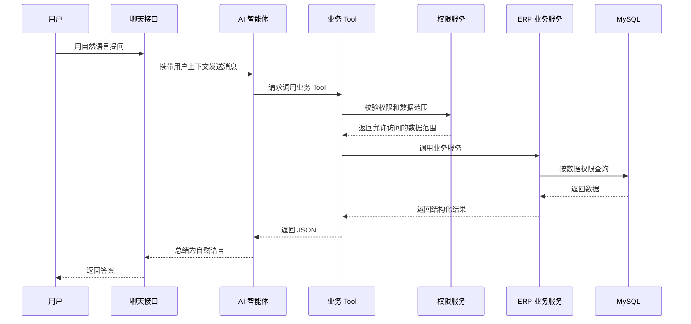
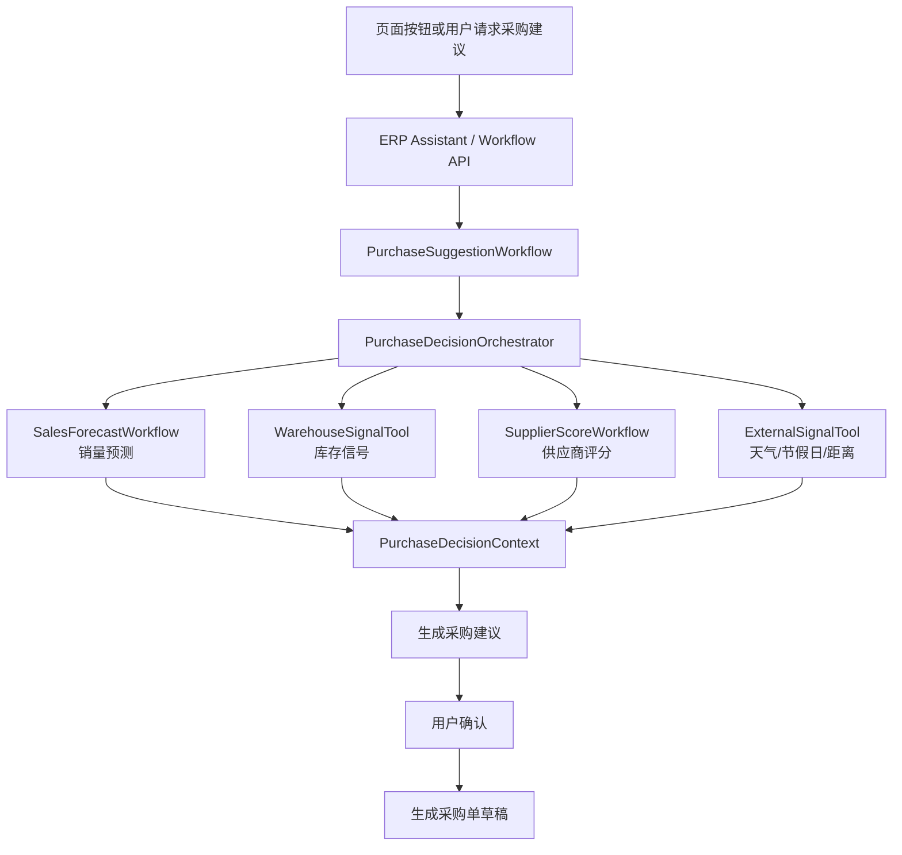
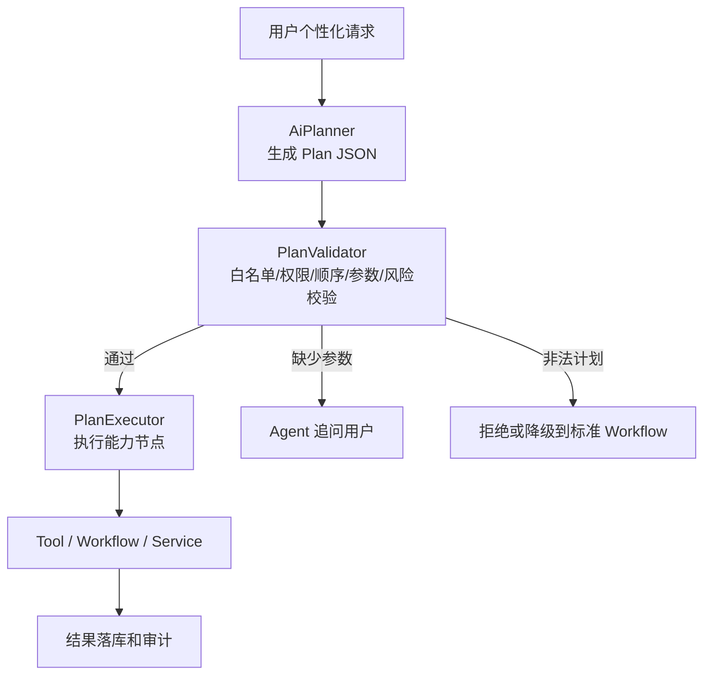
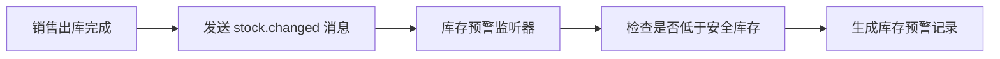

# ERP + AI 智能体项目设计文档

## 1. 项目介绍

本项目计划搭建一个面向企业内部管理的 ERP 系统，覆盖产品、仓库、采购、销售、供应商、客户等核心业务模块，并在传统 ERP 能力之上接入 AI 智能体。

系统的核心原则是：

```text
ERP 业务系统是主干。
AI 智能体是自然语言入口。
AI 只能通过受控 Tool 调用已有业务能力。
AI 不能绕过权限体系直接查询或修改数据。
```

项目第一阶段先完成基础 ERP 能力和权限体系，再逐步接入 RAG 知识库问答、自然语言业务查询、PythonTool 分析和业务建议。

配套架构思考文档：

```text
docs/erp-core-architecture-thinking.md        传统 ERP 核心架构设计思考
docs/ai-agent-architecture-thinking.md        AI Agent 架构设计思考
docs/ai-module-final-design.md                AI 模块最终设计方案
```

## 2. 项目目标

### 2.1 业务目标

- 支持产品资料管理。
- 支持仓库、库存和出入库流水管理。
- 支持供应商管理。
- 支持客户管理。
- 支持采购订单和采购入库流程。
- 支持销售订单和销售出库流程。
- 支持用户、角色、菜单、权限和数据权限管理。
- 支持公司内部制度、流程、知识文档的 RAG 问答。
- 支持通过自然语言查询 ERP 业务数据。
- 后续支持销量预测、库存分析、采购建议和采购单草稿生成。

### 2.2 AI 目标

- 用 RAG 回答公司制度、业务流程、ERP 使用说明等问题。
- 用自然语言查询库存、销售、采购等业务数据。
- 所有 AI Tool 调用都必须复用原有业务服务和权限校验。
- 对 AI 调用过程进行审计，记录用户问题、Tool 参数、权限结果和返回数据摘要。
- 后续通过 PythonTool 实现销量预测、滞销分析、安全库存计算、采购数量建议。

## 3. 技术选型

| 模块 | 技术 |
|---|---|
| JDK | Java 21 |
| 后端框架 | Spring Boot 3 |
| 权限认证 | Sa-Token 原始 token + Redis session + RBAC + 数据权限 |
| 数据库 | MySQL 8 |
| ORM | MyBatis-Plus |
| 缓存 / 向量检索 | RedisStack |
| 接口文档 | Knife4j |
| AI 框架 | Spring AI Alibaba |
| Agent 编排 | Spring AI Alibaba Multi-agent / Graph |
| Python 分析 | Spring AI Alibaba PythonTool |
| 外部工具接入 | MCP |
| 跨系统 Agent 协议 | A2A 预留，MVP 暂不引入 |
| 定时任务 | Spring Scheduler |
| 消息队列 | RabbitMQ |
| 技术日志 | SLF4J + Logback |
| 业务审计 | 审计日志表 |

## 4. 整体技术架构



## 5. 项目结构设计

项目采用模块化单体结构，代码按业务领域拆分为多个 Maven 子模块，由 `erp-admin` 作为统一启动模块。

```text
erp-system
├── erp-common              通用工具、异常、响应体、枚举
├── erp-security            登录、Session、权限、数据权限
├── erp-system              用户、角色、部门
├── erp-product             产品、分类
├── erp-warehouse           仓库、库存、出入库流水
├── erp-purchase            供应商、供应商供货产品、采购订单
├── erp-sales               客户、销售订单
├── erp-ai                  智能体、RAG、Tools、Prompt、多 Agent 编排
├── erp-job                 定时任务
└── erp-admin               启动模块
```

模块依赖关系：



## 6. 模块设计

### 6.1 erp-common

通用基础模块，负责系统公共能力。

主要内容：

- 统一返回对象 `Result<T>`。
- 分页返回对象 `PageResult<T>`。
- 全局异常和错误码。
- 通用枚举。
- 通用常量。
- 时间、金额、字符串等工具类。
- MyBatis-Plus 通用配置。

### 6.2 erp-security

权限认证模块，负责登录、鉴权和数据权限。

主要内容：

- Sa-Token 登录。
- Sa-Token 原始 UUID token。
- Session 存入 Redis。
- 登录拦截器。
- 角色校验。
- 权限码校验。
- 当前登录用户上下文。
- 数据权限上下文。
- 敏感字段脱敏工具。

MVP 阶段不引入 Sa-Token JWT 插件。登录后由 Sa-Token 生成原始 UUID token，并把登录态、用户基础信息、角色编码、权限码集合和后续数据权限上下文存入 Redis session。接口鉴权时通过 token 定位 Redis session，再从 session 或权限服务中读取当前用户权限。

权限数据仍以数据库为准：`sys_role.permission_codes` 是角色权限码来源，Redis session 只作为登录态和权限上下文缓存。用户被禁用、角色或权限变更时，需要清理对应用户 session 或重新加载权限上下文，确保权限调整能尽快生效。

核心表：

```text
sys_user
sys_role
sys_user_role
sys_dept
```

MVP 阶段为减少表数量，暂不设计菜单权限表、独立权限表和细粒度数据权限；页面入口先统一展示，进入页面或调用接口时再校验角色中的粗粒度权限码。权限码直接保存在 `sys_role.permission_codes`，后续权限复杂度提升后，再拆分菜单、按钮、独立权限表或数据范围表。

权限码示例：

```text
product:view
product:create
product:update
stock:view
stock:adjust
purchase:create
purchase:approve
sales:create
sales:view
ai:rag:chat
ai:query:stock
ai:query:sales
```

### 6.3 erp-system

系统管理模块，负责用户、组织和权限配置。

主要内容：

- 用户管理。
- 角色管理。
- 部门管理。
- 权限分配。

菜单、岗位管理暂不进入 MVP，页面先由前端固定展示，后续根据组织和权限复杂度再扩展。

### 6.4 erp-product

产品资料模块，负责维护基础商品信息。

主要内容：

- 产品管理。
- 产品分类。

MVP 阶段暂不单独设计品牌表、单位表和 SPU/SKU 多层结构；品牌、单位、规格型号直接作为产品字段保存。后续商品复杂度提升后，再拆分品牌、单位或 SKU 表。

### 6.5 erp-warehouse

仓库库存模块，负责仓库、库存余额和出入库流水。

主要内容：

- 仓库管理。
- 库存查询。
- 库存调整。
- 出入库流水。
- 库存预警。
- 滞销分析数据基础。

MVP 阶段暂不设计库位表、批次、序列号、保质期、库存预警表和单独库存流水表；库存先按仓库 + 产品维度维护。采购入库、销售出库、退货和库存调整统一生成出入库流水，确认后更新库存，出入库流水明细记录合格数量、不合格数量、变动前库存、变动数量和变动后库存，并能追溯到来源采购单、销售单或退货单。

### 6.6 erp-purchase

采购模块，负责供应商、供应商供货产品和采购订单业务。

主要内容：

- 供应商管理。
- 供应商供货产品。
- 采购订单。
- 采购订单明细。

MVP 阶段采购模块不单独设计采购入库单表；采购订单审核后生成仓库模块的 `PURCHASE_IN` 出入库流水，确认后完成入库、更新库存并回写采购订单已入库数量。供应商供货产品表保留价格、交期和评分字段，用于后续 AI 自动选择本次采购得分最高的供应商。供应商评分由 `SupplierScoreRefreshJob` 定时任务根据采购订单、采购入库流水、合格数量和不合格数量刷新。

供应商评分、推荐分、准时率、合格率等百分制字段统一用 `int` 存放大 100 倍后的整数，避免 Java 对象转换和小数精度问题。例如 `89.75` 存 `8975`，`100.00` 存 `10000`；接口展示时再除以 100。

该规则作为全局数据库设计约定，后续所有模块新增评分、推荐分、百分率、命中率、准确率等字段时都必须遵守；金额、数量、库存、平均天数等非评分/百分率字段仍按业务需要使用 `decimal`。

### 6.7 erp-sales

销售模块，负责客户和销售订单业务。

主要内容：

- 客户管理。
- 销售订单。
- 销售订单明细。

MVP 阶段销售模块不单独设计销售出库单表；销售订单审核后生成仓库模块的 `SALES_OUT` 出入库流水，确认后完成出库、扣减库存、释放锁定库存并回写销售订单已出库数量。销售退货后续先复用仓库模块 `SALES_RETURN` 出入库流水，如退货流程复杂再补销售退货单表。

### 6.8 erp-ai

AI 智能体模块，负责 RAG、基础业务查询 Tool、标准业务 Workflow、PythonTool 分析、自然语言交互和多 Agent 编排。

主要内容：

- RAG 文档导入。
- 文档解析和切片。
- Embedding 生成。
- RedisStack 向量检索。
- 智能体聊天接口。
- ERP Assistant 统一入口。
- 基础查询 Tool：库存查询、销售汇总、采购订单状态、库存预警。
- 标准业务 Workflow：销量预测、采购建议、仓储建议、供应商评分。
- Planner：个性化需求的结构化计划生成。
- PlanValidator：节点白名单、权限、顺序、参数和风险校验。
- PlanExecutor：按计划执行能力节点。
- 采购决策 Orchestrator。
- 销售预测 Agent。
- 仓储库存 Agent。
- 供应商评分 Agent。
- 外部因素 Agent。
- 业务 Tool 定义。
- Tool 权限校验。
- Tool 调用审计。
- Prompt 模板。
- PythonTool 集成。
- MCP 外部工具接入。

AI 模块分三层落地：第一层是基础 AI 查询能力，所有查询必须通过固定 Tool 调用已有业务 Service，并执行权限校验和审计；第二层是按钮或明确 API 触发的标准业务 Workflow，如销量预测、采购建议和仓储建议，保证稳定、可复现、可落库；第三层是 Planner + Agent 个性化编排，用于自然语言理解、参数补全、结构化计划生成、计划校验、能力节点执行和结果解释。A2A 仅作为后期跨系统 Agent 协议预留，单体项目内部优先使用 Spring AI Alibaba 的 Multi-agent / Graph 编排能力。

MVP 阶段 AI 模块数据库只设计知识库文档表、文档切片表和统一 AI 交互审计表；Embedding 向量本体存 RedisStack，MySQL 只保存 `vector_key` 和可追溯元数据。RAG 问答、AI Tool 调用和后续 Workflow 调用统一写入 `ai_interaction_log`，避免过早拆分复杂会话表和多类日志表。

### 6.9 erp-job

定时任务模块，负责周期性统计、扫描和分析任务。

主要内容：

- 每日销售汇总。
- 每日库存预警扫描。
- 每日滞销商品分析。
- 每日供应商评分刷新：`SupplierScoreRefreshJob`。
- 每日采购建议草稿计算。
- AI 分析缓存刷新。

### 6.10 erp-admin

启动模块，负责聚合所有业务模块并启动应用。

主要内容：

- Spring Boot 启动类。
- Web 配置。
- 环境配置。
- 模块装配。

## 7. 核心业务流程设计

### 7.1 采购流程


### 7.2 销售流程


## 8. 权限设计

### 8.1 权限分层

ERP 权限至少分为四层：

```text
登录认证：判断当前用户是谁。
功能权限：判断用户能不能访问菜单、接口、按钮。
数据权限：判断用户能看到哪些部门、仓库、客户、订单。
字段权限：判断用户能不能看到成本价、客户手机号、信用额度等敏感字段。
```

### 8.2 数据权限范围

初期支持以下数据范围：

```text
ALL              全部数据
DEPT             本部门数据
DEPT_AND_CHILD   本部门及子部门数据
SELF             仅本人数据
```

MVP 阶段暂不实现数据范围过滤，只先判断用户是否拥有对应模块或大表的查询权限。部门级、仓库级、本人数据、自定义数据范围在业务流程稳定后再扩展。

数据权限建议放在 Service 查询逻辑或 MyBatis-Plus 查询条件中处理，避免只在 Controller 层做简单拦截。

## 9. AI 智能体设计

### 9.1 AI 功能路线

```text
第一步：公司制度、流程、ERP 使用说明的 RAG 问答。
第二步：基于固定业务 Tool 的自然语言查询，Tool 必须走权限校验和 ERP Service。
第三步：销售、库存、采购数据总结。
第四步：将销量预测、采购建议、仓储建议封装为按钮或明确 API 触发的标准 Workflow。
第五步：PythonTool / Python 分析服务负责预测和数据分析，Agent 只读取结构化结果。
第六步：引入 Planner + Agent 个性化编排，用于结构化计划生成、参数补全、能力节点组合和结果解释。
第七步：接入 MCP 外部因素，如天气、节假日、距离和物流风险。
第八步：用户确认后一键生成采购单草稿。
```

### 9.2 RAG 流程



### 9.3 自然语言查询流程



### 9.4 初期 AI Tools

第一阶段只开放少量固定、可控的业务 Tool，这是 AI 模块第一落位能力：

```text
queryProductStock          查询产品库存
querySalesSummary          查询销售汇总
queryPurchaseOrderStatus   查询采购订单状态
queryInventoryWarning      查询库存预警
```

Tool 调用原则：

```text
AI Tool 必须调用已有业务 Service。
AI Tool 必须执行权限校验和数据权限过滤。
AI Tool 初期不直接执行大模型生成的 SQL。
AI Tool 返回结果需要控制数量并进行敏感字段脱敏。
AI Tool 调用过程需要记录审计日志。
```

基础查询 Tool 的调用链固定为：

```text
ERP Assistant
-> 受控业务 Tool
-> 权限校验
-> ERP Service
-> MySQL
-> 结构化 JSON
-> Agent 自然语言解释
```

MVP 阶段禁止 Agent 直接生成 SQL、绕过业务 Service 查库、绕过用户权限查询敏感数据。

### 9.5 PythonTool 分析能力

初期 PythonTool 只用于固定分析任务：

```text
forecastSales              销量预测
analyzeSlowMovingStock     滞销库存分析
calculateSafetyStock       安全库存计算
suggestPurchaseQuantity    采购数量建议
```

PythonTool 分析结果只作为建议，不直接自动修改业务数据。涉及采购单生成、库存调整等动作时，必须由用户确认后再执行。

Python 分析能力不由 Agent 自己计算，而是封装为受控工具或独立 Python 分析服务。Agent 只负责触发分析、校验结构化结果、解释结果和衔接后续工作流；预测方法、回测指标、误差和解释原因必须落库，避免黑盒预测。

PythonTool 不直接绕过业务 Service 查库。Python 分析所需的销售历史、库存、出入库流水等业务数据，必须先由标准 Workflow 调用基础查询 Tool，再经过权限校验和 ERP Service 获取。PythonTool 只接收经过授权和清洗后的结构化数据，输出分析结果。

### 9.6 标准业务 Workflow

销量预测、采购建议、仓储建议和供应商评分属于核心业务决策能力，必须设计成稳定 Workflow，可以由页面按钮、明确 API 或 Agent 触发。

推荐 Workflow：

```text
SalesForecastWorkflow       销量预测
PurchaseSuggestionWorkflow  采购建议
WarehouseSuggestionWorkflow 仓储建议
SupplierScoreWorkflow       供应商评分
```

Workflow 原则：

```text
标准路径固定步骤，不依赖 Agent 自由选择工具。
每一步输入输出结构化。
中间结果和最终结果都可落库。
失败步骤可定位、可重试。
用户确认前不修改核心业务单据。
```

### 9.7 多 Agent 采购决策编排

采购建议不是单一查询任务，需要结合销售预测、仓储库存、供应商评分和外部因素。为避免单个 Agent 工具过多、上下文过长，采购建议阶段采用“标准 Workflow + 多专家 Agent + 结构化结果聚合”的设计。

推荐 Agent：

```text
ERP Assistant                  统一自然语言入口
PurchaseDecisionOrchestrator   采购决策编排器
SalesForecastWorkflow          销量预测工作流
WarehouseSignalTool            仓储库存信号工具
SupplierScoreWorkflow          供应商评分工作流
ExternalSignalTool             外部因素工具，后续可升级为 Agent Tool
```

协作原则：

```text
标准 Workflow 或专家工具只处理自己的领域任务。
标准 Workflow 或专家工具只使用本领域必要工具。
所有中间结果输出固定 JSON，不用自由文本传递关键业务数据。
采购编排器只消费结构化决策信号，不读取完整推理上下文。
每次 Tool / Workflow / Agent Tool 调用结果需要落库或写入审计，便于追溯采购建议来源。
```

采购决策流程：



MCP 用于接入天气、节假日、地图距离、物流风险等外部工具。MVP 阶段外部因素先封装为 `ExternalSignalTool` 或 `ExternalSignalWorkflow`，由采购建议工作流直接调用；当外部因素判断变复杂、需要多步推理或独立上下文时，再升级为 `ExternalSignalAgent` 并通过 Agent Tool 方式暴露给采购编排器。A2A 用于后期独立 Agent 系统之间的通信协作，MVP 阶段暂不引入。

### 9.8 Planner 个性化计划编排

固定 Workflow 模板无法覆盖所有用户个性化表达，因此系统引入受控 Planner。Planner 不直接执行工具，而是生成结构化计划；计划必须经过 Java 侧 `PlanValidator` 校验后，才能由 `PlanExecutor` 执行能力节点。



Planner 原则：

```text
优先使用 Plan-and-Execute，不采用纯 ReAct。
LLM 只负责生成结构化计划。
系统只允许执行白名单能力节点。
计划执行前必须校验权限、参数、节点顺序和风险。
写操作必须用户确认，且优先生成草稿或预览。
Python 节点不能直接查库，MCP 节点只能返回外部信号。
```

能力节点示例：

```text
validate_product
validate_supplier
query_inventory
query_in_transit_purchase
run_sales_forecast
score_suppliers
filter_suppliers
query_external_signal
calculate_purchase_qty
generate_purchase_suggestion
generate_draft_preview
explain_existing_result
```

Spring AI Alibaba 可以支撑 Planner 所需的 LLM 调用、结构化输出、Tool Calling、Workflow / Graph 和 Multi-agent / Agent Tool 能力；但 `PlanValidator`、能力节点白名单、ERP 权限校验、业务顺序和执行器必须由项目自己实现。

## 10. RabbitMQ 设计

RabbitMQ 用于异步处理业务事件，降低主流程耦合。

适合的事件：

```text
stock.changed                  库存变化
purchase.inbound.completed     采购入库完成
sales.outbound.completed       销售出库完成
ai.analysis.requested          请求 AI 分析
audit.log.created              创建审计日志
```

示例流程：



## 11. 定时任务设计

第一阶段使用 Spring Scheduler。

推荐任务：

- 每日库存预警扫描。
- 每日销售汇总。
- 每日滞销商品分析。
- 每日供应商评分刷新。
- 每日采购建议草稿计算。
- 每周 AI 经营摘要。

供应商评分刷新任务：

```text
SupplierScoreRefreshJob
- 输入：近 180 天采购订单、采购订单明细、PURCHASE_IN 出入库流水、合格数量、不合格数量。
- 输出：更新 supplier_product 的价格分、交付分、质量分、综合推荐分；汇总更新 supplier 总评分、准时率、合格率、平均交付天数。
- 计算：价格分 30% + 交付分 30% + 质量分 30% + 服务分 10%；评分落库时统一乘以 100 转成整数。
- 触发：每日定时刷新；采购入库确认后可异步触发单个供应商/产品的局部刷新。
```

## 12. 日志和审计设计

### 12.1 技术日志

技术日志使用：

```text
SLF4J + Logback
```

主要记录：

- 系统异常。
- 接口异常。
- SQL 慢查询。
- AI Tool 调用失败。
- RabbitMQ 消费失败。
- 定时任务执行失败。

### 12.2 业务审计

MVP 阶段暂不单独设计通用 `audit_log` 表，避免在第一版增加过多横切表。普通业务先通过订单状态、操作人字段、确认时间和出入库流水追溯关键动作。

AI 相关审计先使用 `ai_interaction_log`，记录：

- 用户原始问题。
- 调用的 Tool 名称。
- Tool 参数。
- 权限校验结果。
- 返回数据条数。
- 是否进行了敏感字段脱敏。

后续如果需要更完整的业务审计，再新增通用 `audit_log` 表，记录用户、模块、动作、目标对象、请求参数摘要、结果摘要、IP、User-Agent 和创建时间。

## 13. 开发计划

### 阶段 1：基础框架

- 创建 Maven 多模块项目。
- 配置 Spring Boot。
- 配置 MyBatis-Plus。
- 配置 MySQL。
- 配置 RedisStack。
- 配置 Knife4j。
- 设计统一返回对象。
- 设计全局异常处理。
- 配置 Logback 日志。

### 阶段 2：Sa-Token 权限

- 登录。
- 退出。
- Sa-Token 原始 UUID token。
- Redis session 存储登录态和权限上下文。
- 用户表。
- 角色表。
- 角色粗粒度权限码。
- 用户角色关系。
- 接口权限校验。
- 当前用户上下文。

### 阶段 3：ERP 核心业务

- 产品模块。
- 仓库模块。
- 供应商模块。
- 客户模块。
- 采购订单。
- 采购入库。
- 销售订单。
- 销售出库。
- 库存更新。
- 出入库流水。

### 阶段 4：RAG 知识库

- 内部文档表。
- 文档切片表。
- RedisStack 向量索引。
- 文档导入。
- 知识库问答。
- 返回引用来源。
- RAG 问答审计日志。

### 阶段 5：自然语言业务查询

- 定义业务 Tool 接口。
- 库存查询 Tool。
- 销售汇总 Tool。
- 采购订单状态 Tool。
- Tool -> 权限校验 -> 业务 Service -> 数据库的固定调用链。
- Tool 权限校验。
- AI Tool 审计日志。
- AI Tool 调用写入 `ai_interaction_log`。

### 阶段 6：Python 分析

- SalesForecastWorkflow。
- PythonForecastTool / Python 分析服务。
- 销量预测。
- 滞销库存分析。
- 安全库存计算。
- 采购数量建议。
- 分析结果落库和误差指标记录。
- SupplierScoreRefreshJob。
- 定时分析任务。

### 阶段 7：AI 业务闭环

- PurchaseSuggestionWorkflow。
- WarehouseSuggestionWorkflow。
- SupplierScoreWorkflow。
- AiPlanner。
- PlanValidator。
- PlanExecutor。
- 能力节点白名单。
- 采购决策 Orchestrator。
- 销售预测 Agent。
- 仓储库存信号 Tool。
- 供应商评分 Agent。
- 外部因素 Tool / Workflow。
- MCP 天气、节假日、距离工具接入。
- 生成采购建议。
- 生成采购单草稿。
- 用户确认后提交。
- 后续接入审批流和 A2A 跨系统 Agent 协作。

## 14. 风险设计

| 风险 | 应对方式 |
|---|---|
| AI 绕过权限 | 所有 Tool 都调用权限服务和业务服务 |
| 大模型生成不安全 SQL | MVP 阶段不开放自由 SQL |
| 权限只控制菜单 | 增加接口权限和数据权限 |
| PythonTool 被滥用 | 初期只开放固定分析 Tool |
| Agent 代替工作流导致结果不稳定 | 核心建议能力设计成按钮或 API 触发的标准 Workflow |
| Planner 生成非法计划 | 通过 PlanValidator 校验节点白名单、权限、参数、顺序和风险 |
| 单 Agent 工具过多导致误调用 | 采购建议阶段拆分多专家 Agent，每个 Agent 只暴露本领域工具 |
| 多 Agent 协作信息缺失 | 优先使用标准 Workflow 和专家 Tool；需要 Agent Tool 时传递固定 JSON，并记录中间结果和审计日志 |
| 外部 MCP 工具影响业务稳定性 | 外部因素只作为决策信号，不直接修改业务数据 |
| 敏感数据泄漏 | 字段脱敏 + AI 审计 |
| 库存、采购、销售数据不一致 | 通过业务事务、出入库流水和审计日志追踪 |

## 15. 第一版 MVP 范围

第一版建议完成：

- 登录。
- 用户、角色、权限。
- 产品管理。
- 仓库管理。
- 供应商管理。
- 客户管理。
- 采购订单和采购入库。
- 销售订单和销售出库。
- 库存和出入库流水。
- RAG 知识库问答。
- AI 查询库存 Tool。
- AI 查询销售汇总 Tool。
- AI 查询采购订单状态 Tool。

MVP 成功标准：

```text
用户可以登录系统，维护产品和仓库，完成采购和销售流程。
系统可以正确更新库存和出入库流水。
用户可以通过普通接口查询数据。
用户也可以通过 AI 自然语言查询同样的数据。
AI 查询不能绕过用户自身权限。
```
