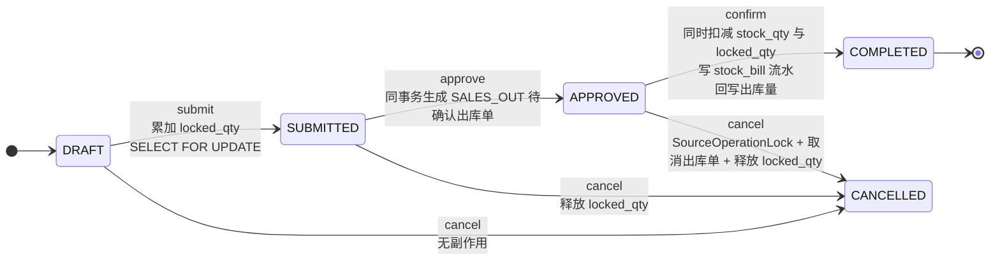
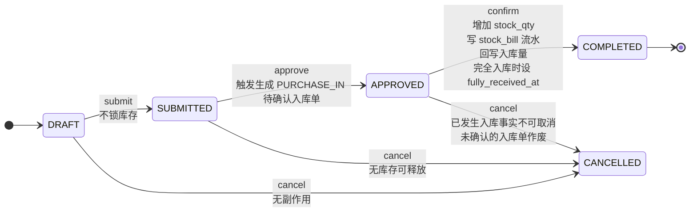
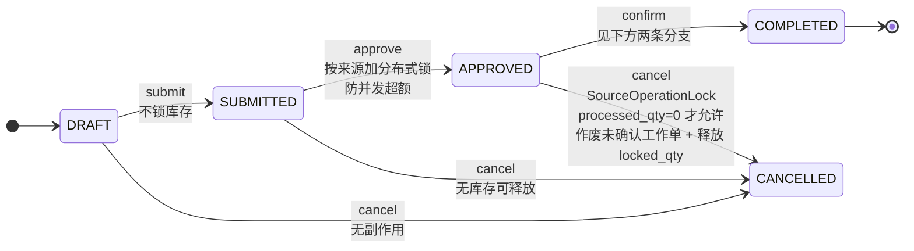
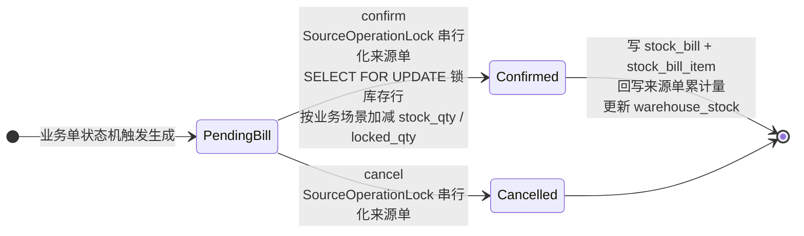
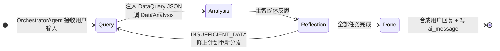

# ERP + AI 智能体项目功能说明书

> 本文档是项目级的功能与架构说明书,聚焦"每个模块做什么、模块之间如何协作、AI 与业务系统如何衔接"三个问题,不写接口细节、不写开发路线、不写验收用例。
>
> 读者:产品 / 后端 / 前端 / AI 开发 / 测试 / 面试者。
>
> 关联文档:`docs/project-introduction.md`、`docs/erp-core-architecture-thinking.md`、`docs/backend-development-guide.md`、`docs/ai-module-final-design.md`、`docs/ai-agent-architecture-thinking.md`、`docs/database/database-design-conventions.md`、`docs/supplier-score-module-delivery-plan.md`、`docs/api/erp-openapi.yaml`。

---

## 一、文档元信息

### 1.1 文档目的

本文档回答三个问题:

- 项目每个模块**做什么功能**。
- 每个模块的**架构设计点**(分层、状态机、并发、一致性、缓存、与 AI 的边界)。
- 模块之间**如何协作**,特别是进销存主链路、AI 增强层、工作台缓存层三者的衔接关系。

### 1.2 名词约定

| 名词 | 含义 |
|---|---|
| ERP 业务系统 | 采购、销售、库存、退货、产品、权限等传统业务模块的总称 |
| AI 智能体 | Spring AI Alibaba 框架下,以 ChatClient 为核心的对话式能力单元 |
| OrchestratorAgent | 主智能体,负责对话入口、任务规划、子智能体调度、反思 |
| DataQuerySubAgent | 数据查询子智能体,把 ERP Service 封装为受控 Tool,只查不写 |
| DataAnalysisSubAgent | 数据分析子智能体,只接收主智能体注入的上下文,纯计算不查库 |
| SubAgent | 子智能体,在 Spring AI Alibaba 框架下作为 Agent Tool 注册给主智能体 |
| Tool / Agent Tool | 主智能体可调用的能力单元;Tool 是函数,Agent Tool 是子智能体 |
| 上下文注入 | 主智能体把 DataQuery 的结果 JSON 注入到 DataAnalysis 的输入字段 |
| 反思 | 主智能体在每次子智能体返回后,根据任务描述校验结果是否满足,决定推进 / 重试 / 追问 / 降级 |
| 任务清单 | 主智能体维护的有序任务 JSON,记录当前会话所有子任务的进度与引用 |
| 软删除 | 表 `deleted` 字段,删除时不物理删除,所有查询自动过滤 |
| 乐观锁 | 表 `version` 字段,更新时通过 MyBatis-Plus `@Version` 自动追加 `where version = ?` |
| 草稿 | AI 给出的建议产物,由用户在 ERP 页面预览 / 编辑 / 提交,AI 不直接落库 |
| 弱外键 | 模块间不建物理外键,通过 Service 事务与业务校验维护一致性 |
| 哨兵值 | 用固定字符串表示"全部"等开放语义,如 `ALL` 表示执行时按当前权限展开全部可见资源 |

---

## 二、项目定位与价值

### 2.1 项目概述

本项目面向中小型商贸、批发、经销及仓配类企业,围绕产品、供应商、客户、采购、销售、退货、仓库、库存等核心业务,建设一套可落地、可扩展、可审计的企业内部管理平台。

系统在传统 ERP 能力之上接入 AI 智能体,将 AI 作为自然语言入口和业务分析辅助层。用户可以用自然语言查询库存、销售、采购等业务数据,也可以让 AI 分析销量异常、给出采购建议、解读供应商评分。AI 不直接操作数据库、不绕过权限体系,而是通过受控 Tool 调用已有业务服务,确保业务数据安全、结果可追溯。

### 2.2 用户角色与典型诉求

| 角色 | 主要诉求 | 对应能力 |
|---|---|---|
| 企业负责人 / 经营管理者 | 了解库存、销量、采购和经营风险 | 工作台、AI 业务查询、跨模块综合分析 |
| 采购人员 | 维护供应商、创建采购订单、跟踪入库 | 供应商管理、采购订单、采购入库、采购建议(评分辅助) |
| 销售人员 | 维护客户、创建销售订单、确认可售库存 | 客户管理、销售订单、销售出库 |
| 仓库人员 | 管理仓库、库存余额、入库、出库和库存调整 | 仓库管理、库存查询、出入库单、库存调整 |
| 业务主管 | 追踪采购、销售和库存数据,辅助决策 | 销售汇总、库存预警、供应商评分解读、AI 分析建议 |
| 系统管理员 | 管理用户、角色、权限和基础配置 | 用户管理、角色管理、权限码配置、审计日志 |
| AI 分析师 | 仅查询业务数据,辅助 AI 模块运行 | 各业务数据查询权限 + AI 入口权限 |

### 2.3 MVP 与扩展边界

MVP 阶段的核心边界:

- 完成产品、客户、供应商、采购、销售、退货、仓库、库存主链路。
- 完成用户、角色、部门、权限码的基础权限体系。
- 完成 RAG 知识库、AI 基础查询能力、AI 审计。
- 库存改动统一收口到 `erp-warehouse`,任何业务模块不得绕过。
- AI 不写业务数据,所有写操作必须用户确认。

后续可扩展:细粒度数据权限、菜单与按钮权限、SKU 与批次、库位与序列号、复杂审批流、财务结算、A2A 跨系统协作等。

### 2.4 非目标范围

为保证 MVP 边界清晰,本项目不覆盖以下能力:

- 生产制造、BOM、工序、排产和质检流程。
- 财务总账、应收应付、发票、付款、收款和对账。
- 复杂审批流、流程引擎和组织岗位体系。
- 多租户 SaaS 商业化架构。
- 电商平台订单、支付、物流对接。
- 完整 BI 平台和实时数仓。
- AI 自动执行业务闭环、不经用户确认直接改数据。

---

## 三、技术架构总览

### 3.1 模块化单体

项目采用模块化单体架构,通过 Maven 子模块划分业务边界。MVP 阶段开发与部署简单,后续可按模块独立拆分服务。

| Maven 模块 | 职责 | 不负责什么 |
|---|---|---|
| `erp-common` | 通用响应、异常、枚举、工具类、基础配置 | 不写任何业务工具 |
| `erp-security` | 登录、Session、权限码、用户上下文 | 不处理具体业务规则 |
| `erp-system` | 用户、角色、部门、权限码 | 不处理采购、销售、库存 |
| `erp-product` | 产品基础资料、产品分类 | 不保存库存数量 |
| `erp-warehouse` | 仓库、库存余额、入库单、出库单、库存流水、库存调整 | 不决定采购与销售价格 |
| `erp-purchase` | 供应商、供货产品、采购订单、采购入库入口、采购退货来源 | 不直接绕过仓储模块改库存 |
| `erp-sales` | 客户、销售订单、销售出库入口、销售退货来源 | 不直接绕过仓储模块改库存 |
| `erp-return` | 统一退货单、采购退货出库、销售退货入库、进度回写 | 不直接绕过仓储模块改库存 |
| `erp-ai` | RAG、AI Tool、Agent 编排、分析工作流、AI 审计 | 不直接修改业务数据 |
| `erp-dashboard` | 工作台聚合、缓存、跨模块只读视图 | 不承载交易逻辑 |
| `erp-admin` | 系统统一启动入口 | — |

模块依赖方向为单向,下层不依赖上层:`erp-admin` → 全部业务模块 → `erp-security` / `erp-ai` / `erp-dashboard` → `erp-common`。AI 模块依赖所有业务模块以便调用其 Service,但业务模块不依赖 AI 模块。定时任务已下沉到各业务模块自身(`erp-purchase`、`erp-dashboard` 等),由 `erp-admin` 统一启用 `@EnableScheduling`,不再保留独立 `erp-job` 模块。

### 3.2 技术栈

- JDK 21 + Spring Boot 3.5.8
- 鉴权:Sa-Token 原始 token + Redis Session + RBAC
- 持久层:MyBatis-Plus + MyBatis-Plus Join(MyBatis-Plus-Join)扩展多表关联
- 数据库:MySQL 8,所有金额 / 数量统一 ×100 存整数
- 缓存与向量:Redis + RedisStack
- 消息队列:RocketMQ,用于供应商评分重算
- AI:Spring AI Alibaba 1.1.2.0 + Spring AI 1.1.2,Multi-Agent / Agent Framework / Graph
- Python 分析:Spring AI Alibaba PythonTool(预留)
- 外部工具接入:MCP(预留)
- 接口文档:Knife4j
- 业务时钟:`Clock` Bean 注入,统一从后端取业务日,避免前端时间篡改

### 3.3 分层架构与通用规约

模块内部统一分层:

- Controller: 接收参数、`@Valid` 校验、调用 Service、返回 `Result<T>`;不直接调用 Mapper,不写业务逻辑。
- Service: 业务逻辑、事务控制、跨模块 Service 调用;查询方法不加事务(只读无收益),写入方法加 `@Transactional`。
- Mapper: 继承 `BaseMapper<T>`,简单 CRUD 用 MyBatis-Plus 内置方法,复杂查询写自定义方法 + XML 或 Join 扩展。
- Domain(Entity): 与数据库表一一对应,不加前端展示字段。
- DTO: 请求与响应对象,含校验注解;VO 用于跨层展示。
- Enums: 模块内枚举,值与数据库 `varchar` 字段一致。

通用规约:

- 类名大驼峰(名词或名词短语)、方法名小驼峰(动词或动宾短语)、变量名小驼峰、常量大写下划线、布尔不加 `is` 前缀。
- 方法体不超过 110 行,超过需拆分。
- 参数 ≥3 封装为 DTO。
- 禁止循环中操作数据库(批量查询 / 更新除外)。
- 嵌套深度不超过 3 层。
- 工具方法优先使用 Hutool / Apache Commons,不允许在业务模块写 wrapper 包装公共工具。

### 3.4 数据设计总约定

- 数值字段:金额与数量统一 `INT × 100` 存储,API 与页面展示业务真实值;`QtyUtil.toDecimal()` 在 Service / VO 层做转换。
- 维护人:所有业务表都有 `create_by_id` / `create_by_name` / `update_by_id` / `update_by_name` 字段,`NOT NULL` 无 `DEFAULT`。
- 单据号:用 Redis INCR 编码,`BillNoGenerator` 统一生成,前缀 + 业务日期 + 6 位序号。
- 乐观锁:业务表 `version` 字段,MyBatis-Plus `@Version` 自动追加。
- 软删除:`deleted` 字段,MyBatis-Plus `@TableLogic` 自动追加。
- 弱外键:跨模块表不建物理外键,通过 Service 事务与业务校验维护一致性。

### 3.5 跨模块数据流转总图

进销存主链路按"业务单状态机 + 入库出库单 + 库存流水 + 库存余额"四层展开。四张图统一用 `stateDiagram-v2`,横向状态机 + 转移动作 + 锁点说明。

**销售订单与销售出库**:



**采购订单与采购入库**:



**退货单(统一)**:



退货单 APPROVED 之后的 confirm 分销售退货与采购退货两条路径:

| 退货类型 | 审核生成的工作单 | confirm 时的库存动作 |
|---|---|---|
| 销售退货 (`SALES_RETURN`) | `SALES_RETURN_IN` 待确认入库单 | 增加 `stock_qty`,写库存流水,回写退货进度 |
| 采购退货 (`PURCHASE_RETURN`) | `PURCHASE_RETURN_OUT` 待确认出库单 + 预占(`locked_qty` ↑) | 同时扣减 `stock_qty` 与 `locked_qty`,写库存流水,回写退货进度 |

**库存流水与库存余额**:



`business_source_type` 五种来源类型:

| 来源类型 | 业务单 | 入库 / 出库 |
|---|---|---|
| `PURCHASE_ORDER` | 采购订单 | 入库 |
| `SALES_ORDER` | 销售订单 | 出库 |
| `PURCHASE_RETURN_ORDER` | 采购退货单 | 出库 |
| `SALES_RETURN_ORDER` | 销售退货单 | 入库 |
| `STOCK_ADJUST` | 库存调整 | 入库 / 出库(取决于调整方向) |

**所有锁链复用同一条**:`SELECT ... FOR UPDATE` 锁库存行 + `SourceOperationLockSupport` 按 `sourceType + sourceId` 加分布式锁,覆盖采购入库、销售出库、销售退货入库、采购退货出库、库存调整五个分支。

AI 增强层:



工作台与 AI 衔接:

```text
业务事务提交 → ApplicationEventPublisher 发事件
  → @TransactionalEventListener(AFTER_COMMIT) 触发缓存更新 / 缓存失效
  → DataQuery Tool 通过 dashboard 聚合查询读取最新数据
```

---

## 四、erp-common 通用基础设施

### 4.1 模块定位

无业务语义,只提供通用工具、响应、异常、枚举、基础配置。被所有模块依赖,自身不依赖任何业务模块。

### 4.2 功能点

- 通用响应:`Result<T>` / `Result<Void>` / `PageResult<T>` / `PageQuery` 分页基类。
- 异常体系:`BizException` / `ErrorCode` 分段(2xxxx~9xxxx)/ `GlobalExceptionHandler` 全局处理。
- 工具类:`QtyUtil`(`×100` 与业务值互转)/ `IdUtil`(字符串 ID 解析为 Long,前端防精度丢失)/ `CodeGen`(单据号生成)/ `BillNoGenerator`(Redis INCR)/ `RedisUtil` / `Clock`(业务时钟注入)/ `PageQuery`(分页参数)。
- 业务事件:`ApplicationEventPublisher` 封装的事件类型,供各业务模块发布,工作台缓存层与 AI 审计层订阅。

### 4.3 架构设计点

- 零业务依赖,任何反向依赖都视为架构违规。
- `BillNoGenerator` 走 Redis INCR 而非数据库自增,避免分布式事务。
- `Clock` Bean 由 `erp-common` 统一注入,所有业务日期从 `Clock` 取,不允许读取 `LocalDate.now()`。
- `QtyUtil.toDecimal()` 是数值字段从 DB `×100` 整数到业务 `BigDecimal` 的唯一入口,业务代码不允许自行除以 100。

---

## 五、erp-security 鉴权与上下文

### 5.1 模块定位

单一职责:登录、Session、权限码、当前用户上下文。所有业务模块都依赖 `erp-security` 提供的鉴权能力。

### 5.2 功能点

- Sa-Token 登录:`AuthController` 提供登录 / 当前用户 / 登出接口。
- Session 存储:Redis Session,Sa-Token 原始 UUID token,前端通过 `satoken` 请求头传递。
- 权限校验:注解式 `@SaCheckPermission("xxx:yyy:zzz")` 与编程式 `StpUtil.checkPermission("xxx:yyy:zzz")` 双轨。
- 用户上下文:`UserContext` 提供 `getCurrentUser` / `requireCurrentUser` / `getUserId` / `getUsername` / `isAdmin`。
- 数据权限扩展点:`StpInterfaceImpl` 与 `LoginUser` 字段预留,后续扩展按部门 / 仓库 / 自定义范围过滤。

### 5.3 架构设计点

- 单一职责:`erp-security` 不处理任何具体业务规则,只暴露鉴权能力。
- 超管通配:超级管理员 `isAdmin = true`,权限校验链路跳过。
- AI 与业务权限统一:AI Tool 内部调用 `StpUtil.checkPermission`,使用与 Controller 同款的细粒度权限码,不另建 AI 专属权限码(粗粒度入口权限码由 Controller 层校验)。
- 角色绑权限码 JSON:角色表的 `permission_codes` 为 JSON,`SUPER_ADMIN` 用 `["*"]` 表示通配。

---

## 六、erp-system 系统管理

### 6.1 模块定位

负责用户、角色、部门、权限码等系统管理能力。是权限码的"目录"层,与具体业务模块解耦。

### 6.2 功能点

- 用户:CRUD + 启停 + 重置密码 + 批量状态 / 密码 / 删除 + 角色分配。
- 角色:CRUD + 启停 + 批量 + 权限码 JSON 绑定 + 用户分配。
- 部门:CRUD + 启停 + 批量 + 树形结构。
- 权限码:CRUD + 模块分组(`module_code`)+ 操作类型分类(`action_type`:query / create / update / delete / manage / execute)+ 启停 + 批量 + 选项接口。

### 6.3 架构设计点

- 权限码按 `module_code + action_type` 分组,角色绑 `permission_codes JSON`,查询时按 JSON 展开校验。
- 暂不做菜单权限、按钮权限、字段权限、仓库数据权限,只做接口级权限码。
- 软删除 + 乐观锁 + 维护人 NOT NULL。
- 关键约束:删除用户前必须清理关联角色与登录上下文;删除角色前必须校验是否有用户绑定;删除部门前必须校验子部门与用户绑定。
- 权限码选项接口(`/system/permissions/options`)供其他模块在前端表单中按模块选择权限码,是 AI 模块和业务模块引用权限的基础。

---

## 七、erp-product 产品管理

### 7.1 模块定位

负责产品基础资料与产品分类。不保存库存数量,不参与采购 / 销售价格决策。

### 7.2 功能点

- 产品分类:树形结构 CRUD + 排序 + 启停 + 级联约束。
- 产品:基础资料(编码、名称、分类、品牌、单位、规格、参考采购价、参考销售价、安全库存、数量精度、状态)+ CRUD + 启停 + 批量状态 / 删除。
- 选项接口:产品选项供采购 / 销售 / 库存模块下拉引用。

### 7.3 架构设计点

- 不保存库存数量,库存数量归 `erp-warehouse` 的 `warehouse_stock` 表。
- `quantityPrecision`(数量精度)由产品定义,所有数量相关字段统一 ×100 存储与展示。
- 产品编码全局唯一,被采购 / 销售 / 库存引用时不可删除,只能停用。
- 软删除 + 乐观锁 + 维护人 NOT NULL。
- 列表查询使用 MPJLambdaWrapper 关联产品分类,一次性返回分类名称,避免前端二次查询。

### 7.4 与 AI 协作

- DataQuery 暴露 `queryProducts` Tool:`StpUtil.checkPermission("product:query")` 校验后调用 `IProductService.page`。
- 经营分析中的安全库存读取该模块,DataAnalysis 子智能体在"库存风险"场景读取安全库存做派生判断。
- AI 不持有产品维护 Tool(写操作),任何产品修改必须用户在 ERP 页面操作。

---

## 八、erp-purchase 采购管理

### 8.1 模块定位

负责供应商、供货关系、采购订单、采购入库入口、采购退货来源。是供应商评分体系与 AI 采购建议的核心数据来源。

### 8.2 功能点

- 供应商:CRUD + 启停 + 批量 + 详情(含评分汇总、服务分原因、样本金额、评分状态)。
- 供货关系(`supplier_product`):CRUD + 启停 + 初始报价与有效期维护 + 报价专用调整接口。
- 采购订单:草稿 / 提交 / 审核 / 取消 / 部分入库跟踪 / 完全入库状态。
- 候选供应商查询:返回启用、未删除、`READY`、有效报价的供货关系,按推荐分降序、报价升序、样本金额降序、平均到货周期升序、关系 ID 升序固定排序。
- 评分日志查询:按指标类型查询评分变化记录,含指标分前后值、产品推荐分前后值、供应商综合分前后值、原因与批次。

### 8.3 供应商评分体系

综合分 = 30% 价格 + 30% 交付 + 30% 质量 + 10% 服务,必需输入缺失则 `NULL` + `NOT_READY`,不重分配权重。

字段分布:

- `supplier` 维护交付分(`delivery_score`)、服务分(`service_score`)。
- `supplier_product` 维护质量分(`quality_score`)、价格分(`price_score`)、推荐分(`recommend_score`)、综合分快照。
- `supplier_score_change_log` 只记录真正发生的分值变化,配 `batch_no` 关联同一批次。

评分状态:

- `NOT_READY`:样本不足或关键评分项缺失,值为 `NULL`,展示空态。
- `READY`:评分已计算,值可能是 `0`(真实零分)或非零。

`INT × 100` 存储:`null` ≠ `0`,`null` 表示评分条件或样本不足,`0` 表示已计算且结果为零。`SUPER_ADMIN` 与普通用户对 `null` 与 `0` 的展示一致。

### 8.4 评分计算引擎

180 天滚动窗口,规则版本化,`BigDecimal` 中间过程保证精度,最终统一转 `INT × 100` 落库,不存小数分。

计算口径:

- 产品质量分按 180 天内已完全入库的采购订单计算,按数量计算,供应商层面才用 `score_basis_amount` 做金额加权。
- 供应商交付分按采购金额计算,不和产品绑定;承诺日当天确认均视为按时。
- 交付分公式:`max(0, 100 × (1 - Σ(受罚金额 × 逾期系数) / Σ到期应交金额))`,逾期系数固定按时 0% / 1-3 天 25% / 4-7 天 50% / 8-15 天 75% / 超过 15 天 100%。
- 价格分按产品参考采购价与有效报价计算,同产品最低有效报价只用于候选展示 / 同分排序。
- 推荐分按供货关系维度计算,综合分按供应商维度加权。

触发源:完全入库、完全入库后的合法纠正 / 冲销、服务分调整、报价或报价有效期变化、产品参考采购价变化、供应商责任取消、承诺日 / 逾期档位跨越、报价失效、180 天样本出窗。普通部分入库不发送即时评分消息。

异步重算:业务事务提交并递增 `score_input_version` 后,通过 RocketMQ 延迟消息异步发送。消费者按供应商维度加互斥锁,读取最新 `score_input_version`,若已等于 `score_calculated_version` 直接跳过,否则按最新版本完整重算一次,成功后写回 `score_calculated_version`。乱序消息因版本相同会空操作。一次有效重算只生成一个 `batch_no`,只记录实际发生分值变化的日志。

### 8.5 库存锁与一致性架构

采购模块对库存的影响只在"入库"环节,数据一致性依赖仓储模块的锁链:

- 采购订单审核后**生成待确认入库单**(`inbound_bill`,`status = PENDING`),不直接增加库存。
- 入库单确认时由 `WarehouseStockLockSupport` 按"仓库 + 产品"固定顺序 `SELECT ... FOR UPDATE` 锁库存行。
- 取消 / 编辑 / 确认三类操作按 `SourceOperationLockSupport` 按 `sourceType + sourceId` 加 Redisson 分布式锁,防 TOCTOU 导致"取消已确认的入库"或"确认已取消的入库"。
- 完全入库时使用**最后一笔入库确认时间**写入 `fully_received_at`,不使用 `update_time`。
- 部分入库不立即触发评分重算,完全入库时触发一次;未完成订单由到期及逾期档位边界任务重算。
- 评分重算通过 RocketMQ 异步 + 业务事务后 `score_input_version` 自增,与库存事务解耦,不影响库存事务提交速度。

### 8.6 架构设计点

- 服务分与报价走**专用接口**,基础编辑接口白名单拒绝所有评分字段,避免前端误传覆盖系统值。
- 草稿创建 / 编辑不接收 `selectedSupplierScore`,由审核时后端冻结评分快照。
- 取消接口:仅没有确认入库事实的 `APPROVED` 订单可标记供应商责任取消,部分入库 / 完全入库一律拒绝取消。
- 删除引用保护:被供货关系、采购订单、采购退货引用时禁止删除。
- 评分重算通过 RocketMQ + 定时补偿,业务事务只提交事实并递增 `score_input_version`,不引入通用 Outbox 表。
- 软删除 + 乐观锁 + 维护人 NOT NULL。

### 8.7 与 AI 协作

DataQuery 子智能体工具:

- `querySuppliers`:供应商分页查询,`supplier:query` 权限。
- `querySupplierProducts`:供货关系查询,`supplier:query` 权限。
- `queryCandidateSuppliers`:候选供应商查询(按推荐分 / 报价 / 履约排序),`supplier:query` 权限。
- `querySupplierScoreChangeLogs`:评分日志查询,`supplier:query` 权限。
- `queryPurchaseOrders`:采购订单查询,`purchase:query` 权限。
- `queryPurchaseSummary`:采购汇总,`purchase:query` 权限。

DataAnalysis 子智能体意图:

- `supplier_recommendation_analysis`:供应商推荐分析,输入产品 ID + 候选供应商 + 履约历史 + 评分明细,输出推荐供应商与综合分。
- `supplier_delivery_health`:供应商交付健康分析。
- `purchase_concentration_risk`:采购集中度风险分析。

---

## 九、erp-sales 销售管理

### 9.1 模块定位

负责客户、销售订单、销售出库入口、销售退货来源。库存锁定是该模块的关键架构点。

### 9.2 功能点

- 客户:CRUD + 启停 + 批量 + 信用额度维护 + 敏感字段脱敏。
- 销售订单:草稿 / 提交 / 审核 / 取消 / 锁定库存 / 部分出库跟踪 / 完全出库。
- 销售汇总:按时间维度聚合销售金额、订单数、客户数。

### 9.3 库存锁与一致性架构

销售模块对库存的影响分两个阶段:审核时锁库、确认时扣减。

**审核阶段(锁库)**:

- 销售订单审核时调用 `WarehouseStockReservationSupport.applyLockedQtyChanges` 预占 `locked_qty`,**不扣减** `stock_qty`。
- 预占前先由 `WarehouseStockLockSupport` 按"仓库 + 产品"顺序锁库存行(`SELECT ... FOR UPDATE`),再校验 `available_qty = stock_qty - locked_qty` 是否足够。
- 不允许在锁库前手动改库存,所有库存行改动必须经过预占支持类。

**确认阶段(扣减)**:

- 出库单确认时由 `WarehouseStockLockSupport` 锁库存行,**同时**扣减 `stock_qty` 与 `locked_qty`,即一笔出库同时影响两个字段。
- 行锁按 `productId` 升序排列后获取,避免多产品单据的死锁。

**取消 / 编辑(释放)**:

- 取消订单或编辑单据时调用 `WarehouseStockReservationSupport`,**先释放再预占**:差额编辑同一产品时,先释放旧差额再预占新差额,使已释放数量可被本单立即复用。
- 取消 / 编辑 / 确认三类操作按 `SourceOperationLockSupport` 按 `sourceType + sourceId` 加 Redisson 分布式锁,防 TOCTOU 导致"取消已确认的出库"或"确认已取消的出库"。
- 锁粒度为单张来源单级别,不影响其他订单的并发。

**超时识别**:

- 行锁等待按 JDBC `SQLTimeoutException` 或 MySQL 错误码 `1205` 识别,转换为业务"库存正在被其他单据处理,请稍后重试"。
- 不把死锁 `1213` 误判为可等待冲突。

**单位与精度**:

- `×100` 整数在 Service 层维持原始值,在 VO 层统一 `QtyUtil.toDecimal()` 转换,不允许跨模块自行除以 100。
- `available_qty` 由 `stock_qty - locked_qty` 派生,在 SQL 层用原始值比较,不在 Java 层循环。

### 9.4 架构设计点

- 客户敏感字段(`mobile` 在 Vo 层脱敏,`creditLimit` 在返回前根据权限脱敏)必须经过 Service 层脱敏,不允许 Controller 直接返回 Entity。
- 销售订单审核不直接扣减库存,只锁库 + 生成待确认出库单。
- 锁库 / 出库统一收口到 `erp-warehouse`,销售模块不直接操作 `warehouse_stock`。
- 软删除 + 乐观锁 + 维护人 NOT NULL。
- 删除保护:被销售订单、销售退货引用的客户不能删除,只能停用。

### 9.5 与 AI 协作

DataQuery 子智能体工具:

- `queryCustomers`:客户查询,`customer:query` 权限,敏感字段脱敏。
- `querySalesOrders`:销售订单查询,`sales:query` 权限。
- `querySalesSummary`:销售汇总,`sales:query` 权限。

DataAnalysis 子智能体意图:

- `sales_anomaly_analysis`:销量异常分析。
- `customer_concentration_risk`:客户集中度风险分析。

---

## 十、erp-warehouse 仓库与库存

### 10.1 模块定位

**库存改动唯一入口**。所有业务模块对库存的最终影响都必须经过本模块,是项目数据一致性的核心。

### 10.2 功能点

- 仓库:CRUD + 启停 + 批量 + 状态切换。
- 库存余额(`warehouse_stock`):分页查询 + 健康度派生(`NORMAL` / `LOW_STOCK` / `NO_AVAILABLE` / `OUT_OF_STOCK`)+ 占用状态派生(`UNLOCKED` / `PARTIALLY_LOCKED` / `FULLY_LOCKED`)+ 汇总。
- 入库单(`inbound_bill` / `inbound_bill_item`):草稿 / 提交 / 确认 / 取消,关联来源单据(PURCHASE_ORDER / PURCHASE_RETURN_ORDER / SALES_RETURN_ORDER / STOCK_ADJUST)。
- 出库单(`outbound_bill` / `outbound_bill_item`):草稿 / 提交 / 确认 / 取消,关联来源单据(SALES_ORDER / PURCHASE_RETURN_ORDER / STOCK_ADJUST)。
- 库存流水(`stock_bill` / `stock_bill_item`):已确认库存变动凭证,记录 `business_source_type`、`source_id`、`before_qty`、`delta_qty`、`after_qty`。
- 库存调整:人工增减库存,生成 STOCK_ADJUST 类型的入库 / 出库单。

### 10.3 库存锁与一致性架构

**三层数据结构**:

- `warehouse_stock`:当前库存余额,按 (warehouse_id, product_id) 唯一,查询快。
- `inbound_bill` / `outbound_bill`:待确认作业单,记录来源、计划数量、本次数量、剩余数量,记录作业进度。
- `stock_bill` / `stock_bill_item`:已确认库存变动凭证,记录变动前、变动数量、变动后,作为追溯源。

为什么分三层:采购订单审核不等于货已到,销售订单审核不等于货已出。MVP 无物流模块时,需仓库人员确认本次数量后才改变库存。入库 / 出库单处理仓库作业,库存流水只记录已确认库存事实。

**行级锁(`WarehouseStockLockSupport`)**:

- 所有增减库存操作走 `lockExistingStocks(warehouseId, productIds)`,内部按 `productId` 排序后 `SELECT ... FOR UPDATE`。
- 锁粒度为同一仓库同一批产品,不影响其他仓库或其他产品的并发。
- 不存在的库存记录不在结果中,由调用方按业务逻辑创建(入库场景)。
- 超时识别按 JDBC `SQLTimeoutException` 或 MySQL 1205,不把死锁 1213 误判为可等待冲突。

**来源单分布式锁(`SourceOperationLockSupport`)**:

- 按 `sourceType + sourceId` 串行化取消 / 编辑 / 确认,把 TOCTOU 冲突检测前移到事务开头。
- 后到的请求在锁内重查状态,若已变更则直接拒绝,不进入副作用阶段,零回滚成本。
- 锁粒度为单张来源单,不影响其他订单的并发。
- 锁在事务完成后通过 `TransactionSynchronization.afterCompletion` 释放。
- 使用 Redisson watchdog 续期,避免慢事务提前失锁;不指定固定租约。

**预占一致性(`WarehouseStockReservationSupport`)**:

- 所有业务模块只能通过本组件增减 `locked_qty`,避免来源审核、手工出库和后续退货各自实现可用库存校验,导致预占口径不一致。
- 释放 / 预占顺序固定:差额编辑同一产品时先释放再预占,使已释放数量可被本单立即复用。
- 创建 / 取消只需处理一种方向,避免不必要的遍历。

**快照写入流水**:

- 确认出入库时把 `product_code` / `product_name` / `unit_name` 复制进 `stock_bill_item`,历史单据不受口径变化影响。
- `business_source_type` 区分 PURCHASE_ORDER / SALES_ORDER / PURCHASE_RETURN_ORDER / SALES_RETURN_ORDER / STOCK_ADJUST 五种来源。
- 流水 `before_qty` / `delta_qty` / `after_qty` 都用 ×100 原始值存储,与库存余额表口径一致。

**健康度派生**:

- SQL 层用 ×100 原始值比较派生 `NORMAL` / `LOW_STOCK` / `NO_AVAILABLE` / `OUT_OF_STOCK`,Java 层不循环。
- `available_qty = stock_qty - locked_qty`,派生计算在 VO 层完成。
- 建议补货量 = `safety_stock_qty * 2 - available_qty`,产品停用时为 0。

**入库单快照字段**:

- `expected_arrival_date`(预计到货日期)只保存在入库作业主表 `inbound_bill`,不复制到 `stock_bill`。
- 评分交付直接读取入库作业快照及 `confirmed_at`,不再为承诺日期反查采购单。

### 10.4 架构设计点

- 待确认入库 / 出库单和库存流水分层,避免把未确认作业误认为已变库存。
- 库存余额用于快查,入库 / 出库 / 流水用于追溯。
- 软删除 + 乐观锁 + 维护人 NOT NULL。
- 删除保护:被采购入库、销售出库、退货执行引用的仓库不能删除,只能停用。
- 跨模块调用规则:`erp-purchase` / `erp-sales` / `erp-return` 必须通过 `IInboundBillService` / `IOutboundBillService` 触发库存改写,不直接调用 `WarehouseStockMapper`。

### 10.5 与 AI 协作

DataQuery 子智能体工具:

- `queryProductStock`:库存余额查询,`warehouse:query` 权限,支持健康度 / 占用状态过滤。
- `queryStockBills`:库存流水查询,`warehouse:query` 权限。
- `queryInboundBills`:入库单查询,`warehouse:query` 权限。
- `queryOutboundBills`:出库单查询,`warehouse:query` 权限。
- `queryInventoryWarning`:库存预警(基于当前库存与安全库存派生风险等级),`warehouse:query` 权限。

DataAnalysis 子智能体意图:

- `inventory_health_overview`:库存健康总览。
- `slow_moving_stock_analysis`:滞销库存分析。

---

## 十一、erp-return 统一退货

### 11.1 模块定位

统一处理采购退货和销售退货。退货单本身不直接改库存,通过 `erp-warehouse` 完成入库 / 出库。

### 11.2 功能点

- 退货单:草稿 / 提交 / 审核 / 取消。
- 来源单据查询:采购单 / 销售单的可退明细。
- 仓储执行:采购退货 → 待确认出库单,销售退货 → 待确认入库单。
- 进度回写:退货明细累计已入库 / 已出库量。
- 退货单详情:含来源单、退货明细、关联仓储作业单、执行进度。

### 11.3 库存锁与一致性架构(本期重点)

退货模块不直接操作库存,所有库存影响都委托给 `erp-warehouse`:

- 退货单审核**不直接改库存**,只生成待确认入库 / 出库单并交给仓储模块。
- 仓储执行时同样走 `WarehouseStockLockSupport` + `SourceOperationLockSupport`,与正常出入库使用同一套锁链,保证取消 / 编辑 / 确认三类操作的串行化。
- 来源订单(采购单 / 销售单)累计已退量保持不变,仅作为可退校验依据,避免双扣减。
- 退货入库 / 出库走与销售 / 采购相同的 `stock_bill` 写入路径,`business_source_type` 区分 `PURCHASE_RETURN_ORDER` / `SALES_RETURN_ORDER`。
- 跨事务一致性:退货单审核与生成待确认入库 / 出库单在同一事务内完成,失败整体回滚;后续确认环节是独立事务。
- 取消退货单时,若已生成待确认入库 / 出库单,必须先取消仓储作业单后才能取消退货单,确保来源链可追溯。

### 11.4 架构设计点

- 不直接改库存,统一通过 `erp-warehouse` 处理入库 / 出库。
- 退货单与来源单据的关联通过 `source_type + source_id` 弱外键维护,Service 层做完整性校验。
- 软删除 + 乐观锁 + 维护人 NOT NULL。
- 退货状态机:DRAFT → SUBMITTED → APPROVED → (CANCELLED | COMPLETED),COMPLETED 由仓储全部确认后触发。
- 退货单生成时校验来源单据的可退数量(剩余数量 - 累计已退数量),防止超退。

### 11.5 与 AI 协作

DataQuery 子智能体工具:

- `queryReturnOrders`:退货单查询,`return:query` 权限。
- `queryReturnSourceOrders`:退货来源单据查询,`return:query` 权限。

DataAnalysis 子智能体意图:

- `return_reason_analysis`:退货原因分析(基于退货明细与原因字段)。

---

## 十二、erp-dashboard 工作台

### 12.1 模块定位

经营概览、库存风险、订单流转、商品排行、供应商履约、顶栏铃铛的聚合展示层。不承载交易逻辑,只读、聚合、缓存。

### 12.2 功能点

- 概览指标聚合:库存金额、待处理订单、销售 / 采购汇总、库存风险 SKU、铃铛摘要。
- 库存风险面板:TopN 风险 SKU,按缺口降序展示,SQL 层排序截断,最多 20 条。
- 订单流转:待审核 / 待入库 / 待出库 / 待确认,按来源拆分。
- 商品排行:近 30 天销售金额与数量排行。
- 供应商履约:TopN 供应商综合评分。
- 顶栏铃铛摘要:跨模块待办聚合。
- 待办聚合:库存风险 SKU、退货待处理、系统异常等。

### 12.3 缓存层架构
工作台缓存层是项目性能与一致性的关键设计,采用三套 Redis 缓存 + 事务后事件 + 凌晨全量重建的组合方案。

**三套缓存,职责分离**:

- `TrendDailyAmountCache`:经营趋势按日金额,Redis Hash,field 为 ISO 日期,value 为原始分值(×100 整数)。支持单日独立删除与回填,不会因一张订单变更而让 30 日趋势整体失效。TTL 35 天,只保留最近 35 天字段。
- `TopProductRankCache`:近 30 天 TOP 商品排行,Redis Sorted Set(金额) + Hash(数量),支持 `ZINCRBY` / `HINCRBY` 增量更新与凌晨 SQL 全量重建。商品属性(编码 / 名称 / 库存)不入缓存,读取时按需实时查数据库。
- `PrevValueCache`:指标对比期快照,日快照(待处理订单 / 库存风险 SKU,TTL 3 天)+ 月快照(销售 / 采购累计,TTL 90 天)。日快照由 `DashboardDailySnapshotJob` 在每日 23:55 拍快照写入;月快照由 `DashboardMonthlySnapshotJob` 在每月最后一天 23:55 拍快照写入。

**写入路径(事务后事件)**:

- 业务 Service 在事务提交后通过 `ApplicationEventPublisher` 发 `DashboardTrendInvalidatedEvent` / `TopProductRankAdjustEvent`。
- 由 `@TransactionalEventListener(AFTER_COMMIT)` 触发缓存更新 / 失效,**回滚不污染缓存**。
- 事件载荷含 `businessDate` 和影响条目,只失效 / 增量更新相关日期和条目,不刷新全量。
- 业务日期早于 30 天窗口起点的增量事件直接跳过,由凌晨 SQL 兜底。

**重建路径(凌晨全量)**:

- `DashboardTrendDailyCacheJob` / `DashboardDailySnapshotJob` / `DashboardMonthlySnapshotJob` 在凌晨触发全量 SQL 重算。
- Redisson 互斥锁(`dashboard:trend:daily-amount:lock:*`)+ 临时 key + 原子 RENAME 切换,避免重建期间读空数据。
- 重建期间所有业务事件写入缓冲队列,重建完成后由 Lua 单脚本 LPOP + 应用 +关闭标记,杜绝最后一批事件遗漏。
- 异常路径也强制消费队列,避免遗留到下次重建被重复扣减。

**TOP 排行双层保护**:

- Redisson watchdog 锁:多实例只让一个跑,进程崩溃自动释放锁。
- Redis `rebuilding` 标记:存在即处于重建,增量事件一律缓冲;重建结束 DEL 该 key。
- 重建异常路径:即使缓存是旧数据,事件也该应用上;只有 Redis 不可用连回放都失败时,才保留标记与队列等下次重建。

**Lua 原子脚本**:

- 增量 / 缓冲 Lua:状态判定与写入在同一脚本内,避免"判断后到写入前状态被切换"的边界遗漏。
- 回放关闭 Lua:回放队列与关闭标记原子执行,杜绝"最后几条事件与状态切换之间遗漏"。
- 读 TopN Lua:一次性 ZREVRANGE 前 N 名 + HGET 对应数量,金额与数量同一时刻快照。
- 切换 Lua:空数据时清掉旧 key 避免过期榜单残留;非空时 RENAME 临时 key 到正式 key。

**缓存 miss 与降级**:

- 缓存 miss 时直接回源数据库,写回缓存,不阻塞响应。
- 日快照 / 月快照 miss 时返回 `null`,由调用方 fallback 展示,不抛异常。
- TOP 排行 miss 时重建优先于即时回填。

**Loader 模式**:

- `*Loader` 类直接聚合只读 SQL,允许跨模块表查询(如 `WarehouseStockMapper`、`ProductMapper`、`SupplierMapper`),不调用其他模块的 Service。
- `Service` 仅组合 Loader 输出,不参与聚合。
- `×100` → 业务真实值在 Loader / VO 层用 `QtyUtil.toDecimal()` 转换,不暴露数据库原始值。

### 12.4 架构设计点

- 主入口权限码 `dashboard:overview:query`;系统异常待办额外用 `dashboard:exception:query` 裁剪,业务类待办按各自模块的 manage / query 权限裁剪。
- 不承载交易,只读 / 聚合 / 缓存。
- 待办铃铛跨模块聚合(`DashboardTodoAggregator`),按用户权限过滤,保证不同角色看到不同待办。
- 顶栏铃铛摘要接口独立于概览接口,降低首页加载延迟。

### 12.5 与 AI 协作

- DataQuery 子智能体暴露 `queryDashboardOverview` Tool:`dashboard:overview:query` 权限,返回工作台关键指标。
- 经营问答中转:用户问"最近经营情况"时,主智能体调 `queryDashboardOverview` 拿关键指标,再注入 DataAnalysis 做"跨模块综合分析"。
- 缓存更新路径不直接被 AI 调用,AI 走查询路径,通过 Tool 调用间接触发数据库查询,工作台缓存层与 AI 之间没有直接耦合。

---

## 十三、erp-ai 智能体系统

### 14.1 模块定位

RAG、AI Tool、SubAgent、任务管理、AI 审计。是 ERP 的自然语言入口和分析辅助层,不直接修改业务数据。

### 14.2 设计目标与边界

- AI 是自然语言入口和分析建议层,业务主链路必须稳定。
- AI 不直接操作数据库,不绕过权限体系。
- 重要业务动作必须由用户确认后执行,AI 只提供建议或生成草稿。
- 复杂分析场景必须由结构化工作流或子智能体执行,AI 自身不做重型计算。

### 14.3 总体架构:三层 + 三智能体

**OrchestratorAgent(主智能体)**:对话入口、任务规划、子智能体调度、反思、上下文注入控制。

- 工具:4 个任务管理工具 + 2 个子智能体 Agent Tool。
- 任务清单:显式 JSON,记录当前会话所有子任务的进度与 `resultRef` 链。
- 反思:每次子智能体返回后校验结果是否满足任务描述,决定推进 / 重试 / 追问 / 降级。

**DataQuerySubAgent(数据查询子智能体)**:拿数据,把 ERP Service 封装为受控 Tool。

- 工具:18 个查询 Tool,全部走 `StpUtil.checkPermission` 细粒度权限。
- 不分析、不解读,只把数据按统一 JSON 协议返回。
- 所有 Tool 内部都经过 Service 层校验,业务规则(状态机 / 乐观锁 / 字段白名单)在代码层强制。

**DataAnalysisSubAgent(数据分析子智能体)**:分析数据,**不查库**,只接收主智能体注入的上下文。

- 工具:纯计算 Tool,无任何数据库访问或外部 HTTP 调用。
- 输入协议:`intent` + `primaryData` + `contextData`(由主智能体注入)+ `analysisParams`。
- 输出协议:固定 JSON Schema(conclusion / keyMetrics / anomalies / suggestions / confidence / usedDataRefs)。

**业务约束在代码层拦截**:

- 主智能体的工具列表中**不包含**任何业务 Tool,只包含任务管理工具和子智能体 Agent Tool。
- DataQuery 子智能体的 18 个 Tool **全部为查询**,无写操作接口。
- 即使注册写操作 Tool,Tool 内部 Service 也会因状态 / 权限校验抛 `BizException`。
- DataAnalysis 子智能体的 system prompt 显式声明"不查库不写表",工具列表里只有纯计算函数。
- AI 层不重复承诺业务规则,具体状态机 / 乐观锁 / 字段白名单 / 权限码校验全部由 ERP Service 在代码层强制。

### 14.4 上下文注入与回流流程

主智能体对每个任务的执行都遵循以下循环:

```
注入完整上下文 + 触发子智能体
  → 子智能体返回结果或 INSUFFICIENT_DATA
  → 主智能体反思:结果是否满足任务描述
    - 满足 + 无需追加数据 → completeTask,推进下一任务
    - 满足 + 需要追加校验 → 新增任务,重新分发
    - 不满足 + 缺少字段 → 修正计划,创建补充任务,重新分发
    - 业务约束冲突 → failTask,记录错误,决定重试或放弃
    - 用户缺参数 → askUser,挂起任务清单
  → 所有任务完成 → 主智能体合成汇报
```

**上下文注入**:DataQuery 子智能体的结果以 `resultRef` 链(如 `data-q-1`)的形式存储在任务上下文中。OrchestratorAgent 把 `resultRef` 解析后嵌入到 DataAnalysis 的 `primaryData` / `contextData` 字段,实现数据传递。

**信息不足回流**:DataAnalysis 子智能体评估输入数据是否足够时,返回 `INSUFFICIENT_DATA` 信号 + `missingFields` 列表。主智能体根据 `missingFields` 创建补充任务(通常是 DataQuery 类型),再次调用 DataQuery 拿数据,再次注入,再次分析,直到成功或追问用户。

**反思触发条件**:

- 子智能体返回字段缺失 → `failTask` + `retry`,重试上限 2 次。
- 子智能体返回数据为空 → 反思是否参数有误,是则追问用户,否则在总结中提示"未查到数据"。
- 子智能体超时 → `failTask` + `retry`,累计 3 次失败 → `ABORTED`,提示用户稍后重试。
- 分析结论与数据冲突 → `failTask` + 重试分析子智能体。
- 用户中途插入新需求 → 把当前任务清单中 PENDING 任务标记为 `ABORTED`,重新生成清单。
- 关键写操作被请求 → 直接拒绝,并在总结中提示用户到 ERP 页面操作。

### 14.5 多模型路由

- 主智能体:大模型(规划 / 自然语言),擅长多步骤推理和长上下文。
- DataQuery 子智能体:轻量模型(参数映射),擅长意图分发和参数转换。
- DataAnalysis 子智能体:**不同厂商或不同尺寸模型**,避免与主智能体同倾向性错误。
- 模型选型策略:按场景切换、可配置、降级方案(主模型不可用时降级到备用模型)。

### 14.6 主智能体工具

任务管理 4 个工具:

- `createTask`:创建任务,任务进入 `RUNNING`,记录 `taskId`。
- `completeTask`:标记任务完成,关联结果 JSON,任务进入 `DONE`。
- `failTask`:标记任务失败,可携带重试策略。
- `askUser`:追问用户,任务清单挂起,等待用户回复。

任务状态机:`PENDING → RUNNING → DONE` / `→ FAILED → PENDING(重试)` / `→ ABORTED`。

子智能体 2 个 Agent Tool:

- `DataQuerySubAgent`:把任务委派给数据查询子智能体。
- `DataAnalysisSubAgent`:把任务委派给数据分析子智能体。

### 14.7 DataQuery 子智能体工具集

18 个查询 Tool,全部 `StpUtil.checkPermission` 细粒度权限:

- 库存:`queryProductStock` / `queryInventoryWarning` / `queryStockBills`。
- 出入库:`queryInboundBills` / `queryOutboundBills`。
- 采购:`queryPurchaseOrders` / `queryPurchaseSummary`。
- 销售:`querySalesOrders` / `querySalesSummary`。
- 供应商:`querySuppliers` / `querySupplierProducts` / `queryCandidateSuppliers` / `querySupplierScoreChangeLogs`。
- 客户 / 产品:`queryCustomers` / `queryProducts`。
- 退货:`queryReturnOrders` / `queryReturnSourceOrders`。
- 工作台:`queryDashboardOverview`。

统一 JSON 输出协议:

- 元数据:`sourceTool` / `permissionCode` / `queryAt`。
- 分页:`pageNum` / `pageSize` / `total` / `hasNext`。
- 汇总:`summary` 字段(按 Tool 含义不同)。
- 记录:`records` 字段。
- 数据质量:`desensitized` / `truncated` / `notes`。

### 14.8 DataAnalysis 子智能体工具集

纯计算 Tool 6 个:

- `summarizeSeries`:时序聚合,计算 total / mean / median / std / max / min / WoW / DoD。
- `detectAnomaly`:异常点检测,基于 Z-Score 或 IQR。
- `correlationMatrix`:多维关联,Pearson / Spearman,只输出强关联(>0.7)。
- `segmentBreakdown`:维度拆解,按分类 / 仓库 / 供应商 / 客户分组输出 TopN。
- `forecastHint`:简易预测提示,移动平均 + 趋势识别,不替代正式预测工作流。
- `explainWithRules`:规则化解读,把指标映射成业务解释模板。

约束:不查库、不写表、不调外部 HTTP,单次输入记录数 ≤ 5000,超出需主智能体缩小窗口。

### 14.9 反思机制

主智能体在每个子任务返回后自动进入反思步骤:

- 校验子智能体返回的 JSON Schema 是否完整。
- 判断结果是否回答了任务描述。
- 若不满足,根据错误类型触发不同的处理路径(见 14.4 节"反思触发条件")。
- 反思信息写入 `ai_interaction_log`,`interaction_type = REFLECTION`。

### 14.10 审计

`ai_interaction_log` 五类交互:

- `RAG_CHAT`:RAG 检索问答。
- `TOOL_CALL`:工具调用(DataQuery 子智能体的 Tool)。
- `SUBAGENT_CALL`:子智能体调度。
- `REFLECTION`:反思决策。
- `TASK_MANAGE`:任务管理(createTask / completeTask / failTask / askUser)。

每次调用写入 `parent_request_id`,把一次用户请求的所有节点串起来,支持从任意节点反向追溯。

### 14.11 会话与消息

- `ai_conversation`:会话表,按用户隔离,跨用户访问按不存在处理。
- `ai_message`:消息表,按 `conversation_id` 关联,含 `charts_json` / `action_cards_json` / `workbench_json` / `sources_json` / `agent_traces_json` / `task_card_json`。
- 流式输出:SSE 流式事件,前端按事件类型渲染文本 / 图表 / 草稿。
- AI 服务未启用时消息发送接口返回能力不可用,不返回固定回复。

### 14.12 RAG 能力

- `ai_document` / `ai_document_chunk` 存储文档与切片。
- Embedding 写入 RedisStack,`vector_key` 关联切片。
- RAG 回答必须返回引用来源,引用切片 ID 写入 `cited_chunk_ids`。
- RAG 问答独立于业务 Tool 调用,不需要细粒度业务权限,但需要 `ai:query:*` 入口权限。

### 14.13 与各业务模块协作边界

- DataQuery 子智能体的 Tool 是业务 Service 的**只读封装**,与 Controller 走相同的权限码。
- DataAnalysis 子智能体**不持有**任何业务 Tool,只能接收主智能体注入的 JSON。
- 主智能体**不直接持有**任何业务 Tool,只能通过子智能体中转。
- AI 草稿(`draft_created` 事件)不是写操作,而是建议产物,由用户在 ERP 页面预览 / 编辑 / 提交。
- AI 永远不会触发采购下单、销售出库、库存调整等写操作,这些操作必须用户在 ERP 页面完成。

---

## 十五、典型业务场景(端到端)

### 15.1 场景叙述约定

每个场景按以下顺序展开:

```text
1. 用户输入
2. 主智能体接收:识别意图、判断信息缺失
3. 主智能体制定计划(任务清单)
4. 主智能体分发任务 → DataQuery 拿源数据
5. 主智能体分发任务 → DataAnalysis 分析(上下文注入)
6. DataAnalysis 评估信息是否充足
7. 主智能体反思:结果是否满足任务描述
   - 满足 → completeTask,推进下一任务
   - 不满足 → 修正计划(新增 / 修改任务),重新分发
   - 业务约束冲突 → 代码层拦截,反思后给用户解释
8. 全部任务完成 → 主智能体合成汇报
```

补充约定:

- 任务清单是显式 JSON,不是 LLM 内部思考;每次状态变化都对应一次 `ai_interaction_log` 审计条目。
- 主智能体不直接持有任何业务 Tool,所有数据 / 分析都必须经过 DataQuery / DataAnalysis 子智能体中转。
- 业务约束在代码层拦截,不在智能体层承诺:子智能体的 Tool 调用最终都落到 ERP Service,Service 校验数据约束,不合规抛 `BizException`,Tool 返回错误;主智能体只承诺"AI 不写业务数据",具体拦截由代码层兜底。
- 数据传递用 `resultRef` 链,由主智能体在 DataAnalysis 的输入字段注入,避免上下文漂移。

### 15.2 库存查询(简单场景,展示完整闭环的最短版本)

**用户输入**:"杭州主仓 USB-C 扩展坞还有多少库存?"

**主智能体接收**:识别意图 = 库存查询,显式参数 = 产品 + 仓库,无缺失字段。

**主智能体制定计划**:单个 DataQuery 任务,查询 USB-C 扩展坞在杭州主仓的库存余额。

**分发任务 → DataQuery**:调 `queryProductStock`,走 `warehouse:query` 权限,返回统一 JSON(含仓库、产品、当前库存、锁定库存、可用库存、安全库存、健康度)。

**主智能体反思**:JSON 含任务所需全部字段,无需追加任务,标记完成。

**合成汇报**:自然语言 + 结构化字段(可用库存 / 安全库存 / 风险等级),输出到 `ai_message`。

### 15.3 销量异常分析(中等场景,展示 1 轮回流)

**用户输入**:"USB-C 扩展坞最近销量下滑,帮我分析原因"

**主智能体接收**:识别意图 = 销量异常分析,显式参数 = 产品,时间窗口 / 对比基线缺失,但可通过默认参数补全。

**主智能体制定计划**:3 个任务,DataQuery 取销售订单、DataQuery 取库存、DataAnalysis 综合分析。

**第 1 轮分发**:

- DataQuery 取近 90 天销售订单明细(权限 `sales:query`)。
- DataQuery 取同期可用库存与锁定库存(权限 `warehouse:query`)。
- 主智能体把 2 份数据注入 DataAnalysis 的输入,执行销量异常分析意图,使用默认 90 天窗口与日粒度。
- DataAnalysis 内部:调用时序聚合 + 异常检测 + 规则化解读,返回标准分析 JSON(结论 / 关键指标 / 异常日期 / 建议 / 置信度 / 数据引用)。

**主智能体反思**:JSON 含异常日期和具体原因描述,任务完成。

**合成汇报**:自然语言总结 + 关键指标表格 + 异常日期列表 + 建议列表。

### 15.4 采购建议

**用户输入**:"USB-C 扩展坞要采购,推荐选哪家供应商、采购多少?"

**主智能体接收**:识别意图 = 采购建议,显式参数 = 产品,时间窗口 / 供应商筛选条件缺失。

**第 1 轮计划**:4 个任务,DataQuery 取产品基础资料、当前库存、候选供应商(含评分 / 报价 / 履约),DataAnalysis 综合给出采购建议。

**第 1 轮分发**:

- DataQuery 取产品基础资料与参考采购价。
- DataQuery 取当前库存余额与安全库存。
- DataQuery 取候选供应商(综合分 / 推荐分 / 报价 / 履约周期)。
- 主智能体把 3 份数据注入 DataAnalysis 的输入,执行采购建议意图。
- DataAnalysis 返回 `INSUFFICIENT_DATA`,缺失 3 个关键输入:未来 30 天销量预测、供应商 180 天履约明细、当前在途采购量。

**主智能体反思**:DataAnalysis 缺关键输入,无法直接给采购建议 → **修正计划,新增 3 个补充任务**。

**第 2 轮计划**:在已完成 3 个 DataQuery 任务基础上,新增 3 个 DataQuery 任务(取最近 30 天日均销量、供应商履约明细、在途采购量),1 个 DataAnalysis 任务(综合给出采购建议)。

**第 2 轮分发**:

- DataQuery 取最近 30 天日均销量(权限 `sales:query`)。
- DataQuery 取候选供应商 180 天履约明细(权限 `supplier:query`)。
- DataQuery 取当前在途采购量(权限 `purchase:query`)。
- 主智能体把 6 份数据全部注入 DataAnalysis,执行采购建议意图。
- DataAnalysis 评估:缺失字段为空,执行时序聚合 + 简易预测 + 维度拆解 + 规则化解读,返回标准 JSON(结论 / 关键指标 / 推荐供应商 / 建议 / 置信度)。

**主智能体反思**:JSON 含完整推荐,置信度满足阈值,任务完成。

**关键边界**:DataAnalysis 输出中的建议是"建议向 XX 供应商采购 YY 件",AI 不会自动调用采购下单 Service,会主动引导用户到「采购订单」页面预览 / 确认 / 提交。

**合成汇报**:自然语言结论 + 关键指标 + 推荐供应商卡片(展示综合分 / 推荐分 / 报价 / 履约 / 各分项)+ 草稿入口按钮(跳转 ERP 页面)。

### 15.5 跨模块综合分析

**用户输入**:"最近经营情况怎么样?有哪些需要关注的?"

**主智能体接收**:识别意图 = 跨模块综合分析,无显式参数。

**主智能体制定计划**:并行触发多个 DataQuery 任务(库存风险 / 销售趋势 / 采购集中度 / 客户集中度 / 待办)。

**主智能体分发 → DataAnalysis**:把多份数据一次性注入,执行跨模块综合分析意图。

**DataAnalysis 评估**:发现联动异常(如"销售下滑 + 库存风险上升 + 单一供应商集中度过高"),标记为联动异常。

**主智能体反思**:分析结果满足"需要关注的",任务完成。

**合成汇报**:按"健康 / 关注 / 风险"三段式呈现联动异常,关联具体业务单据。

### 15.6 写操作拒绝(展示代码层拦截)

**用户输入**:"把 USB-C 扩展坞库存调整为 500 件"

**主智能体接收**:识别意图 = 库存调整,显式参数 = 产品 + 目标数量。

**主智能体反思**:这是写操作,AI 不持有写业务数据的 Tool(代码层面就未注册),即便注册,Tool 内部 Service 也会因为状态 / 权限校验抛异常。

**关键边界**:

- 主智能体工具列表不包含任何写业务数据的 Tool。
- DataQuery 子智能体的 18 个 Tool 全部为查询,无写操作接口。
- 即使用户绕开主智能体直接调子智能体,子智能体也没有写操作入口(代码层不允许)。

**主智能体处理**:拒绝,合成回复"库存调整是写操作,需要在「库存调整」页面提交,我可以先帮您查询当前库存";可选:主动创建查询任务(只读)展示当前库存供参考。

### 15.7 用户追问澄清(展示计划挂起)

**用户输入**:"帮我看看那个卖得不好的产品"

**主智能体接收**:识别意图 = 销量异常分析,但产品名称缺失,无法锁定分析对象。

**主智能体反思**:无法制定有效计划,任务清单无法创建。

**主智能体调用 `askUser`**:提示用户告知具体产品或下滑特征,任务清单挂起。

**用户回复后**:主智能体按完整产品名重新识别,进入 15.3 流程。

### 15.8 RAG 知识库问答(非业务场景)

**用户输入**:"采购订单审核后多久内可以入库?"

**主智能体接收**:识别意图 = 知识库问答,无业务数据查询需求。

**主智能体制定计划**:单任务 RAG 检索 → 命中 `ai_document_chunk` → 拼装回答。

**分发**:`RAGRetrieverTool` 走 `ai:query:*` 入口权限,返回引用切片。

**合成汇报**:自然语言回答 + 引用来源切片(可点击查看原文)。

### 15.9 场景对照表

| 场景 | 任务数 | 回流次数 | 反思触发 | 写操作 |
|---|---|---|---|---|
| 15.2 库存查询 | 1 | 0 | 无 | 无 |
| 15.3 销量异常 | 3 | 0 | 无 | 无 |
| 15.4 采购建议 | 7 | 1 | INSUFFICIENT_DATA | 建议草稿,不下单 |
| 15.5 跨模块 | 6 | 0 | 无 | 无 |
| 15.6 写操作拒绝 | 0 | 0 | 直接拒绝 | 代码层拦截 |
| 15.7 追问澄清 | 0 | 0 | askUser | 无 |
| 15.8 RAG 问答 | 1 | 0 | 无 | 无 |

---

## 十六、数据模型总览

### 16.1 设计约定

- 金额与数量 `INT × 100` 存储,API 与页面展示业务真实值。
- 维护人字段 `NOT NULL` 无 `DEFAULT`。
- 单据号走 Redis INCR,`BillNoGenerator` 统一生成。
- 业务表 `version` 乐观锁 + `deleted` 软删除,MyBatis-Plus 自动追加。
- 跨模块不建物理外键,通过 Service 事务与业务校验维护一致性。
- AI 表 `ai_interaction_log` 不使用 `deleted`,避免审计记录被软删除影响追溯。

### 16.2 业务主表清单

| 模块 | 表名 | 用途 |
|---|---|---|
| `erp-product` | `product_category` | 产品分类(树形) |
| `erp-product` | `product` | 产品基础资料 |
| `erp-purchase` | `supplier` | 供应商主表(含评分汇总) |
| `erp-purchase` | `supplier_product` | 供货关系(含报价 / 评分) |
| `erp-purchase` | `purchase_order` / `purchase_order_item` | 采购订单主表与明细 |
| `erp-purchase` | `supplier_score_change_log` | 评分变化日志 |
| `erp-sales` | `customer` | 客户主表 |
| `erp-sales` | `sales_order` / `sales_order_item` | 销售订单主表与明细 |
| `erp-warehouse` | `warehouse` | 仓库 |
| `erp-warehouse` | `warehouse_stock` | 库存余额 |
| `erp-warehouse` | `inbound_bill` / `inbound_bill_item` | 入库单 |
| `erp-warehouse` | `outbound_bill` / `outbound_bill_item` | 出库单 |
| `erp-warehouse` | `stock_bill` / `stock_bill_item` | 库存流水 |
| `erp-return` | `return_order` / `return_order_item` | 统一退货单 |

### 16.3 系统表与 AI 表

| 模块 | 表名 | 用途 |
|---|---|---|
| `erp-system` | `sys_user` | 用户主表 |
| `erp-system` | `sys_role` | 角色主表 |
| `erp-system` | `sys_dept` | 部门主表 |
| `erp-system` | `sys_permission` | 权限码目录 |
| `erp-ai` | `ai_document` | AI 知识库文档 |
| `erp-ai` | `ai_document_chunk` | AI 文档切片 |
| `erp-ai` | `ai_conversation` | AI 经营助手会话 |
| `erp-ai` | `ai_message` | AI 经营助手消息 |
| `erp-ai` | `ai_interaction_log` | AI 交互审计(无 deleted) |

### 16.4 评分表与版本字段

`supplier.score_input_version` 与 `supplier.score_calculated_version` 两个版本字段:

- `score_input_version`:最新业务输入版本,业务事务提交后递增。
- `score_calculated_version`:已完成计算版本,消费者比对后决定是否重算。

`supplier.score_basis_amount`(供应商层)与 `supplier_product.score_basis_amount`(供货关系层)记录样本金额。

`supplier_score_change_log` 只记录真正发生的评分变化,每条日志关联 `batch_no`,无变化时不写日志也不生成空批次。

### 16.5 索引与约束总策略

- 主键统一 `bigint`(雪花或 INCR)。
- 唯一键:业务编码(产品 / 客户 / 供应商 / 单据号)+ 业务键(如 `(warehouse_id, product_id)`、`(supplier_id, product_id)`)。
- 普通索引:`deleted`(软删除过滤)+ `status`(启用)+ `update_time`(排序)+ `(module_code, action_type)`(权限码目录)。
- 复合索引按高频查询条件组合,如 `(warehouse_id, product_id)` 用于库存余额查询。
- 外键不建物理外键,Service 层做完整性校验。

---

## 十七、收尾

### 17.1 一句话总结

ERP 业务系统是主干,AI 是自然语言入口和分析辅助层。

- 业务主链路靠**三层库存数据结构 + 行级锁 + 来源单分布式锁 + 预占一致性**保证数据一致。
- 工作台靠**三套 Redis 缓存 + 事务后事件 + 凌晨全量重建 + Lua 原子脚本**保证实时与准确。
- AI 靠**主智能体 + 数据查询 / 数据分析双 SubAgent + 上下文注入与回流 + 多模型路由**保证可用与可控。

业务规则全部由 ERP Service 在代码层强制,AI 不重复承诺;业务约束冲突时由 Service 抛 `BizException`,AI 层只需要识别错误并反馈给用户。

### 17.2 文档沉淀路径

| 章节 | 落盘路径 |
|---|---|
| 一 ~ 二 | `docs/product/feature-spec.md`(本文档) |
| 三(技术架构总览) | 已分散至 `erp-core-architecture-thinking.md` / `backend-development-guide.md` |
| 四 ~ 七(基础模块) | 模块设计点见 `backend-development-guide.md` 与各模块 `mvp-*-schema.md` |
| 八(采购与评分) | 评分细节见 `supplier-score-module-delivery-plan.md` / `supplier-score-phase-1-detailed-plan.md` |
| 九 ~ 十一(进销存主链路) | 数据模型见各模块 `mvp-*-schema.md` |
| 十二(工作台缓存) | 设计思想见 `erp-core-architecture-thinking.md` |
| 十四(AI 智能体) | 多智能体细节见 `ai-module-final-design.md` / `ai-agent-architecture-thinking.md` |
| 十五(典型场景) | 端到端流程见本文档 |
| 十六(数据模型) | 表结构见各模块 `mvp-*-schema.md` |

本文档作为项目级索引与功能 / 架构设计点摘要,具体模块细节请查阅上述关联文档。