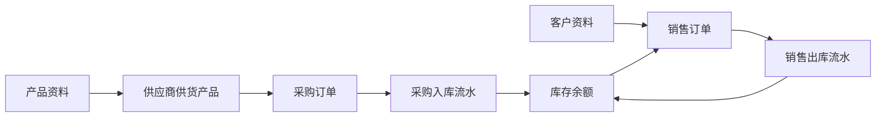

# ERP + AI 智能体项目介绍

## 1. 项目概述

本项目是一个面向**中小型商贸、批发、经销及仓配类企业**的进销存 ERP 系统，围绕产品、供应商、客户、采购、销售、仓库和库存等核心业务，建设一套可落地、可扩展、可审计的企业内部管理平台。

系统在传统 ERP 能力之上接入 AI 智能体，将 AI 作为自然语言入口和业务分析辅助层。用户可以通过自然语言查询库存、销售、采购等业务数据，也可以基于企业知识库进行制度、流程和系统使用说明问答。AI 不直接操作数据库，也不绕过权限体系，而是通过受控 Tool 调用已有业务服务，确保业务数据安全、结果可追溯。

项目第一阶段以 MVP 为目标，优先完成进销存主链路、基础权限体系和 AI 基础查询能力；后续再逐步扩展销量预测、库存分析、采购建议、供应商评分解释和采购单草稿生成等智能化能力。

## 2. 项目定位

本项目的定位不是覆盖所有行业、所有业务场景的重型 ERP，而是先聚焦**中小型商贸企业进销存管理**。

核心定位如下：

| 维度 | 项目定位 |
|---|---|
| 系统类型 | 企业内部进销存 ERP + AI 业务助手 |
| 目标企业 | 中小型商贸、批发、经销、零售仓配类企业 |
| 核心场景 | 产品管理、采购管理、销售管理、仓库库存管理、权限管理、AI 查询和分析建议 |
| 建设策略 | 先跑通采购、销售、库存主链路，再逐步扩展复杂能力 |
| AI 角色 | 自然语言入口、知识问答入口、业务查询助手、分析建议辅助层 |
| 安全边界 | AI 只能通过受控 Tool 调用业务 Service，不能直接查询或修改数据库 |

## 3. 面向人群

系统主要面向企业内部使用人员，不面向普通 C 端消费者。

| 用户角色 | 主要诉求 | 对应能力 |
|---|---|---|
| 企业负责人 / 经营管理者 | 了解库存、销量、采购和经营风险 | 经营看板、库存预警、销售汇总、AI 业务查询 |
| 采购人员 | 维护供应商，创建采购订单，跟踪采购入库 | 供应商管理、采购订单、采购入库、采购建议 |
| 销售人员 | 维护客户，创建销售订单，确认可售库存 | 客户管理、销售订单、库存查询、销售出库 |
| 仓库人员 | 管理仓库、库存余额、入库、出库和库存调整 | 仓库管理、库存查询、出入库流水、库存调整 |
| 业务主管 | 追踪采购、销售和库存数据，辅助业务决策 | 销售汇总、库存预警、供应商评分、AI 分析建议 |
| 系统管理员 | 管理用户、角色、权限和基础配置 | 用户管理、角色管理、权限码配置、审计日志 |

## 4. 建设背景

中小型商贸企业在日常经营中通常会面临以下问题：

- 产品、客户、供应商资料分散，维护口径不统一。
- 采购、销售和库存数据割裂，难以及时追踪业务状态。
- 库存变动缺少统一入口，容易出现账实不一致。
- 管理人员依赖人工统计报表，查询效率低。
- 业务系统中积累的数据没有被充分用于采购建议、库存预警和销售分析。
- 引入 AI 时容易出现权限绕过、结果不可追溯、数据安全边界不清的问题。

因此，本项目采用“传统 ERP 主干 + AI 辅助层”的建设思路：先保证 ERP 业务链路稳定，再让 AI 基于受控业务能力提供查询、解释和建议。

## 5. 项目目标

### 5.1 业务目标

- 支持产品资料和产品分类管理。
- 支持供应商资料、供应商供货产品和供应商评分维护。
- 支持客户资料管理。
- 支持采购订单创建、审核和采购入库流程。
- 支持销售订单创建、审核、库存锁定和销售出库流程。
- 支持仓库管理、库存余额查询、库存调整和出入库流水追溯。
- 支持用户、角色、部门和粗粒度权限码管理。
- 支持业务操作审计和 AI Tool 调用审计。

### 5.2 AI 目标

- 支持公司制度、业务流程和系统使用说明的 RAG 知识库问答。
- 支持通过自然语言查询库存、销售、采购和供应商等业务数据。
- 支持库存预警、销量趋势、滞销分析和采购建议等扩展能力。
- 保证 AI Tool 复用原有业务 Service 和权限校验。
- 记录 AI 调用过程，包括用户问题、Tool 参数、权限结果和返回数据摘要。
- 重要业务动作必须由用户确认后执行，AI 只提供建议或生成草稿。

## 6. 核心业务范围

MVP 阶段围绕进销存主链路建设，不追求一次性覆盖完整大型 ERP 的所有能力。

| 业务模块 | 核心能力 | MVP 边界 |
|---|---|---|
| 产品模块 | 产品资料、产品分类、参考采购价、参考销售价、安全库存 | 暂不拆品牌、单位、SPU/SKU |
| 采购模块 | 供应商、供货产品、采购订单、采购入库 | 暂不做复杂审批流和采购退货单 |
| 销售模块 | 客户、销售订单、库存锁定、销售出库 | 暂不做复杂价格体系和销售退货单 |
| 仓库库存模块 | 仓库、库存余额、出入库流水、库存调整 | 暂不做库位、批次、序列号 |
| 系统权限模块 | 用户、角色、部门、权限码、登录鉴权 | 暂不做完整 IAM 平台 |
| AI 模块 | RAG 问答、业务查询 Tool、审计日志、分析工作流预留 | 暂不允许 AI 直接写业务数据 |

## 7. 核心业务主链路

项目第一阶段最重要的是保证采购、销售和库存之间形成稳定闭环。



设计原则：

- 采购订单表达“要采购什么”，不直接增加库存。
- 销售订单表达“要销售什么”，不直接扣减库存。
- 库存变动统一由仓库模块处理。
- 出入库流水承担库存变动凭证，记录来源单据、出入库类型、操作人和确认时间。
- 库存余额用于快速查询，出入库流水用于追溯库存变化原因。

## 8. AI 能力边界

AI 是本项目的重要特色，但 AI 不替代 ERP 主业务系统。

系统遵循以下核心原则：

```text
ERP 业务系统是主干。
AI 智能体是自然语言入口和分析建议层。
AI 只能通过受控 Tool 调用已有业务能力。
AI 不能绕过权限体系直接查询或修改数据。
```

AI 初期重点建设以下能力：

| 能力 | 说明 |
|---|---|
| RAG 知识库问答 | 回答企业制度、业务流程、系统操作说明等问题 |
| 自然语言库存查询 | 查询产品库存、可用库存、锁定库存和库存预警 |
| 自然语言销售查询 | 查询销售汇总、销量趋势和订单状态 |
| 自然语言采购查询 | 查询采购订单状态、入库进度和供应商基础信息 |
| 标准分析工作流 | 后续支持销量预测、采购建议、库存风险分析 |
| AI 审计日志 | 记录用户问题、Tool 调用、权限结果和返回摘要 |

AI 禁止行为：

- 禁止直接生成 SQL 查询业务库。
- 禁止绕过 Service 直接访问数据库。
- 禁止绕过权限体系查询敏感数据。
- 禁止直接创建、审核、修改采购单、销售单或库存数据。
- 禁止动态生成不受控 Python 代码执行。

## 9. 技术架构

项目采用模块化单体架构，使用 Spring Boot 作为后端主体框架，通过 Maven 子模块划分业务边界。该方式既能保证 MVP 阶段开发和部署简单，又能为后续模块拆分和能力扩展保留空间。

| 技术领域 | 选型 |
|---|---|
| JDK | Java 21 |
| 后端框架 | Spring Boot 3.5.8 |
| 权限认证 | Sa-Token 原始 token + Redis session + RBAC |
| 数据库 | MySQL 8 |
| ORM | MyBatis-Plus |
| 缓存 / 向量检索 | RedisStack |
| 接口文档 | Knife4j |
| AI 框架 | Spring AI Alibaba 1.1.2.0 + Spring AI 1.1.2 |
| Agent 编排 | Spring AI Alibaba Agent Framework / Graph |
| Python 分析 | Spring AI Alibaba PythonTool |
| 外部工具接入 | MCP |
| 定时任务 | Spring Scheduler |
| 消息队列 | RocketMQ |
| 日志体系 | SLF4J + Logback |
| 业务审计 | 审计日志表 |

## 10. 模块划分

```text
erp-system
├── erp-common              通用工具、异常、响应体、枚举
├── erp-security            登录、Session、权限、数据权限
├── erp-system              用户、角色、部门
├── erp-product             产品、分类
├── erp-warehouse           仓库、库存、出入库流水
├── erp-purchase            供应商、供应商供货产品、采购订单
├── erp-sales               客户、销售订单
├── erp-ai                  智能体、RAG、Tools、Prompt、多 Agent 编排
├── erp-job                 定时任务
└── erp-admin               启动模块
```

| 模块 | 职责 |
|---|---|
| `erp-common` | 通用响应、异常、枚举、工具类和基础配置 |
| `erp-security` | 登录认证、权限校验、用户上下文和数据权限扩展 |
| `erp-system` | 用户、角色、部门等系统管理能力 |
| `erp-product` | 产品资料和产品分类管理 |
| `erp-warehouse` | 仓库、库存余额、出入库流水和库存调整 |
| `erp-purchase` | 供应商、供货产品、采购订单和采购入库流程 |
| `erp-sales` | 客户、销售订单、库存锁定和销售出库流程 |
| `erp-ai` | RAG、AI Tool、Agent 编排、分析工作流和 AI 审计 |
| `erp-job` | 定时统计、预警扫描和分析任务调度 |
| `erp-admin` | 系统统一启动入口 |

## 11. 企业开发规范体现

本项目按照企业级后端开发思路进行规划，重点体现以下规范：

| 规范方向 | 设计体现 |
|---|---|
| 分层清晰 | Controller、Service、Mapper、Domain 按职责拆分 |
| 模块边界明确 | 采购、销售、库存、产品、权限、AI 按业务领域拆分 |
| 权限前置 | 普通接口和 AI Tool 统一走权限校验 |
| 数据一致性 | 库存变动统一收口到仓库模块，避免多模块直接改库存 |
| 可追溯 | 业务操作和 AI 调用都保留审计记录 |
| 可扩展 | MVP 简化表结构，但保留权限、批次、退货、财务、AI Workflow 扩展点 |
| 可维护 | 统一响应结构、统一异常处理、统一日志规范 |
| 可测试 | 核心 Service 逻辑可独立编写单元测试和集成测试 |
| 文档化 | 项目计划、架构设计、数据库设计和 AI 设计均以文档沉淀 |

## 12. 项目特色

### 12.1 业务主链路完整

项目不是只做基础增删改查，而是围绕采购、销售和库存构建完整业务闭环。采购入库、销售出库和库存变化之间有明确的数据一致性边界。

### 12.2 AI 与业务系统安全集成

AI 不直接操作数据库，而是复用受控业务 Tool、权限体系和审计机制。这种方式既能体现 AI 能力，也能符合企业系统对安全和可追溯性的要求。

### 12.3 MVP 简化但不封死扩展

第一版不盲目引入复杂审批、批次、财务、IAM 和制造模块，而是先确保核心链路稳定。后续可以逐步扩展退货、财务结算、字段权限、仓库数据权限、销售预测和采购建议等能力。

### 12.4 面向真实企业开发场景

项目在技术选型、模块拆分、权限控制、库存一致性、审计日志、接口文档和数据库设计上都贴近企业开发实践，可作为后端项目、毕业设计、简历项目或面试讲解项目。

## 13. 非目标范围

为保证项目边界清晰，MVP 阶段暂不覆盖以下能力：

- 生产制造、BOM、工序、排产和质检流程。
- 财务总账、应收应付、发票、付款、收款和对账。
- 复杂审批流、流程引擎和组织岗位体系。
- 多租户 SaaS 商业化架构。
- 电商平台订单、支付、物流对接。
- 完整 BI 平台和实时数仓。
- AI 自动执行业务闭环，不经用户确认直接改数据。

这些能力可以作为后续扩展方向，但不进入第一阶段核心开发范围。

## 14. 项目价值

本项目的价值主要体现在三个方面：

| 价值方向 | 说明 |
|---|---|
| 对企业业务 | 帮助企业统一管理产品、采购、销售和库存数据，提高业务协同效率 |
| 对系统建设 | 通过模块化单体、权限体系和审计机制，形成可维护、可扩展的企业应用架构 |
| 对 AI 落地 | 将 AI 控制在安全边界内，让 AI 成为业务查询、知识问答和分析建议工具 |

总体而言，本项目不是简单的后台管理系统，而是一个以进销存 ERP 为业务主干、以 AI 智能体为增强入口的企业级管理系统。它既关注传统企业系统的稳定性和一致性，也探索 AI 在真实业务系统中的安全落地方式。
